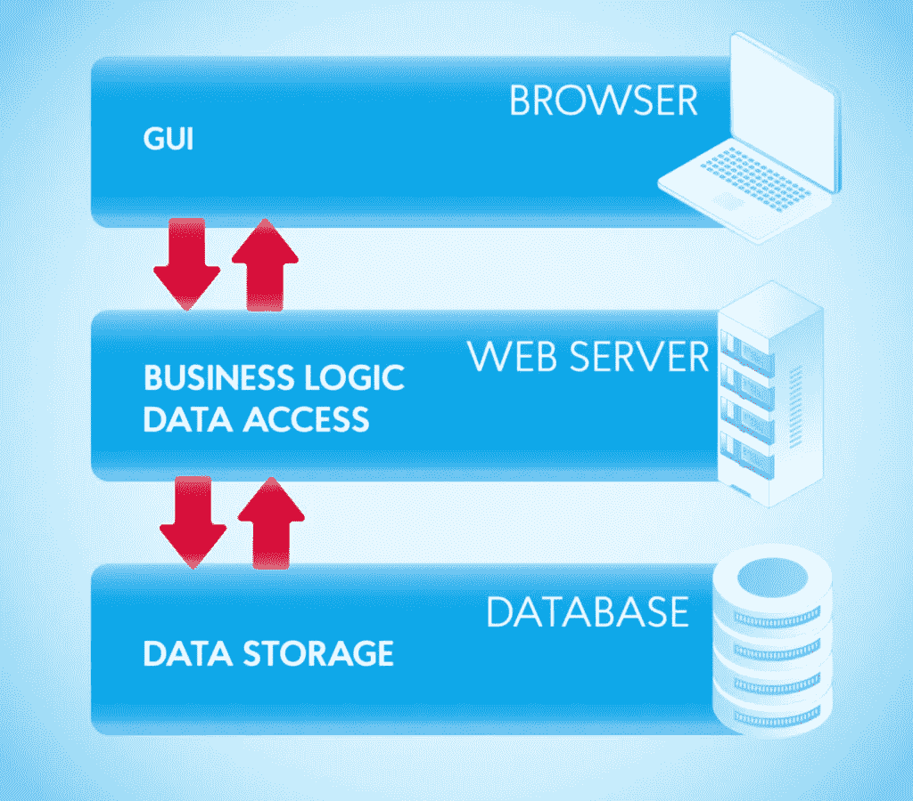
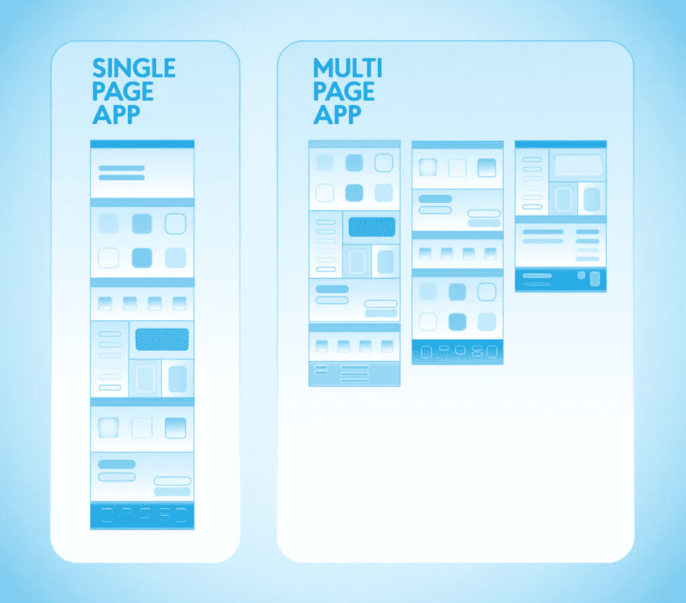
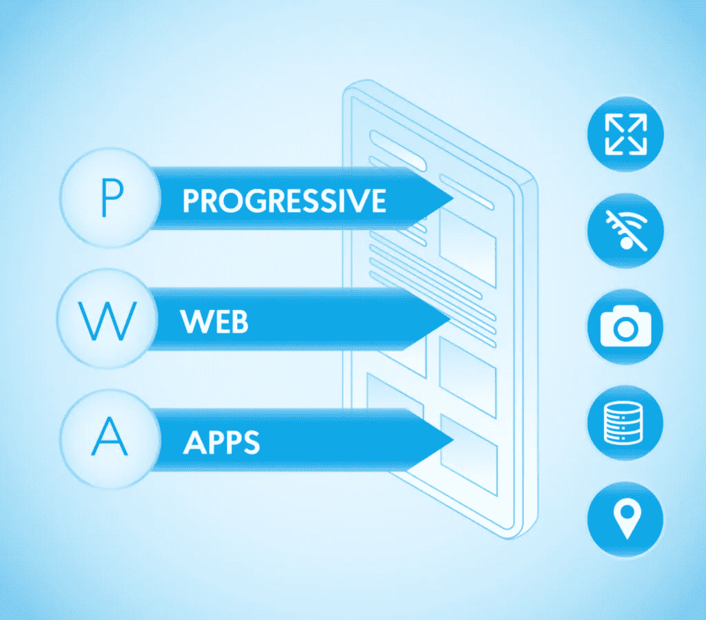
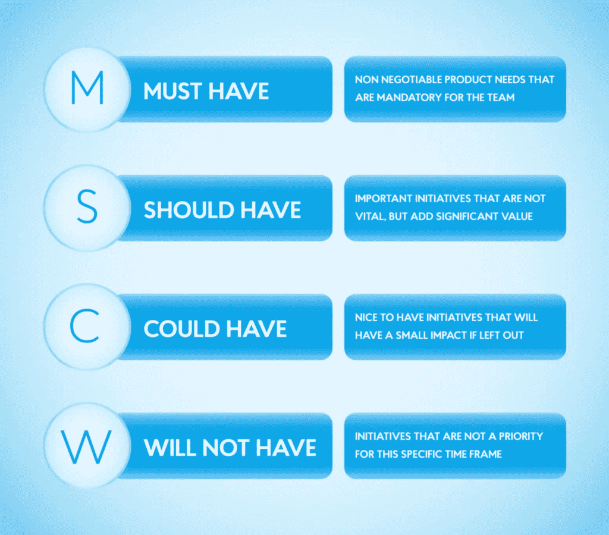
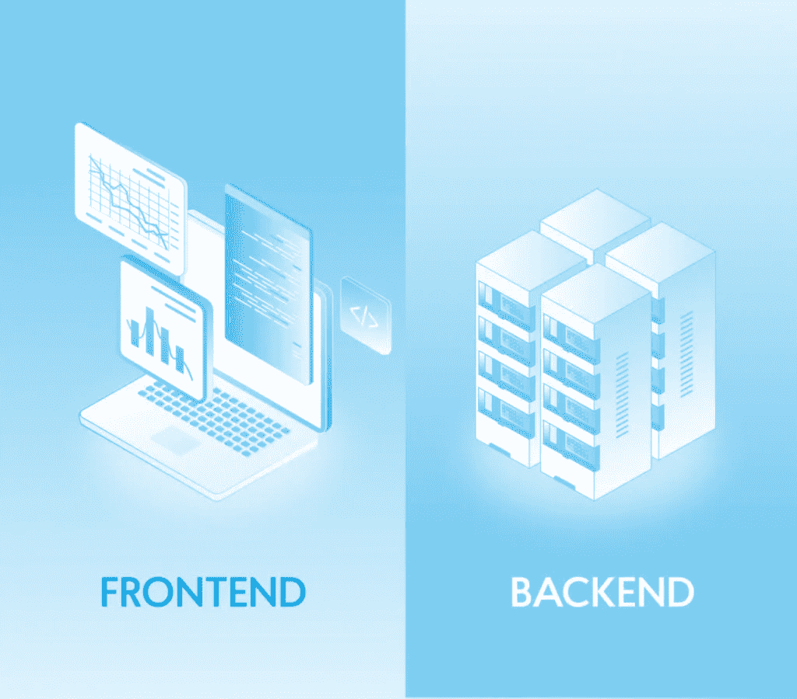

# 创建 Web 应用程序的关键步骤，以及业务的类型和优势— NIX United

> 原文：<https://medium.com/geekculture/key-steps-in-creating-web-apps-and-types-and-benefits-for-business-nix-united-4f254792687f?source=collection_archive---------25----------------------->

在当今竞争激烈的环境下，通过优化用户体验来占领细分市场变得至关重要。使用可定制的 web 应用程序，使消费者能够通过 web 浏览器直接与您交流，而不管使用什么设备，这是最好的方法之一。在线商店、社交网络、教育产品、照片、视频和文本编辑器、游戏和预订系统——所有这些都是 web 应用程序。它们比标准的信息网站更复杂，在这些网站上，用户不仅仅是被动的读者，而是一个过程中的积极参与者，与组织互动。

通过一个信息网站，你可以告诉用户你的公司，但你不能得到反馈或提供有用的服务。也就是说，为一个没有交互性的公司开发一个网站并不能提供所有这些选项。此外，交互性使您能够融入游戏化，提供评论选项，并与用户交流。所有这些都有助于围绕品牌发展一个社区，并提高对公司的忠诚度。

在今天的文章中，我们将向您详细介绍 web 应用程序:它们的工作原理是什么，有哪些类型，以及如何构建 web 应用程序。要了解它们与传统网站和移动应用程序的不同之处，它们的优势和劣势，以及为什么您应该考虑使用 [web 开发机构](https://nix-united.com/services/web-development/)为您的企业创建 web 应用程序，请继续阅读！

这种工具不应该与网站混淆。Web 应用程序是交互式的，用户可以执行各种操作:订购产品或服务、订票、发表评论或评论、编辑内容等等。几乎可以在任何领域创建网站应用程序，所有这些应用程序都可以使客户和企业受益，例如社交网络、游戏、教育产品、机票和酒店预订系统、在线商店、金融解决方案等。

创建一个 web 应用程序无疑是当今公司发展中投入时间和资源的最进步的方式之一，因为它的实现允许你:

*   自动化员工和职员的业务流程
*   吸引目标受众的注意力，在竞争中脱颖而出
*   使常见任务的解决方案更简单、更可靠、更安全

# Web 应用程序是如何工作的？

不管创建 web 应用程序的目的是什么，这种类型的应用程序都工作在客户机-服务器模型上。因此，以下组件在结构上有所区别:

*   客户端——负责用户执行的操作
*   服务器端——负责服务器上发生的进程
*   数据库——有序存储和访问信息的结构

Web 应用程序可能由小型开发团队创建，通常开发周期很短。大多数 web 应用程序都是使用 HTML5、CSS 和/或大量 JavaScript 框架创建的。这些语言在客户端编程中被用来构建应用程序的前端。在为 web 应用程序编写脚本时，服务器端编程经常使用 Python、Java 和 Ruby 等语言。

web 应用程序的功能允许它们处理几种类型的页面，包括:

*   统计-服务器进程生成一个页面来响应请求，并将其发送到浏览器，而不管用户的操作，这样不同的用户将会看到相同请求的相同材料。
*   动态-服务器进程生成页面以响应请求，但只有内容首先通过应用服务器，并根据发送的命令形成。

创建 web 应用程序的主要职责是提供客户端和服务器组件之间的有效通信、对数据库的访问以及创建和交付预先制作的页面以响应请求的适当能力。

根据目标，开发人员可以创建一个可以从任何设备访问的 web 应用程序，或者创建一个只有具备一定硬件能力的设备才能使用的高要求开发环境。可以使用各种方法来构建 web 应用程序，包括那些开放访问架构的方法，如在 Wikipedia 中，或者没有这种访问权限的方法，如在任何商业或新闻应用程序中。

# 网站应用的类型

# 单页应用程序(SPA)

单页应用程序基本上由存储在服务器上的一个 HTML 页面组成，当你滚动或点击链接时页面会更新。换句话说，当你点击按钮时，你没有移动到一个新的页面，但是元素被添加到已经加载的页面中。Gmail 就是这些单页程序的一个例子——当你在邮件列表之间切换时，页面的地址保持不变。这是温泉的特征。

创建 spa 的主要语言是 JavaScript。jQuery 库可以用来创建一个很小的单页面应用程序；然而，对于复杂的应用程序来说，这并不是最好的选择。Vue、React 和 Angular 框架是最常用的。

水疗的优势包括:

*   与多页面应用程序相比，开发更容易
*   应用程序很快:页面上的内容会随着用户的移动而改变，并且不需要加载大量资源
*   在一个页面上，更容易做出一致的设计，用户肯定不会迷路或困惑

但是也有缺点:

*   为 SPA 设置 SEO 优化将比其他选项更耗时
*   很难保证这种页面的安全性:它们比多页面应用程序(MPA)和渐进式 Web 应用程序(PWA)更容易受到攻击和泄露，我们将在下面讨论

这使得用户能够在网站之间导航和滚动浏览器窗口，并且他们的内容以整页格式显示。例如，一旦用户完成支付，在 SPA 中会加载一个确认框，而在 MPA 中，支付页面会完全更新。亚马逊网上商店是一个多页面应用程序的杰出例子。

MPA 的优点是:

*   简单搜索引擎优化
*   对于习惯于在页面间导航的大多数用户来说，这是一个更熟悉的选项
*   如果应用程序很复杂并且有很多特性，那么它肯定应该是多页面的。通过页面导航，用户可以轻松找到所需的部分。当他们突然需要一些信息时，没有人想把一个巨大的单页应用程序滚动到开头。

MPA 的缺点如下:

这介于网站和移动应用之间。不用使用应用商店，PWA 可以直接从手机主屏幕上的浏览器安装。这些程序在浏览器中打开，同时也发送推送提醒和离线工作。服务工作者技术——前端和后端之间的所有交互都通过这个脚本流动——使这变得可行。该脚本可以访问缓存和数据。事实上，你可以在大多数网站上添加一个服务人员，然后你就会得到一个 PWA。因此，媒体，如华盛顿邮报，经常采用这种技术。

使用 PWA 的优点:

*   离线和在线模式的结合是用户友好的
*   这样的应用程序可以相对快速地开发

让我们看看缺点:

除了技术分类，还有一种是基于目的的。下面，让我们来看看最流行的商务 web 应用程序类型:

# 电子商务系统

创建这些系统是为了让客户可以在没有第三方参与的情况下订购和销售商品，在销售链中只留下两个人。最引人注目的电子商务平台类型是市场、在线目录和在线商店。

# 客户关系管理(CRM)系统

开发这些系统是为了使销售部门和所有收到的请求自动化。由于 CRM 系统，你将能够:看到和跟踪公司的整个销售漏斗；预约，并查看与所有客户的互动历史。

# 企业资源规划系统

这些是基于网络的系统，不仅包括销售部门的自动化，还包括公司的所有资源和部门。由于有了 ERP 系统，你可以看到每个部门的效率，并设置适当的任务。

# 企业门户

这些是网络应用程序，作为你持有的社交模块。由于这个 web 应用程序，诸如向公司所有员工快速传播信息、公司培训和员工控制(人力资源模块)等问题都可以得到解决。

# Web 应用程序的优势

在开发过程中，您不需要为不同的操作系统创建单独的应用程序——它们在任何浏览器中都是一样的:Opera、Safari、Google Chrome 等。

web 系统只有一个入口点，因此您可以集中配置它的保护。此外，用户数据存储在云中，因此如果硬盘损坏，信息将保留下来。

# 从不同设备访问

用户可以通过计算机、智能手机、平板电脑等与 web 应用程序进行交互。最重要的是能上网。

# 缺少客户端软件

用户不需要下载任何东西，更重要的是，不需要更新。您可以更改客户端界面，更新到最新版本将在下次加载页面时发生。

# 可量测性

即使系统负载增加，您也不需要增加客户机容量。通常情况下，web 应用程序只能用硬件资源处理更多的数据，所以你不需要重写代码和改变架构。

# 如何制作 Web 应用程序

创建 web 应用程序的过程与创建任何其他软件的过程相同。成功开发的关键总是一个伟大的团队和定义良好的过程。你需要一些工具来构建一个 web 应用程序，使你能够构建一个结构，开发一个视觉上令人惊叹的设计，并使其具有交互性。主要的 web 应用程序开发技术如下:

Web 应用程序开发包括几个步骤，可能是一个相当长且耗费人力的过程。以下是创建 web 应用程序的主要阶段:

# 想法产生阶段

如果你想知道如何制作一个 web 应用程序，那么你应该知道起点在哪里。和任何其他项目一样，当你创建一个 web 应用程序时，你应该从一个想法开始。

## 创意来源

在这一点上，你不需要想出任何实质性的、准备实施的想法。相反，强调集思广益，把解决用户问题放在第一位。一旦你知道用户面临什么问题，你就可以想出解决这些问题的产品。

## 目标市场和竞争对手研究

对目标市场和竞争的分析是任何产品最重要的出发点之一。团队必须对市场、市场问题、规模(受影响的人数)以及任何竞争解决方案有一个全面而现实的了解，才能构建一个 web 应用。

## 网站应用程序的主要特点和功能

通过列出使用 MSCW 模型生产成品所需的所有特征(重要的和次要的),对 web 应用程序的基本属性和功能进行优先排序。

当您创建一个 web 应用程序时，下一件要考虑的事情是设计。理解用户界面(UI)和用户体验(UX)，以及在开发的这个阶段它们是如何影响设计决策的，是创建 web 应用的第一步。

UI 关注于 web 应用的感觉和外观，以及字体、颜色和布局等细节。用户界面设计的目标是让用户觉得界面既实用又美观。UX 处理和管理用户如何与应用程序交互，通过详细了解用户的需求和感受。

## 用户旅程地图

通过在流程的每个点绘制用户的旅程，可以更容易地理解用户的动机、需求和挑战。这也使得调整 UX 设计来解决这些问题变得更加容易。

## 网站应用线框

未来应用的数字化流线型图形概念被称为线框。它们显示了产品的架构、层次结构及其组成部分之间的联系。将线框视为 web 应用程序的前端和后端功能和设计的草稿或蓝图。

## 可点击原型

创建的线框集合可以变得更具交互性，以便最终的原型设计功能和外观完全像一个成熟的网站应用程序。由于交互性和模拟用户体验的 UX 改进，您可以查看和利用这个原型。通过这样做，您可以在完整的开发完成之前获得关于功能、设计和可用性的有用的用户反馈。

## 视觉设计

通过选择用户界面元素，如字体、配色方案、图标、形状、按钮、屏幕元素大小和比例、图片等，UI 设计人员开发了演示应用程序在此阶段如何出现的布局。动画和屏幕过渡等动作设计组件也包括在内。

# 发展阶段

创建 web 应用程序的下一步是开发，在开发过程中，要对支持应用程序的框架和技术以及 web 应用程序本身的编码做出重要的技术选择。

## 数据库模式

您的 web 或移动应用程序的代码存储在数据库中。它还负责管理、存储、收集、处理和安全访问数据。市场几乎完全被 MySQL、MongoDB 和 PostgreSQL 所主导，这使得决定使用哪个数据库变得非常简单。在选择数据库时，安全性和数据泄露的可能性是需要考虑的最重要的因素。

客户端开发称为前端，通过浏览器向用户展示 web 应用程序。几个框架为当代前端开发提供了基本的模板和部件。您只需要设置好开发环境就可以开始了。选择一个代码编辑器(比如 VS Code)，一个编译打包框架(比如 Webpack)，一个前端框架(比如 React，Vue 等。)，并配置工具包以与可能在本地主机上的不同端口上运行的后端进行通信。在大多数情况下，HTTP 代理主机用于此目的。

后端开发涉及实际的逻辑、数据库和 web 应用服务器。因为后端非常复杂，所以有许多框架可以帮助开发。为构建 web 应用程序而选择的语言或技术堆栈会对可用的框架可能性产生影响。其中包括 NodeJS、Python、Laravel、Ruby on Rails，还有一些比较知名的。

## 前端 API 与后端的集成

为了实现数据交换，API 集成过程将接口与后端连接起来。

## 网站应用测试

测试人员的主要任务是在应用程序发布之前检查其运行情况，以便团队能够以高质量的产品进入市场。测试人员研究产品文档，创建测试用例(要测试的特性及其顺序的列表),并验证所有特性都如需求中指定的那样执行。他们要么手动模拟不同场景中的用户操作，要么编写自动化测试的脚本。之后，开发人员会收到一份报告，其中列出了错误和纠正建议。

此时，您应该已经选择了一个位置来托管您的 web 应用程序并将其呈现给真正的用户。

web 应用程序可以通过托管在云中来访问，让您可以从地球上的任何地方立即访问。其中包括知名的托管公司，如亚马逊网络服务、微软 Azure 和谷歌云平台。选择托管服务时，要考虑成本、范围、限制、附件、可扩展性和用户评估等因素。

## 部署

最后一步需要将网站应用程序从源代码管理转移到托管公司的云中。有许多程序可以在这方面提供帮助，包括 GitHub、GitLab、Jenkins 和 Bitbucket。

# 最后的想法

移动应用程序的开发在世界范围内变得越来越流行。然而，给你一个与你的观众交流的简单方法的网络应用是今天的无名英雄。它们让用户通过他们的网络浏览器执行动作/操作，所以你可能会推断它们是你的移动应用的精简版。此外，构建 web 应用程序比构建移动应用程序要便宜得多。出于所有这些原因，如果您想要为您的公司定制 web 应用程序，您应该考虑 web 开发。

如何做一个 web app 的问题，可以在 NIX United 找专业人士解答。我们是一个值得信赖的合作伙伴，重视我们的客户并实现最佳结果。同时，考虑到外包 web 开发的所有[好处和风险](https://nix-united.com/blog/outsourcing-web-development-in-2023-benefits-risks-and-tips/)，选择这个选项将是双赢的，因为它允许公司专注于业务任务，而外包团队则负责 web 应用。

*原载于 2022 年 12 月 9 日*[*【https://nix-united.com】*](https://nix-united.com/blog/complete-guide-on-how-to-build-a-web-application/)*。*