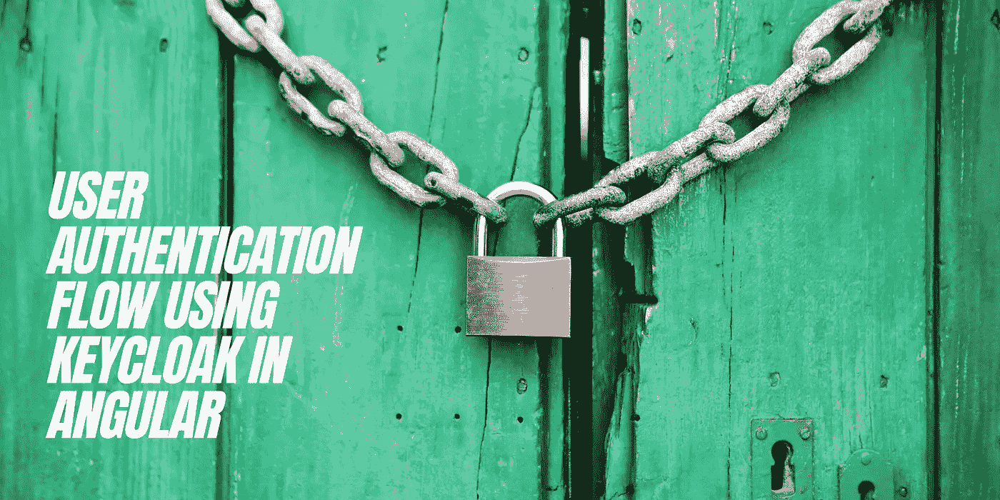

# Angular 中使用 Keycloak 的用户认证流程

> 原文：<https://medium.com/geekculture/keycloak-authentication-flow-for-angular-project-4d5705c91d55?source=collection_archive---------3----------------------->

## 全栈开发|认证

## 登录| SSO | Angular 11 | Keycloak 15.0.1

User Authentication Flow Using Keycloak In Angular

Keycloak 是一款开源软件产品，允许针对现代应用和服务进行身份和访问管理的单点登录。在这里，我将解释我们如何设置身份验证流程…