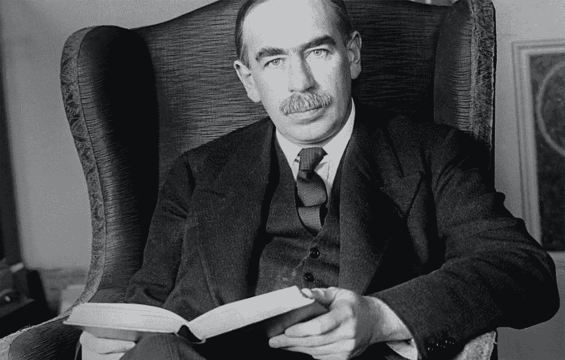

# 凯恩斯经济学

> 原文：<https://medium.com/geekculture/keynesian-economics-8cdc614e33c?source=collection_archive---------31----------------------->

约翰·梅纳德·凯恩斯是一位出生于 1883 年的经济学家，他的思想从根本上改变了宏观经济实践和政策实施的理论和方式。他的主要研究深入探讨了政府支出对通货膨胀、产出和就业的影响，尤其是在经济疲软时期，如衰退和萧条时期。凯恩斯经济学被认为是一种“需求方”理论，它关注的是一个经济体在需求方面的动态变化