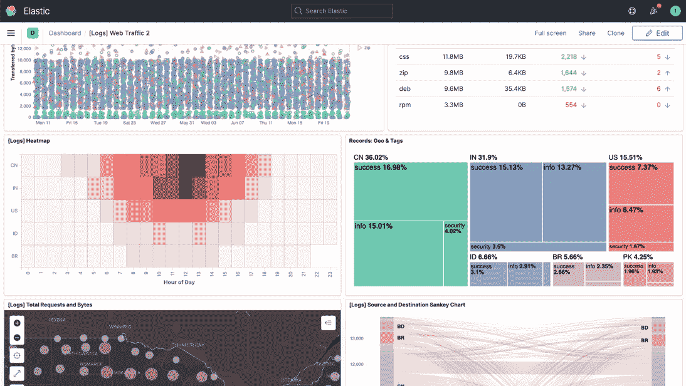
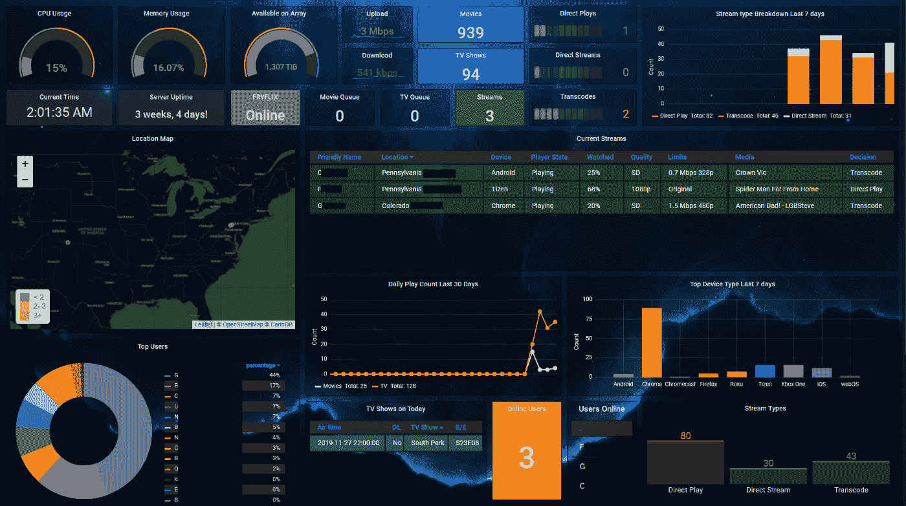
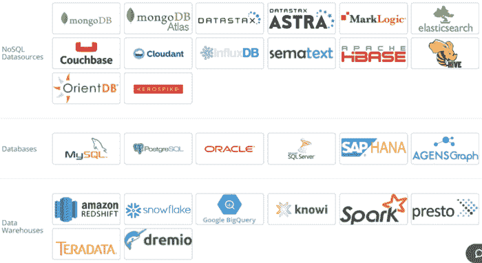

# Kibana 替代品:Grafana、Splunk 和 Knowi

> 原文：<https://medium.com/geekculture/kibana-alternatives-c697aef14e00?source=collection_archive---------3----------------------->

对于日志数据分析，您应该考虑的主要 Kibana 替代方案。

Image by Author

## **目录:**

*   [简介 ](#835c)
*   [**基巴纳的好处**](#a697)
*   [**基巴纳**](#aea0) 的局限性
*   [**最佳 Kibana 替代品**](#ca6d)[**Grafana**](#b758)[**Knowi**](#c2e3)[**Splunk**](#2122)
*   [**结论**](#73d7)

## **简介**

[Kibana](https://www.elastic.co/kibana/) 是一个可视化界面工具，您可以使用它来探索、可视化和构建由 Elasticsearch 集群生成的日志数据的仪表板。它是由一家名为 Elastic 的荷兰公司与另外两个开源工具 Elasticsearch 和 Logstash 一起开发的。Elasticsearch 是一个半结构化和面向文档数据的数据库。Logstash 有助于收集、解析和存储日志。这三种工具统称为 ELK 或弹性堆栈。

Kibana 为您提供了不同的数据可视化方式，包括折线图、热图、饼图和直方图，以根据您的 Elasticsearch 数据构建和共享仪表盘。

## **基巴纳的好处**

以下是 Kibana 用户享有的好处:

1.  **开源**

Kibana 是一个开源工具。你可以用它来分析你的日志，而不需要支付任何费用。

**2。与 Elasticsearch 的强大集成**

Kibana 与 ELK 堆栈紧密耦合，并且与 Elasticsearch 集成得很好。因此，如果您的项目使用 Elasticsearch 作为数据库，Kibana 将为您提供最佳性能。

**3。互动图表**

Kibana 提供交互式图表和报告，可以帮助您交互式地浏览大量日志数据。它允许您放大和缩小特定数据集，动态拖动时间窗口，并深入报告以从数据中提取有价值的见解。

**4。映射支持**

Kibana 具有强大的地理空间功能，可帮助您在数据之上添加地理信息，然后在地图上显示结果。这是由弹性地图服务实现的，该服务提供底图切片、shapefiles 和其他有利于地理数据可视化的关键要素。

**5。预置过滤器和聚合**

Kibana 附带了预构建的过滤器和聚合，您只需点击几下，就可以使用它们来运行不同类型的分析，如 top-N 查询、直方图和趋势。

**6。易于操作的仪表板**

Kibana Dashboard (Source-www.elastic.co/kibana/)

在 Kibana 中设置仪表板并与他人共享很容易。您只需要一个 web 浏览器来查看仪表板和浏览数据。它还通过限制信息查看以防止数据泄露的选项，促进了仪表板和可视化的安全共享。

**7。定制的可视化效果**

Kibana 为其用户提供了基本的可视化工具，如饼图、直方图和线图，还允许他们设计自己的图像。这使得 Kibana 用户可以满足自己的需求和偏好。这是使用 Vega Grammar 实现的，它是 Kibana 完全集成的可视化语言。

## **基巴纳的局限性**

以下是与 Kibana 相关的限制:

1.  **只能可视化弹性搜索数据**

尽管 Kibana 与 Elasticsearch 紧密集成，但它不支持与其他数据源的集成。因此，您只能使用它来可视化 Elasticsearch 数据。如今，大多数组织跨不同的数据源(SQL 数据库、NoSQL 数据库、REST APIs 等等)存储/检索数据。因此，Kibana 只与 Elasticsearch 合作可能是一个问题。

**2。没有现成的警报系统**

Kibana 没有现成的警报系统。他们只能通过实现 Elastalert、使用 X-Pack 插件或使用 Logz.io 等托管的 ELK 堆栈来配置警报。他们可以通过 API 或使用名为 watchers 的函数在 Elasticsearch 中配置警报。

**3。没有用户管理功能**

Kibana 提供了任何用户管理特性。因此，任何链接到您的仪表板的个人都可以查看数据。要向 Kibana 添加用户管理特性，您必须依赖与第三方工具的集成。

**4。不适合非技术业务用户**

Kibana 有一个陡峭的学习曲线，它要求个人事先了解麋鹿栈。因此，对于非技术业务用户来说，这可能是压倒性的。

## **最佳基巴纳替代品**

市场上有许多数据可视化工具可以用来代替 Kibana。在本节中，我们将讨论 Kibana 的三大最佳替代方案。

## **格拉夫纳**

Grafana 是一个开源的数据可视化工具，可以用来可视化任何数据。它主要由 InfluxDB、Graphite 和 Elasticsearch 使用。

Grafana 用户还可以从头开始编写自己的插件，并使用它们来集成不同的数据源。它也是一个很好的*时间序列分析工具，*允许你在一段时间内研究、分析和监控你的数据。它还支持不同类型的可视化，用户可以使用这些可视化来可视化他们的数据。Grafana 有定制选项，用户可以用他们想要的方式分割数据。Grafana 用户还可以尝试不同的颜色、可视化尺寸、标签等等。

**格拉法纳特色**

以下是常见的 Grafana 特征:

1.  **可视化**

Grafana 提供了不同类型的可视化，从图形到直方图，您可以使用它们来可视化和理解您的数据。每个单独的可视化被称为*面板*。这些面板组合在一起就构成了一个仪表板。

**2。显示仪表板**

Grafana Dashboard (Source-danuka-praneeth.medium.com)

通过 Grafana，您可以使用预建的模板和自定义报告来可视化您的数据。您还可以与其他用户共享您的报告。

**3。警报**

Grafana 允许您配置接收警报的阈值和条件。然后，您可以通过 PagerDuty、Slack、Webhooks 和 Gmail 接收通知。

**4。注释**

使用 Grafana，您可以在图表上添加注释或注释。这使得你可以在你的视觉化图像上标记重要的点。笔记可以作为未来行动的提醒，在您的可视化上标记特殊事件，或者为入职团队成员提供指导。

**Grafana 的优势**

以下是使用 Grafana 的好处:

1.  **开源**

Grafana 是一个完全开源的数据可视化工具。它还有一个充满活力的用户群体。Grafana 用户可以创建自己的插件，也可以使用其他用户开发的插件。

**2。对许多集成的本地支持**

与 Kibana 不同，Grafana 本身支持与各种数据库的集成。如果 Grafana 没有到您的数据库的本地连接器，您可以创建一个插件，通过它 Grafana 可以与您的数据库进行交互。

**3。可定制的仪表板**

Grafana 以直方图、热图和图表的形式提供了广泛的可视化数据。您还可以使用插件创建自定义可视化，以满足您的特定需求。

**4。有利于用户管理**

Grafana 有很好的用户管理功能。您可以创建角色和用户，以允许您控制和监控访问您的数据和仪表板的用户。

**Grafana 的缺点**

以下是 Grafana 的局限性:

1.  **对非技术人员不友好**

对于非技术人员来说，Grafana 不是一个用户友好的日志分析工具。它需要你编写插件来连接一些数据源，或者获取一些可视化，这些都需要编码知识。

**2。无法加入数据**

Kibana 缺乏聚合或连接来自多个来源的数据的能力，因为它不是自己的数据存储。它不能处理多种数据类型之间的相关性。

**3。不支持机器学习**

Grafana 不支持机器学习。这意味着你不能用 Grafana 建立机器学习模型。

**4。不支持日志搜索和分析**

Grafana 不支持查询文本数据，因此，您不能使用它来搜索日志。

## **Knowi**

[Knowi](https://www.knowi.com/) 是一个数据分析平台，本机连接到 Elasticsearch 和其他 NoSQL、SQL 和 REST-API 数据源。它通过数据虚拟化来实现这一点，这种技术允许它实时连接到任何数据源，而不需要耗时的 ETL 过程。这使得用户可以快速连接到他们的 Elasticsearch 索引，并对其进行分析。

Knowi 能够处理非结构化数据，这是目前市场上许多 BI 工具所不具备的功能。

Knowi 成立于 2015 年，如今它自豪地为世界上许多公司提供 BI 服务，包括财富 500 强公司和初创公司。

**Knowi 特性**

以下是 Knowi 提供的最受欢迎的功能:

1.  **可视化**

Knowi 支持 30 多种可视化，您可以使用它们来可视化地呈现您的数据。Knowi 还允许其用户使用 JavaScript 创建定制的可视化，以帮助他们满足特定的需求。

**2。与数据源集成**

Knowi Data Sources (Source — knowi.com)

您可以将 Knowi 与 36 个以上的结构化和非结构化数据源集成。它还支持与包括 Elasticsearch 在内的 NoSQL 数据库集成。Knowi 还提供了一个强大的 REST API 集成来连接 API 和连接来自不同来源的数据。

**3。日志搜索和分析**

Knowi 支持对文本数据的查询，因此，您可以使用它来搜索日志。

**4。警报**

Knowi 允许您配置警报，以便在您的数据或业务发生变化时得到通知。在检测到数据中的配置条件、异常或阈值后，它会实时发送警报。知道我可以通过 Slack、Webhooks 或电子邮件发送警报。

**5。基于搜索的分析**

Knowi 有一个由人工智能支持的基于搜索的分析功能。它允许非技术用户用简单的英语输入问题(类似于谷歌搜索)，并以表格、图表和图形的形式得到答案。Knowi 还在 Slack 和微软团队中引入了基于搜索的分析。

**6。机器学习**

您可以使用 Knowi 来执行机器学习任务，例如分类、回归分析和时序异常检测。它还允许用户通过受指导的数据准备向导来准备数据、创建和训练机器学习模型。

**7。多源连接**

Knowi 允许用户连接跨越 Elasticsearch 索引和不同数据源的数据，包括 NoSQL、SQL 和 REST-API。它支持内连接、左外连接、全外连接、右外连接和循环连接。

**知识的优势**

以下是用户在使用 Knowi 时享有的好处:

1.  **支持多种集成**

Knowi 支持与许多数据源的集成。它还允许用户在不依赖第三方工具的情况下连接到 NoSQL 数据源。

**2。适用于非结构化数据**

Knowi 使用数据虚拟化来处理任何类型的数据，包括非结构化数据，而不考虑底层数据结构。

**3。支持多索引和多源连接**

当达到 Kibana 的极限时，Knowi 就开始发挥作用了，主要是因为它不能执行多索引连接或与其他数据库的连接。使用 Knowi，您可以在同一个可视化小部件或仪表板中可视化来自多个 Elasticsearch 索引或其他完全不同的数据源的不同数据类型的数据。

**4。适合非技术用户**

Knowi 基于搜索的分析功能使其成为一款适合非技术用户使用的工具。他们可以使用自然语言从他们的数据中提出问题并得到答案，而不需要预先了解底层查询语言

**5。用户授权**

Knowi 具有开箱即用的用户管理功能。您可以创建角色和用户，然后授予他们访问您的仪表板的权限。这将帮助您控制谁可以查看您的数据和仪表板。

**已知的缺点**

以下是使用 Knowi 的缺点:

1.  **不支持桌面安装**

虽然 Knowi 支持云和内部部署，但它不支持桌面安装。

**2。复杂的用户界面**

Knowi 有一个直观的业务用户界面。但是，它面向数据工程师的用户界面很复杂，用户可能需要一段时间来适应。

**3。没有“最漂亮”的开箱即用可视化效果**

Knowi 的开箱即用的可视化效果并不十分漂亮，但是如果用户了解 CSS/JavaScript，它允许用户对其进行定制。

**4。不开源**

Knowi 是一个商业工具。

## **Splunk**

[Splunk](https://www.splunk.com/) 是一个软件平台，让您可以轻松收集和管理大量机器生成的数据，并在其中搜索特定信息。它用于应用程序管理、业务和 web 分析、安全性和合规性。

Splunk 是一款可扩展的软件，它可以索引和搜索系统生成的日志文件，并分析其数据以获取运营情报。Splunk 捕获、关联和索引实时数据。然后，它根据数据创建可视化、警报、报告和仪表板。这有助于企业识别常见的数据模式，识别潜在的问题，并将智能应用于业务运营。

Splunk 提供了一个类似浏览器的界面，您可以使用它来检查、监控和搜索机器生成的大数据。Splunk 不需要数据库来存储数据，因为它使用索引来存储数据。

**Splunk 功能**

以下是 Splunk 提供的核心功能:

1.  **数据摄取**

Splunk 可以从数据库、网站、操作系统、服务器等设备和应用程序中收集任何形式的数据，如 XML、JSON、CSV 和非结构化机器数据，如应用程序和 web 日志。然后，可以根据用户需求将非结构化数据建模成数据结构。

**2。数据索引**

Splunk 对收集的数据编制索引并维护相关的元数据，以使用不同的条件加速搜索和查询。

**3。数据搜索**

Splunk 具有强大的搜索功能，允许您浏览您的数据。您可以使用搜索从索引中检索事件、计算指标、搜索特定时间窗口内的特定条件、从数据中识别模式以及预测未来趋势。

**4。警报**

您可以将 Splunk 配置为当实时和历史搜索的搜索结果满足特定条件时向您发送通知。您还可以将警报配置为触发不同的操作，如将警报信息发送到特定的电子邮件地址、在 RSS 提要上发布警报以及执行自定义脚本。

**5。仪表板**

Splunk Dashboard (Source-www.splunk.com)

Splunk 仪表板由字段、搜索框、图表等模块面板组成。仪表板面板通常连接到保存的搜索。它们以图表、透视和报告的形式显示完整的搜索结果和实时搜索的数据。

**6。数据模型**

您可以基于专业领域知识将 Splunk 中的索引数据建模为一个或多个数据集。这有助于最终用户轻松导航，因为他们可以分析业务案例，而不必了解 Splunk 使用的搜索处理语言的技术细节。

**Splunk 的优势**

以下是 Splunk 提供的优势:

1.  **强大的搜索功能**

Splunk 具有强大的搜索功能，可帮助您轻松快速地在日志中搜索所需的数据。

**2。综合机器学习**

Splunk 具有内置的机器学习功能，因此，您可以将机器学习应用于数据流，而无需依赖第三方工具或编写代码。

**3。预配置模块**

Splunk 附带一个预配置模块库，帮助您快速了解数据。这些模块是控制面板、指标和警报的集合，为您提供最需要的现成见解。

**Splunk 的缺点**

以下是使用 Splunk 的缺点:

1.  **非常昂贵**

与其他日志数据分析工具相比，Splunk 是一个非常昂贵的平台，尤其是在管理大量数据时。

**2。难以优化搜索**

对于 Splunk 用户来说，通过优化搜索来提高速度可能很困难，也不切实际。

**3。陡峭的学习曲线**

Splunk 的学习曲线非常陡峭，因此，您可能会花太多时间来学习如何使用该工具。

## **结论**

Kibana 是一个数据可视化工具，可以帮助你可视化由 Elasticsearch 集群生成的日志数据。Kibana 与 Elasticsearch 和 Logstash 一起构成了 ELK stack。因此，Kibana 与 Elasticsearch 紧密集成。Kibana 具有强大的数据可视化特性，可以帮助您可视化日志数据。它还让您能够创建自定义的可视化效果。

尽管 Kibana 提供了强大的日志数据可视化特性，但它也有一些限制，最大的限制是它只能用于可视化 Elasticsearch 数据。因此，如果您的日志数据存储在另一个数据库而不是 Elasticsearch 中，您将不得不寻找 Kibana 的替代工具来实现数据可视化。

Kibana 有很多替代品，但最热门的是 Grafana、Knowi 和 Splunk。

Grafana 是一个开源工具，非常适合数据可视化。它主要由 InfluxDB、Graphite 和 Elasticsearch 使用。Grafana 允许用户从头开始创建自己的插件，并使用它们来执行与数据源的集成。它有一个强大的警报系统，并允许用户注释他们的图表。

[Knowi](https://www.knowi.com/) 是一款强大的商业智能工具，可以让你可视化数据，缩短原始数据和行动之间的距离。它可以连接到任何数据源，包括 NoSQL 数据库，而不依赖于第三方工具，并加入来自多个来源的数据。它支持不同类型的可视化，并让用户能够创建自定义的可视化。Knowi 对于非技术型 BI 用户来说是一个很好的工具，因为它基于搜索的分析功能允许用户以自然语言提问，并以图表的形式获得回答。

[Splunk](https://www.splunk.com/) 是一个 BI 平台，你可以用它来收集和管理大量机器生成的数据，并在其中搜索特定信息。Splunk 可以帮助您收集任何类型的数据并配置警报，以便在您的搜索结果满足特定条件时获得通知。它索引您的数据，以便在数据中快速搜索。Splunk 还带有内置的机器学习功能，允许您在不使用第三方工具的情况下对原始数据应用机器学习。