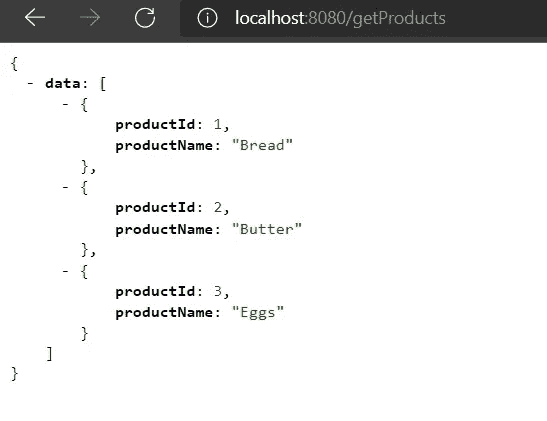
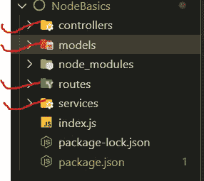
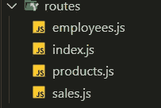
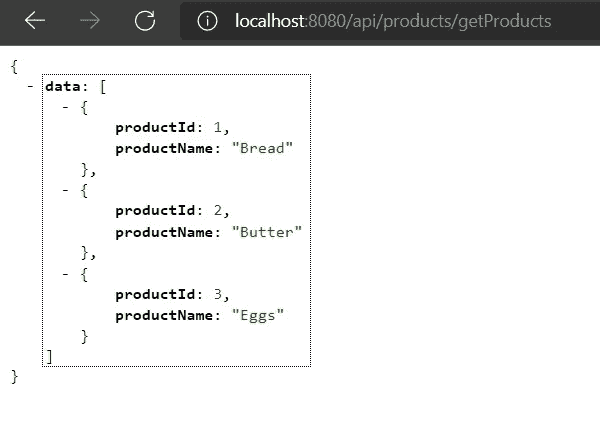
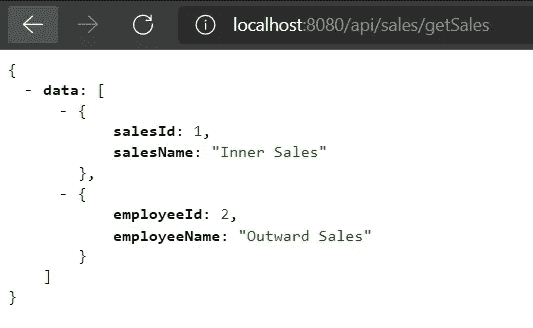
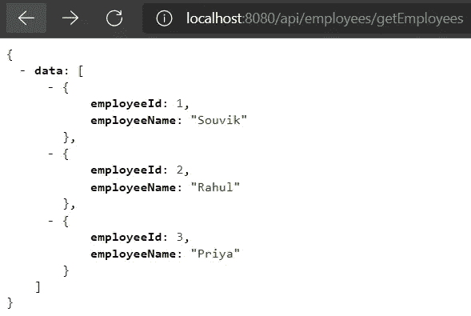
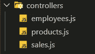
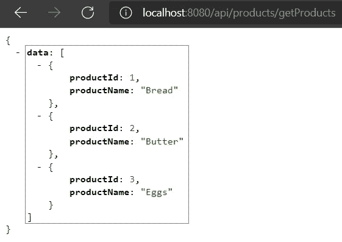
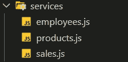

# 启动您的节点应用程序—RESTful API、身份验证、安全性—第 1 部分

> 原文：<https://medium.com/geekculture/kickstarting-your-node-application-restful-apis-authentication-security-720e5612640d?source=collection_archive---------13----------------------->


Source: Unsplash

因此，你拥有一家食品杂货连锁店，在一个晴朗的日子里，一个关于创建一个网站的想法突然出现在你的脑海中，这个网站更像是一个仪表板，以便你管理你的产品和销售。您已经使用自己选择的框架(比如 React、Vue 或 Angular)设计和开发了初始前端。现在是时候拿出后端了。经过一点比较和研究，您决定使用 Node.js 来开发后端应用程序。那么你需要的关键成分是什么呢？

我将在这篇文章中讨论和解释以下内容

**第一部分**

*   设置应用程序的基本结构或样板文件
*   开发 RESTful APIs

[**PART -2**](https://souvikmajumder31.medium.com/kickstarting-your-node-application-restful-apis-authentication-security-part-2-75a843090789)

*   验证和授权您的服务请求
*   实现针对各种漏洞的安全性。


我们开始做饭吧！！！

# 构建样板文件

虽然没有具体的或官方的方法来设计你的应用程序的结构，但我自己通常遵循一个系统的和简单的方法。但是在我们这样做之前，让我们首先创建我们的节点项目。

*   在您的本地机器上安装 NodeJS，打开 VS Code 或您选择的任何其他编辑器，选择一个文件夹，打开一个终端并运行 **npm init** 来初始化节点项目。
*   在您的 *package.json* 文件中给出一个名称和其他可选细节。
*   通过运行 **npm install — save express** ，安装 **express** npm 包。
*   创建一个 **index.js** 文件。

在我构造锅炉板之前，让我们使用 express 在 **index.js** 文件本身中创建 API 端点。

我还需要安装 **nodemon** npm 包，以便服务器能够观察和识别文件中所做的更改，并再次自动重启。

运行命令

```
**npm install — save nodemon**
```

打开 *package.json* 并包含一个启动脚本

执行 npm run start 以启动节点服务器

打开浏览器，点击网址 [http://localhost:8080/](http://localhost:8080/)

让我们再创建一个 GET 端点。



和一个后端点。

因此，我们在这个 index.js 文件中有了所有的端点。

现在是构造 boiler 板的时候了，这样我们就可以相应地分离端点，以便于开发。

想象一下你去餐馆的场景，你把你点的菜交给服务员。服务员(路线)拿走你点的菜并把它交给厨师长(控制员)。厨师长将订单交给厨师(服务员)。厨师从冰箱(模型)中取出蔬菜或肉类，用所有其他配料和他惊人的烹饪技巧烹饪。然后，他把准备好的菜还给厨师长，厨师长再把菜递给你的服务员。服务员(路线)现在带着菜来到你面前，你开始享受美味的饭菜。

路由->控制器->服务->模型->数据库

为 ***路线******服务******管制员*** 和 ***车型*** 创建文件夹。



假设我们想要与**产品**、**销售**和**员工**相关的 API。

首先，在 ***routes*** 文件夹中，我们为产品、销售和员工创建了 3 个单独的文件，以及一个 index.js 文件，该文件将组合上述 3 个文件中的代码。



现在打开 products.js 文件并包含下面两行。

因此，我们使用 express 的路由器类。

现在将我们之前在 main***index . js***中创建的 **getProducts** 和 **createProduct** 的代码移到这里。将所有' ***app*** '替换为' ***路由器*** '。

在 **product.js** 文件的末尾导出 **router**

打开 **routes** 文件夹中的 **index.js** ，初始化 express 模块及其 Router 类。

导入从 **product.js** 导出的路径

所有与产品相关的原料药都应由附加在特定原料药名称前的另一个名为“**产品**”的端点来标识。

在 index.js 文件的末尾导出**路由器**

回到最初的主 **index.js** 文件，从所有其他文件导入合并在 **router/index.js** 中的路由。

使用这个' **routes'** ，并在路径中附加一个' **api'** 。

保存并检查浏览器



对**销售人员**和**员工**重复同样的程序。

***routes/employees . js***

***路线/销售. js***

***routes/index . js***



现在，让我们把相应的控制器也放在图片中。

在 controllers 文件夹中，分别为**产品**、**员工**和**销售**创建 3 个控制器，名称分别为 ***product.js*** 、 ***employees.js*** 和 ***sales.js*** 。



打开***controllers/product . js***，创建两个函数' **getProducts** '和' **createProduct** '。

移动我们在***routes/product . js***文件中编写的示例响应的代码块，如下所示。最后导出两个函数。

在 *routes/product.js* 中，导入**控制器/product.js** 并相应调用函数，如下图所示。

在浏览器中重新运行 API 来检查响应。



于是链路 **App — >路由器— >控制器**建立。对**员工**和**销售**重复相同的程序。

***controllers/employees . js***

***routes/employees . js***

***控制器/sales.js***

***路线/销售. js***

现在，让我们将服务也考虑在内。

在 services 文件夹中，为 products、employees 和 sales 创建 3 个服务，分别名为 product.js、employees.js 和 sales.js。



打开***services/product . js***，和我们之前做的一样，创建两个函数，分别命名为' **getProducts** 和' **createProduct** '。然而，在这种情况下，函数不会直接访问请求参数。

相反，在***controller/product . js***文件本身中，我们将从请求查询参数(如果有)中获取我们需要的所有内容，并将这些内容作为函数参数传递给属于***service/product . js***的函数。

在这种情况下，由于我们获取所有的产品，所以参数中没有传递任何东西。

***服务/产品. js***

在***controller/product . js***中，我们导入***services/product . js***文件，并相应调用返回数据的函数。然后，我们将函数返回的数据作为对路由的响应发送出去。

为了确保仅在接收到数据后才发送响应，我们将***services/product . js***和***controllers/product . js***中的两个函数设为异步

如果是单一产品，那么我们可能需要传递**产品 id** 。

***services/product . js***

这样，链路 **App — >路由器— >控制器— >服务**就建立了。

对**员工**和**销售**也重复同样的练习。

我们已经完成了 API 创建部分。


现在我们已经准备好了所有的 API。我们可以在我们的前端应用程序中轻松使用这些内容。

等等！！！

你不认为它对任何人都是公开的吗？我的意思是，您肯定可以将 Node.js 应用程序部署到云中，但是在您可以访问来自 API 的数据之前，它会要求任何类型的用户凭证吗？没有对吗？这意味着这个星球上的任何人都可以看到你的重要数据，如果他们以某种方式获得部署的 URL，而不需要提供任何类型的凭证。

风险很大！！！！！！不要担心，我支持你:)让我们继续下一部分，看看如何认证我们的 API。

前往第二部分