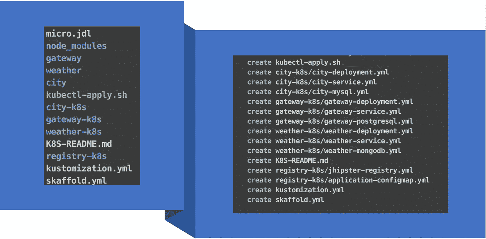
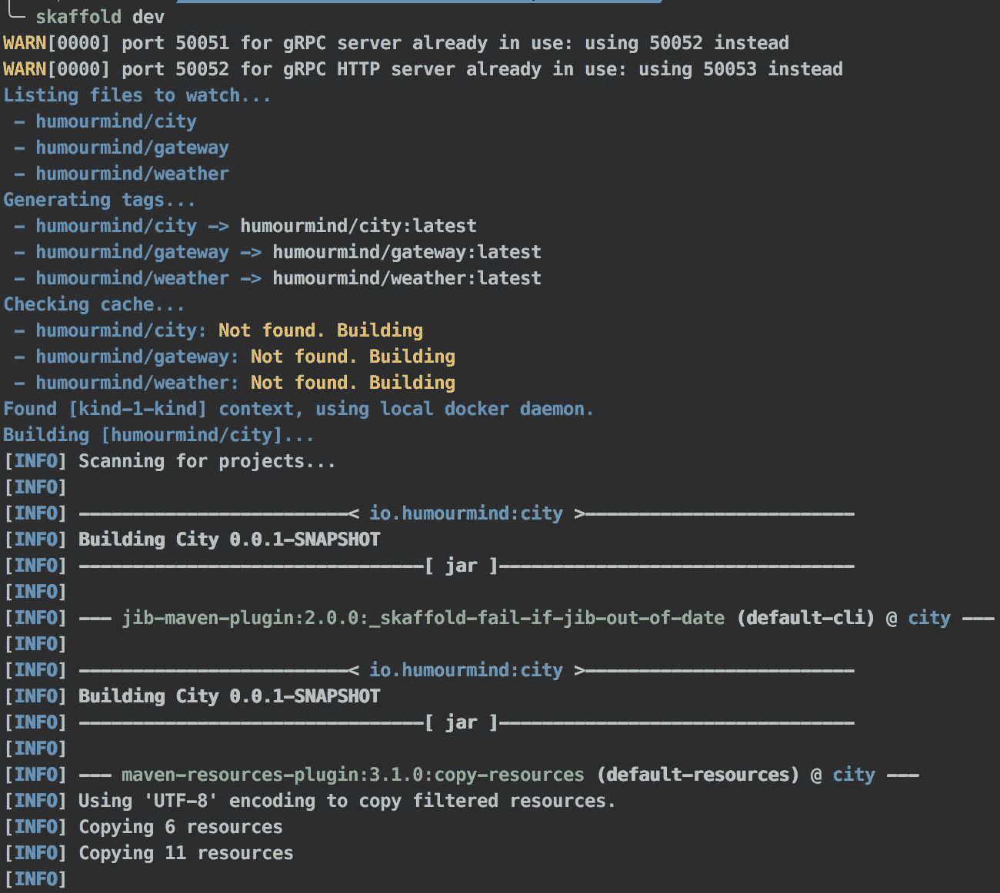
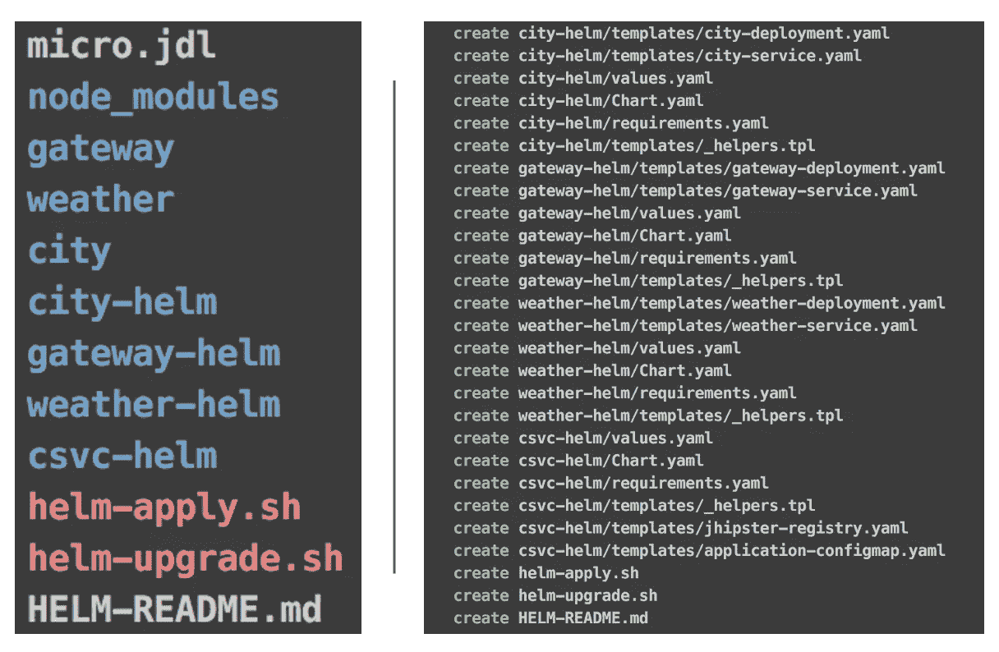
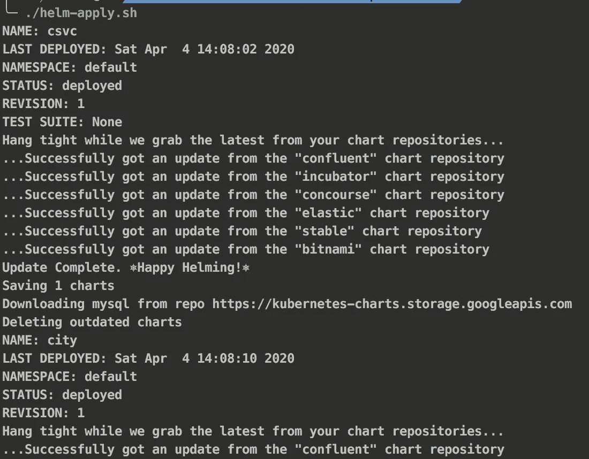
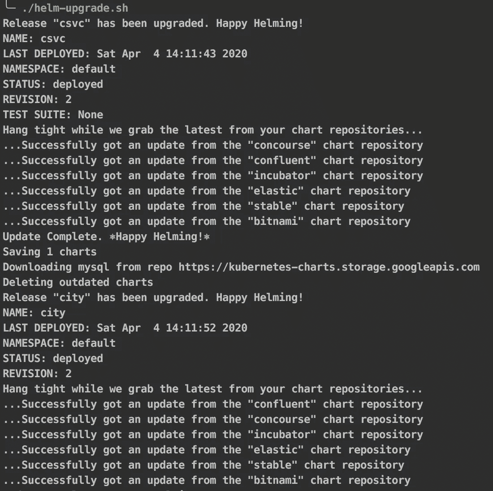
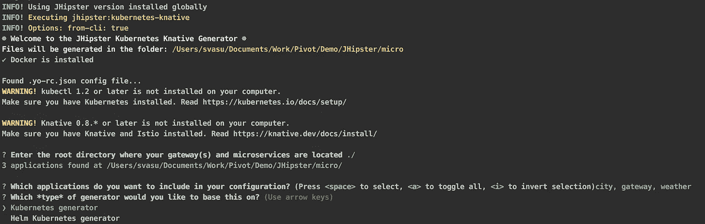
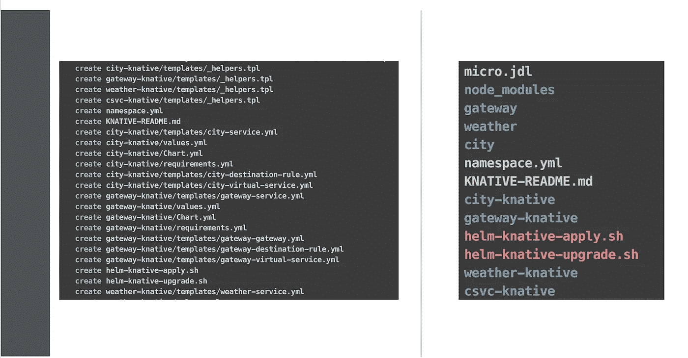

# 克鲁德本地人杰普斯特

> 原文：<https://medium.com/geekculture/kloud-native-jhipster-ba09b2ffbf63?source=collection_archive---------0----------------------->

## **杰普斯特♥弹簧靴♥ K8s**

JHipster 是一个开发人员友好的平台，用于引导、迭代、构建和部署基于云的本地 Spring Boot 服务。它还基于广泛使用的框架/库(如 Angular、React 等)为前端服务生成脚手架代码。它确实提供了与各种数据、日志和监控服务的集成接触点。


随着时间的推移，脚手架支持被添加到跨各种本机云和平台部署生成的服务中。开发人员热爱 JHipster，开发人员生产力是我们作为一个社区不断改进的核心价值之一。随着 Kubernetes 在企业不同角色中的知名度与日俱增，我们也增加了很多很酷的 k8s 友好特性。在这篇博客中，我们将关注各种 k8s 友好的生成器选项以及可供开发人员在私有云和公共云中快速迭代和测试任何开放的符合 k8s 的发行版的特性。

**结果:**

*   了解各种 K8s 发电机选项
*   利用 K8s 友好的工具包加快发布速度

**先决条件:**

*   jhipster cli 二进制文件在本地机器上

*注意，一旦使用 jhipster-cli 引导和构建了项目，我们将使用 k8s 生成器选项。K8s 是 JHipster 支持生成部署工件的目标平台之一。*

> ***波#1***

```
jhipster k8s | jhipster kubernetes
```

我们支持这个生成器选项已经有一段时间了。它提示您一系列问题，然后生成 k8s 清单和一个部署脚本，让您一次性部署服务。除了`kubectl create|apply`选项，我们最近增加了对使用流行的 k8s 工具包如`kustomize`和`skaffold`来扩展它的支持。

您现在可以选择部署生成的清单，



> 。/kubectl-apply.sh -f —使用标准的`*kubectl apply -f*`选项

和

> 。/kubectl-apply.sh -k —使用`*kustomization*`模板来保存更改

使用`skaffold`，现在您可以将您的工作目录转换为 CI/CD 源。当您处理源代码时，会不断地检测、构建和部署变更到平台上。开发人员只关注业务问题，而开发软件交付渠道被 skaffold 工具所拖累。

`skaffold dev`将您的工作目录转换为 CI/CD 源。如果开发人员在没有构建和部署开销的情况下不断迭代，这将是非常高效的。



skaffold dev

> ***波#2***

```
jhipster helm | jhipster kubernetes-helm
```

舵发电机的支持已经有一段时间了。k8s generator 很酷，但是我们所面临的挑战，甚至是我们今天在维护辅助服务清单方面所面临的问题。当您选择 Kafka、Elastic、Mongo 等服务时，我们面临着保持这些清单与上游兼容的问题。这是一项持续的维护开销，用于保持这些清单与上游同步。此外，大多数清单都非常简单，不建议用于生产。

我们现在有了舵发电机的解决方案。在引擎盖下，它为应用程序使用 k8s generator，但辅助服务的清单是从上游稳定的 helm 源拉入的。这样，您就有了企业级稳定的服务清单，可以放心地将其投入生产。



除了应用程序和服务清单之外，它还生成一个命令，准备执行初始安装的脚本`helm-apply.sh`

> helm-apply.sh -首次安装



helm-apply.sh

和`helm-upgrade.sh`用于随后的更新，因为您继续快速迭代和发展。

> helm-upgrade.sh -连续迭代



生成的脚本将支持 helm2+和 3+语义和语法。使用这个生成器的先决条件是在本地机器上有 helm CLI，如果您打算使用 helm2+，那么 tiller 应该部署在集群中。生成的服务清单在 2+上没有任何问题，在 3+上您可能会遇到一些问题，因为一些上游发行版还没有完全升级到 3+兼容性。

> ***第三波***

```
jhipster knative | jhipster kubernetes-knative
```

我们最近增加了对 knative 构造的支持。这仍然是实验性的。我们最近添加了它来为生成的应用程序生成 knative `serving.knative.dev`服务生命周期。使用这个生成器的先决条件是 istio，因为这个生成器为您的应用程序生成`istio`特定的虚拟服务和目的地规则相关的清单。今天它只支持`istio`，将来我们可能会增加对其他控制器的支持。这个发生器反过来利用`k8s`和`helm`。开发人员将被提示选择一个生成器，



jhipster knative

与其他生成器一样，如果您选择 Kubernetes 生成器，它确实通过`kubectl-knative-apply.sh`提供了一个推送部署，


knative-k8s

如果您选择`helm`生成器，它会为安装和更新生成脚本。



knative-helm

> **参考资料:
> 吉斯特** [https://www.jhipster.tech/](https://www.jhipster.tech/) **K8s 发电机** [https://www.jhipster.tech/kubernetes/](https://www.jhipster.tech/kubernetes/) **CLI:** [https://www.jhipster.tech/installation/](https://www.jhipster.tech/installation/)