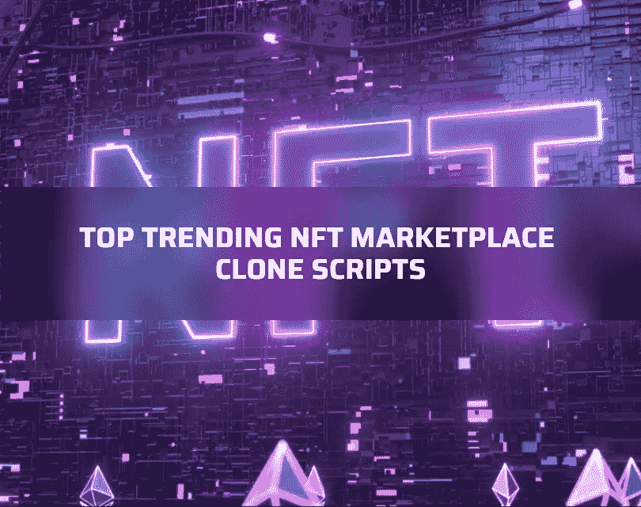

# 了解 2022 年 NFT 市场的顶级克隆脚本

> 原文：<https://medium.com/geekculture/know-about-top-nft-marketplace-clone-scripts-in-2022-b3e4777a7bab?source=collection_archive---------12----------------------->

NFT 是独特的数字收藏品，不可分割，不可互换。NFT 又名不可替代的令牌是目前加密领域数字革命的领导者。这是因为它在全球范围内的使用、突出性和关键特性。对 NFT 的狂热正在飙升，许多交易者对交易和铸造 NFT 表现出浓厚的兴趣，以获得有利可图的收入。

NFT 爱好者可以在通常被称为 NFT 市场的平台上买卖各种各样的 NFT。这种市场运行在不同的区块链，如以太坊，索拉纳，币安智能链，等等。这是一个创作者和艺术家可以将他们的数字收藏品转换成虚拟代币并以他们想要的价格出售的地方。

考虑到这些因素，许多初创公司/企业家表现出了在 NFT 市场开展业务并获取利润的兴趣。你有没有创建一个 NFT 市场并快速进入 NFT 世界的想法？？那么使用白色标签 NFT 市场克隆脚本是你的最佳选择。正如你所知道的，NFT 有很多交易非关税壁垒的市场。类似地，存在许多具有不同功能的 NFT 市场克隆脚本。

这篇文章提供了关于最好的白色标签 NFT 市场克隆脚本的信息，在开始你梦想的 NFT 市场业务之前，你必须知道这些信息。然而，在看到这个话题之前，我想给你一个小的概述…

Top NFT Marketplace Clone Scripts in 2022

# **什么是 NFT 市场克隆脚本？**

简而言之，我们可以说 NFT 市场的克隆脚本是一个经过多次测试的、随时可以部署的 NFT 市场软件。它帮助您建立一个功能齐全的 NFT 市场，类似于现有的市场。因此，它使您的用户能够以数字收藏品的形式购买、出售和竞标 NFT。这是一个可定制的 NFT 市场网站，采用先进的技术进行自由贸易。

它支持所有的趋势区块链网络，如以太坊，币安智能链，索拉纳，多边形，创和卡尔达诺。这些都是创建 NFT 市场的首选区块链。这种克隆脚本为创业公司和企业家提供了广泛的好处。诸如

1.  用户化
2.  即时部署
3.  快速进入 NFT 世界
4.  性价比高
5.  不需要专业技术知识
6.  产生高投资回报率
7.  提高品牌知名度

当您使用现成的 NFT 市场克隆脚本时，您可以获得所有这些额外的好处。这个脚本按照现有的 NFT 平台执行相同的操作来购买/销售各种域的 NFT。

最近，大多数加密初创公司选择 NFT 市场克隆软件，而不是从基础建立一个 NFT 市场。这是因为使用白标解决方案的上述好处。与从零开始开发相比，使用脚本从理想化到部署所需的成本是最小的。除此之外，它还开放了优化功能，因此您可以根据自己的业务需求修改整个市场。

因此，通过使用最佳 NFT 市场克隆脚本来启动 NFT 市场将帮助平台所有者以可承受的成本立即启动有利可图的 NFT 市场业务。

现在，你可能会对什么是 NFT 市场克隆脚本有一个清晰的轮廓，以及它如何积极影响那些愿意在 NFT 市场创业的创业者。所以，让我们进入最激动人心的话题…

# **顶级 NFT 市场克隆脚本**

加密市场充斥着大量的克隆软件，选择正确的软件是一个忙乱的过程。所以，如果你打算坚持用这种方法来发展你的 NFT 市场，那么最好了解一下顶级白色标签 NFT 市场克隆软件。为了选择正确的一个，我做了一些基础工作，并提出了一份清单，列出了在 NFT 市场创业的 **6 个令人兴奋的 NFT 市场克隆脚本**。

1.  [**OpenSea 克隆脚本**](https://www.coinsclone.com/opensea-clone-script/?utm_source=medium&utm_medium=geekculture&utm_campaign=NFTscripts)
2.  稀有克隆脚本
3.  超级罕见的克隆脚本
4.  基础克隆脚本
5.  金恩克隆脚本
6.  币安 NFT 市场克隆脚本

让我简单地描述一下这些杰出的克隆脚本解决方案及其关键特性，以便您清楚地理解，…

# **OpenSea 克隆脚本**

**Opensea** 是知名的全球**最大的 NFT 市场**基于活跃的用户基础、吸引人的用户界面和极高的效率。它被公认为安全可靠地交易各种非功能性金融工具的最佳市场。通过创建一个类似于 OpenSea 的不可替代的令牌市场，你可以获得巨大的收入，而且通过使用一个高级的 Opensea 克隆脚本，这是非常可能的。

OpenSea 克隆脚本是启动 NFT 市场业务的即时解决方案。这个克隆脚本帮助您开发一个功能丰富的市场，与现有的 OpenSea 平台 100%相似。该脚本中启用的特性和安全模块与 OpenSea 相同，因此您的用户可以在您的平台上交易 NFT 时获得最佳体验。

**OpenSea clone 软件的核心特性**

*   店面
*   购买和出价
*   过滤和搜索
*   多链支持
*   高级用户界面/UX
*   用户友好的管理门户
*   活动跟踪
*   多重加密钱包连接支持
*   行政利润管理及更多

# **稀有克隆脚本**

**Rarible** 是区块链地区一家历史悠久的 NFT 市场。这个平台在交易者中赢得了最好的名声，因为它为各种 NFT 交易提供了大量的选择，没有任何限制。这个市场是使用 BSC 网络建立的，自 2020 年以来一直在加密领域，拥有数百万活跃的 NFT 交易员。如果你想开发一个像 Rarible 这样的 NFT 市场，那么 Rarible 克隆脚本就是一把钥匙。

[**Rarible 克隆脚本**](https://www.coinsclone.com/rarible-clone-script/?utm_source=medium&utm_medium=geekculture&utm_campaign=NFTscripts) 是预先设计的 NFT 市场软件，拥有 Rarible 的所有基本属性和插件。通过使用可定制的克隆脚本，人们可以创建和部署一个强大的 NFT 市场，如具有惊人功能的 Rarible。和 Rarible 一样，这个克隆脚本也可以让你的用户连接非保管钱包，并允许以一种无故障的方式进行交易。

**稀有克隆软件的主要特性**

*   铸造 NFT
*   多区块链支持
*   安全的钱包连接
*   各种文件格式支持
*   收入管理
*   多语言支持
*   臭虫奖励计划
*   推荐系统和更多

# **超稀有克隆脚本**

Superrare 是在以太坊上运行的 Opensea 旁边的另一个著名和最大的 NFT 市场。在这里，用户可以即时购买、出售、出价和铸造各种不可替代的令牌，如数字艺术、gif、3D 图像、视频、稀有收藏品、音乐等。这个平台是专门为数字创作者推出的，他们可以轻松地制作 NFT。

[**超级罕见的克隆脚本**](https://www.coinsclone.com/superrare-clone-script/?utm_source=medium&utm_medium=geekculture&utm_campaign=NFTscripts) 是预先设计的 NFT 市场解决方案，允许初创公司立即创建一个超级 NFT 市场。这个克隆脚本是在以太坊网络之上设计和开发的。高级超级稀有克隆脚本带有几个可定制的选项，所以你可以按照你的意愿从上到下个性化 NFT 市场。这个克隆脚本带有下列属性集。

*   收集数字艺术
*   关注顶级艺术家
*   多钱包连接支持
*   铸造并列出 NFT
*   策展画廊
*   出价购买
*   管理利润设置及更多

# **基金会克隆剧本**

**Foundation** 是一个理想的 NFT 市场，它有一个简单的用户界面，在交易非功能性交易时反应灵敏。它于 2021 年初首次推出，售出了价值超过 1 亿美元的不可替代代币。像其他市场一样，基金会平台也在以太坊区块链的帮助下运作。此外，这个基础就是 NFT 世界中优秀的赚钱的 NFT 商业模式。

有可能创建一个 100%类似于基金会的 NFT 市场吗？是的，当你有一个无误的 [**基础克隆脚本**](https://www.coinsclone.com/foundation-clone-script/?utm_source=medium&utm_medium=geekculture&utm_campaign=NFTscripts) 时，这是可能的。这个克隆脚本可以让你在短时间内启动一个繁荣的 NFT 市场业务。它提供了长期运营 NFT 市场所需的所有功能和插件。

**基础克隆软件的主要特性**

*   不同的资产类别
*   无限资产列表
*   分散架构
*   直观的管理面板
*   出价购买
*   多钱包连接支持
*   推荐计划
*   多语言支持

# **金恩克隆剧本**

金恩是区块链地区著名的繁荣的 NFT 市场。它有一个用户友好的界面和所有最新的功能，使金恩成为最好的 NFT 市场。这个平台有一些独特的功能，吸引了许多 NFT 商人。它建立在以太网上，但也支持多个区块链系统。

[**金恩克隆脚本**](https://www.coinsclone.com/enjin-clone-script/?utm_source=medium&utm_medium=geekculture&utm_campaign=NFTscripts) 是市场上流行的 NFT 市场克隆软件之一。这是由于它的基本津贴和非凡的功能。无漏洞的金恩克隆脚本捆绑了尖端的技术功能和防篡改安全模块，类似于金恩。您甚至可以根据您的业务需求定制功能、附加模块和其他方面。金恩克隆脚本经济高效、安全且响应速度快。

**金恩克隆软件的核心特性**

*   提示搜索结果
*   QR 扫描
*   创建者评级
*   特许使用金
*   可靠的安全性
*   多语言
*   加盟计划
*   多种支付方式等等

# **币安 NFT 市场克隆脚本**

许多人可能已经知道了币安——就交易量而言，它是世界上最受欢迎的加密交易所。他们有一个独特的 NFT 市场，名为币安 NFT 市场，以一种无争议的方式安全地交易所有类型的非功能性交易。这个 NFT 市场在币安的家乡区块链运作——BSC 网络。因此，它在全球拥有庞大的用户群，包括多名创作者、收藏家、投资者和交易商。

[**币安 NFT 市场克隆脚本**](https://www.coinsclone.com/binance-nft-marketplace-clone-script/?utm_source=medium&utm_medium=geekculture&utm_campaign=NFTscripts) 是一款预制的 NFT 市场软件，自带所有前沿功能和插件。通过使用这个克隆脚本，您可以在币安智能链上创建和部署一个惊人的 NFT 市场。如果您想在 BSC 网络上开发一个安全、卓越的 NFT 市场，那么使用币安 NFT 市场克隆脚本是您的 NFT 业务的最佳解决方案。

**币安 NFT 市场软件的可取功能**

*   虚拟画廊
*   过滤和搜索
*   多加密钱包连接支持
*   多区块链支持
*   店面
*   高度安全的管理面板
*   活动跟踪
*   行政利润管理
*   多语言协助及更多。

# **包装**

上面提到的是全球加密市场中的趋势和最畅销的 NFT 市场克隆脚本。你可以选择这些克隆脚本中的任何一个来顺利开始你的 NFT 市场业务。那么，创业公司从哪里可以获得所有这些克隆脚本呢？？您从密码领域的正版白标 [**NFT 市场发展公司**](https://www.coinsclone.com/contact-us/?utm_source=medium&utm_medium=geekculture&utm_campaign=NFTscripts) 获得上述所有克隆脚本。通过与他们联系，你可以根据你的商业理念，以合理的成本推出一个功能丰富的 NFT 市场。