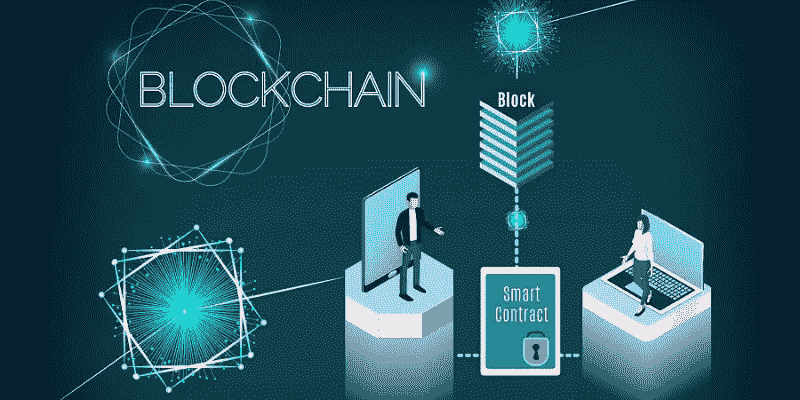
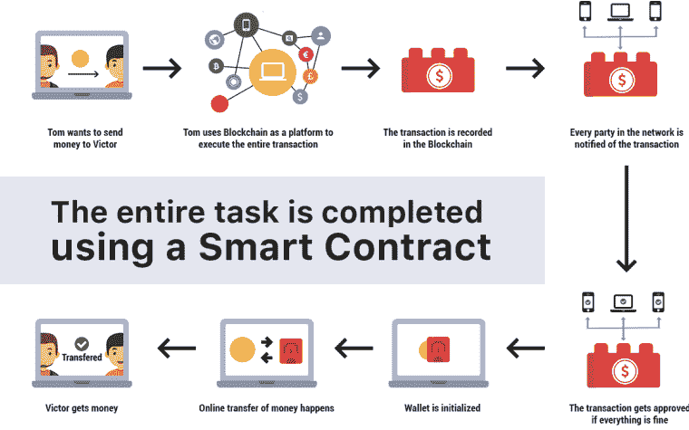
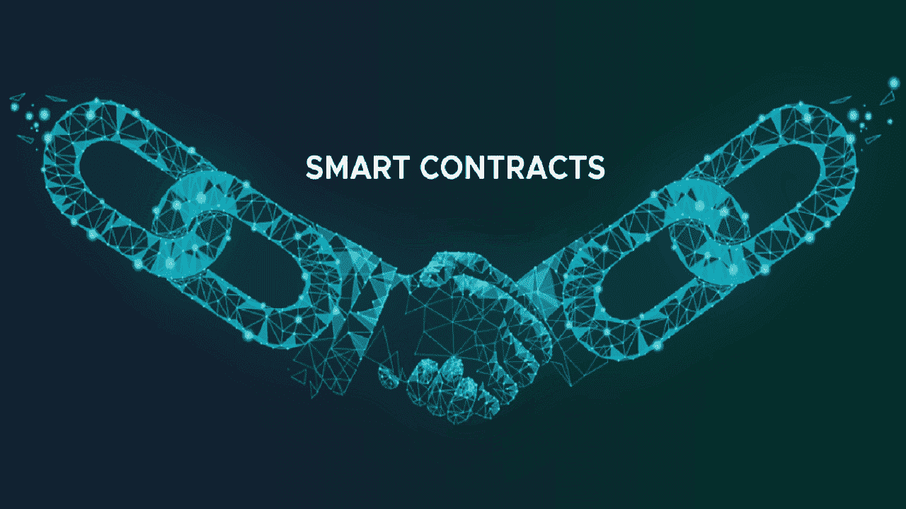

# 了解区块链智能合约的所有信息

> 原文：<https://medium.com/geekculture/know-all-about-blockchain-smart-contracts-e3e82f91dfa8?source=collection_archive---------40----------------------->

如今，区块链智能合约是一个热门话题；大家只是想知道是什么。日常流程正在数字化，这就是为什么必须找到一种途径来制定可靠的数字化业务协议。[智能合同](https://www.valuecoders.com/hire-developers/hire-blockchain-developers?utm_source=medium-blockchain-smart&utm_medium=d7&utm_campaign=medium-blockchain-smart)是恢复通常复杂、缓慢且昂贵的传统合同的绝佳选择。

所以，我们再进一步，先了解一下什么是区块链智能合约……

# 关于区块链智能合约你应该知道的基本事情

Image Source: Research AIMultiple

智能合同是一种自我执行的义务，买卖双方的合同条款被直接写入代码序列。

进入区块链智能合约后，聚会首先需要适应并接受协议条款，然后才能在区块链内缓存的智能合约代码中(部分或全部)纪念这些条款。

智能合同能够在没有第三方义务的情况下产生可信的交易。这是一个分散的路径，这表明中介在确认企业是不必要的。

当提议的条款和条件匹配时，区块链智能合同会根据计划的法律自动执行。

**此外；智能合同包括许多关键部分:**

**签署者:**两个或更多的集会，这些集会利用智能合同并通过他们的数字签名给出关于条款的最终‘前进’。

**Subject:** 以有限的方式，用于智能合约。

**具体术语:**这些术语以精确的数学术语定义，并以适合区块链智能合约的编程语言执行。

如果了解了智能合约的基本知识，还想利用区块链智能合约，那么只需利用 [**区块链开发服务**](https://www.valuecoders.com/blockchain-development-company?utm_source=medium-blockchain-smart&utm_medium=d7&utm_campaign=medium-blockchain-smart) **。这将有助于您的企业有效利用信息技术。**

# 区块链和智能合约

智能合同利用[区块链技术](https://emma347.medium.com/what-is-blockchain-how-is-blockchain-technology-going-to-help-e0593a60a046)来验证、批准、理解和执行各方之间商定的条款。

区块链上的智能合同承认在未知方之间执行的交易和协议，而没有中央实体、外部执法机构或任何法律系统的参与。此外，使用区块链技术完成的交易是透明的，不可更改的，可追溯的。

区块链绝对是智能合约的最佳环境，因为缓存的所有数据都是不可变的，并且受到保护。此外，智能合同数据是加密的，并保存在一个分类账上，这意味着输入块中的知识永远不会丢失、更改或删除。

# 区块链智能合约可以在哪里就业？

各种行业都可以使用智能合同来执行多种功能，例如法规遵从性、跨境金融交易、合同可执行性、信用强制执行、财产购买、法律程序、金融服务、房屋购买、供应管理、文档管理等等。区块链智能合约可用于:

*   保险
*   卫生保健
*   供应链管理
*   房地产
*   电子商务
*   零售
*   银行和金融

# 区块链智能合约的优势

Image Source: Kustard

智能合同比普通合同有几个好处。这些合同比传统的合同法更加有效和可靠，并且由于所有交易都被记录和验证，因此也提供了更好的安全性。让我们更进一步，了解区块链智能合约的好处。

# 准确性和透明度

编码的条款对所有相关方都是完全可见和公开的，因此一旦智能合同设定，就没有必要讨论它们。这些设施可以使交易透明，并可能排除监督和错误的可能性。最终降低监控成本和风险。

# 更高的效率和灵活性

智能合同可以提高商业系统执行的效率和速度。智能合同是自动化的，因此只需要更少的时间和少量的文书工作，甚至不需要手动更正文档中的错误。此外，如果需要更改，那么可以在短时间内进行在线更改，而无需律师的参与。

# 安全性

智能合同提供了更好的安全性，因为所有的行动都被记录和验证。区块链交易记录是编码的，这使得它们非常难以篡改。此外，安全功能还可以整合到智能合同中，以便在发生任何事故、数据丢失事件时自动创建备份和副本。

# 信任

智能合同按照规划的法律自动执行交易，并且这些交易的加密记录与合作伙伴共享。因此，合同中提到的信息和条款是直截了当的。此外，各方的特定验证确保智能合同永远不会被破坏。

# 您在采用智能合同时可能会遇到的挑战

好吧，如果一些新的，创造性的和有利可图的东西对你的生意有好处，那么这并不意味着它不会有任何缺点，因为任何事情都不可能在所有方面都是完美的。同样，智能合同的采用也会带来如下所述的一些挑战。

**人为错误:**纸质合同可以很容易地阅读和更正，但智能联系人是由编码员编写的，因此可能有很大几率出现编码错误，并且可能需要时间来更正。

**机密性、安全性和隐私:**智能合同分散在所有网络节点上，因此很可能存在隐私问题，尤其是当当事人的账户与已知实体相关联时。

**缺乏工程经验:**为了构建区块链智能合约，需要智能的工作和经验，只有密码学专家才能处理。因此，缺乏工程技能会破坏明智的合同。克服这个挑战，利用区块链软件开发服务，或者从最好的区块链 app 开发公司聘请区块链程序员。

法律和监管挑战:智能合同缺乏明确的法律地位，因为没有正式的政府法律适用于它们。

# 最佳区块链智能合约平台

Image Source: Research — AIMultiple

智能合同平台根据技术进行细分，最终用户是指行业类型(银行、电子商务、政府、供应链、医疗保健、房地产、保险等)。)，以及地区(北美、欧洲、亚洲等。).

智能合约平台在编程语言、区块链同意、维护成本、区块链安全性、交易验证速度等方面各不相同。考虑到这些至关重要的参数，我已经提到了你可以盲目信任的 6 大区块链智能合约平台名称。

1.  以太坊
2.  卡尔达诺
3.  真实性
4.  Qtum
5.  波
6.  主要的

# 包扎

智能合同实际上可以改善不同行业达成协议的方式。然而，它可能需要一些时间，需要更多的开发工作，才能达到其主流战略。

一个没有经验的人将无法实施智能合同技术，因为它需要在某一时间进行许多改变和试验。在那个时刻，只有熟练的区块链开发者才能执行这样的技术和创新任务，所以从印度顶级的 [**区块链开发公司**](https://www.valuecoders.com/blockchain-development-company?utm_source=medium-blockchain-smart&utm_medium=d7&utm_campaign=medium-blockchain-smart) 聘请区块链开发者 将对你有利。