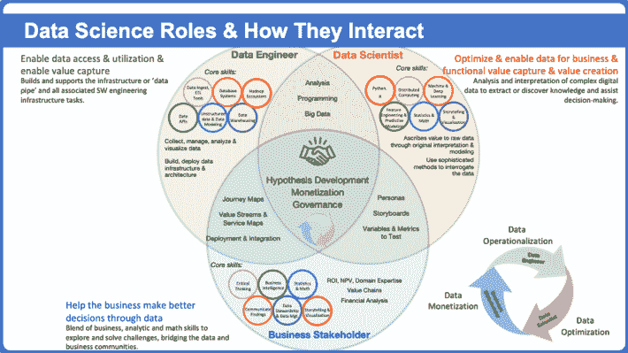

# 了解数据科学专业人员如何为企业增加价值:概述

> 原文：<https://medium.com/geekculture/know-how-data-science-professionals-add-value-to-the-business-an-overview-2a028d210b21?source=collection_archive---------20----------------------->

过去几十年来，数据科学已经成为一个炒作的泡沫，因为它是一个数据密集型的世界！通俗地说，人类和机器产生的数据都是海量的，超出了人脑的能力范围，无法吸收、解释和引导相关信息向正确的方向发展，如果我们在这里谈论的是业务和工作空间的话。

数据科学已经成为每项业务决策和业务流程的核心。如今，没有数据，任何企业都无法生存。数据科学是科学方法、算法、流程和相关见解的结合，用于确保企业成功决策。

从最广泛的意义上来说，数据科学是从大量数据中筛选有意义的信息的过程，公司可以使用这些信息来实现其未来的目标。数据科学有助于企业以更强大的方式与客户打交道，并允许企业以独特的方式与客户联系，帮助他们穿透当今残酷的营销战。

> 数据科学是“新兴技术”，专家发现，目前有超过 60 亿台设备连接到互联网，这意味着人类和机器每天都会产生超过 250 万万亿字节的数据。据预测，到 2022 年，将有数百万人加入该名单，这表明每天约有 3000 万兆兆兆字节的数据。

从旅游到医疗保健和教育，数据科学无处不在，推动业务流程充分发挥潜力。但是，管理数据科学是一项艰巨的任务，计算机科学的这一复杂而广泛的领域不是孤狼式的工作，它需要一个由高度专业的技术专家、数据科学家、信息和机器学习工程师组成的团队，他们协同工作，以提高企业的运营速度。

# **数据科学专业人员的角色**

将数据库转化为可行见解的任务由数据科学专业人员团队执行，他们可以帮助组织实现其业务目标。这就是为什么今天每个企业都希望雇佣数据科学专业人员。 [**数据科学专业人员**](https://www.usdsi.org/) **s** 的团队与客户密切合作，以清晰了解他们的业务结构，并确定如何帮助他们实现这些目标。

数据科学专业人员负责流程的不同部分，例如-

*   创建数据建模流程
*   设计算法
*   预测模型来过滤业务数据

# **数据专业人员的角色和职责**

每个项目都是不同的，因为每个客户都有自己的目标和想法，需要不同的方法来实现他们的期望。收集和分析数据的流程如下-

*   从发现过程开始，了解客户的业务结构
*   收集数据
*   数据的处理和清理
*   集成和存储数据
*   过滤一个或多个潜在的算法和模型
*   应用数据科学技术，如统计建模、机器学习和人工智能
*   测量和改进结果
*   向利益相关者交付最终结果
*   根据反馈进行必要的修改
*   用新方法解决新问题

# **数据科学专业人员的常见职称**

> **数据科学家**

收集、分析和解释大量数据以执行定制分析的人员。 [**数据科学家**](https://www.usdsi.org/data-science-certifications/certified-lead-data-scientist) 利用大量数据做出推论，开发假设，并了解当前的市场趋势。

> **机器学习工程师**

机器学习工程是人工智能的核心，在这里你将构建程序和算法，让机器在没有监督的情况下采取行动。你将制造出能够自主学习的人类刺激系统和软件，就像人类通过观察、试验和实践来学习一样。

> **研究科学家**

研究科学家是人工智能工程中非常复杂的一个方面，它精通各种人工智能学科，如计算统计学、机器学习和应用数学。研究科学家是整个原型开发过程中的主要螺丝钉。要成为一名研究科学家，你应该拥有计算机科学或其他相关技术领域的博士学位。

> **数据分析师**

Data analyst 充当企业的看门人，使用数据分析工具从组织的原始数据中提取有意义的结果，从而检查、清理、转换信息并生成见解。

# **结论**

成为数据科学专业人士听起来可能是一个有趣的职业选择。但是幻想这个职位带来的额外津贴是一回事，每天证明这个工作角色是正确的又是另一回事。公司正在打造理解和培养他们商业目标的最佳专业团队。

因此，你必须提高自己的技能，打造一个由数据科学专业人士组成的强大核心团队。你需要掌握最新的市场趋势和技术。这可以通过接受 [**数据科学认证**](https://www.usdsi.org/data-science-certifications) 和培训计划来实现，培训计划应涵盖技术和软技能理解**数据科学家技能**以在该领域脱颖而出。你需要加快速度。

# 别忘了给我们你的👏！

