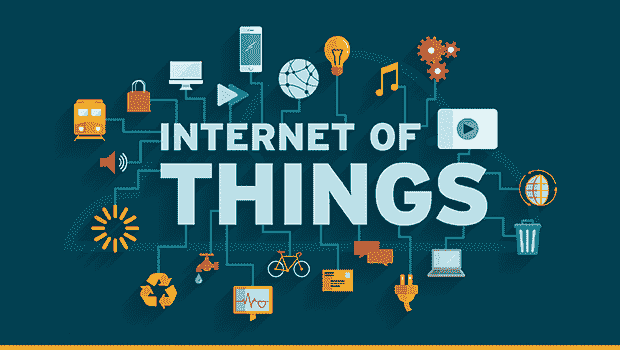
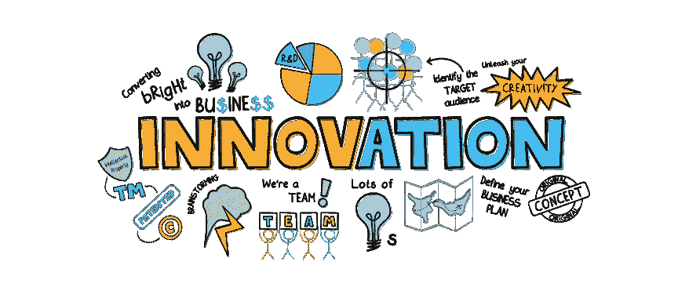

# 了解物联网的力量如何在 2022 年惠及企业

> 原文：<https://medium.com/geekculture/know-how-the-power-of-iot-benefiting-businesses-in-2022-52195a19f781?source=collection_archive---------20----------------------->

Image Source: The Enterprisers Project

世界变化比以往任何时候都快，包括商业世界。在当今高度互联的地球村中，企业必须在一个公平的环境中与全球各地的公司竞争。

如果你想让你的企业在全球化时代蓬勃发展，那么你必须跳出框框思考。实现这一点的一种方法是将物联网纳入您的营销战略。

现在，您一定在思考物联网如何为企业带来好处？很少有与物联网技术相关的见解能帮你知道答案。所以让我们继续前进…

到 **2025** ，物联网解决方案可以在**产生**4-11 万亿**美元的经济价值**。([数据保护](https://dataprot.net/statistics/iot-statistics/))

**94%的厂商** **同意**实施**物联网的好处大于风险**。(数据保护)

如果你改变了想法，想在业务流程中引入物联网，可以想到从一家优秀的[**物联网手机 app 开发公司**](https://www.valuecoders.com/iot-development-company?utm_source=mediumangn12&utm_id=powerofiot) 聘请专业人士。

现在，让我们进一步了解在您的企业中引入物联网的主要优势。

# 物联网如何惠及企业的 15 大优势

使用物联网技术的好处是巨大的。让我们来看看您可以从物联网业务中获得的主要优势:

1.  **提高效率**

当您将设备和机器连接到互联网时，收集和分析数据变得更加容易。这可以帮助你更好地决定如何更有效地经营你的企业。

例如，您可以使用生产线上传感器的数据来优化制造过程。

**2。提高安全性**

借助物联网，企业可以更好地了解其安全风险。您可以使用基于物联网的解决方案来改善您的安全状况，保护您的数据免受网络威胁。

此外，您可以使用物联网技术来提高工作场所的安全性。例如，在制造业或工厂中，您可以使用传感器来检测有害气体或监控交通流量。

**3。提高客户参与度**

物联网可以帮助您为客户创造更加个性化的体验。您可以使用从物联网设备收集的数据来了解客户的行为和偏好。

这些知识可以帮助你设计吸引目标市场的产品和服务。此外，您还可以使用物联网技术来改善客户服务互动。

**4。降低成本**

Image Source: Indifi

物联网可以帮助企业降低成本。您可以使用物联网设备来监控设备并防止停机，从而节省昂贵的维修费用。

您还可以通过使用支持无线连接的智能家电来省钱。这些电器可以远程控制，这意味着你不必浪费能源加热或冷却一个空房子。

**4。提高产品质量**

物联网可以帮助企业提高产品质量。例如，您可以使用传感器来检测产品中的缺陷，并防止它们被运送给客户。

您还可以使用从物联网设备收集的数据来创建符合客户要求的定制产品。

**5。更好的决策**

物联网可以帮助您做出更好的决策，尤其是在您的企业面临高度不确定性和风险的情况下。

例如，自动驾驶汽车上的传感器可以实时收集有关道路和天气状况的信息，并提高司机和行人的安全性。

此外，物联网设备可以帮助您实时跟踪库存，并就如何分配资源做出更好的决策。

**6。提高生产率**

物联网可以帮助企业提高生产力。例如，您可以使用传感器来检测机器何时需要维护，并相应地安排维修。

您还可以使用从物联网设备收集的数据来优化工作流程和改善任务管理。

**7。增强的客户体验**

借助物联网，企业可以为客户提供更好的整体体验。您可以使用从物联网设备收集的数据来了解客户的行为和偏好。

这些知识可以帮助你设计吸引目标市场的产品和服务。例如，健身行业的企业可以使用从可穿戴活动追踪器收集的数据来为个人客户开发定制的健康计划。

**8。提高运营可见性**

物联网技术使企业能够实时监控他们的运营。这使得企业能够快速检测和诊断问题，从而减少停机时间并提高效率。

此外，您还可以使用从物联网设备收集的数据来了解您的业务在一段时间内的表现。这些信息可以帮助您在资源分配方面做出更好的战略决策。

**9。更大的创新潜力**

物联网为企业提供了更具创新性的机会。例如，您可以使用从物联网设备收集的数据来创建符合客户要求的定制产品。

这些知识可以帮助你设计出比竞争对手更能吸引目标市场的产品和服务。

此外，通过移动应用或可穿戴技术收集客户与你的企业互动的实时信息，可以让企业设计更好的营销活动。

10。平稳运行

物联网可以帮助企业实现平稳运营。您可以使用从物联网设备收集的数据来了解客户行为和偏好，这使您能够设计出比竞争对手更能吸引目标市场的产品和服务。

**11。更高的透明度**

物联网可以帮助企业提高透明度。通过向客户提供从物联网设备收集的数据的访问权限，您允许他们查看他们的个人数据是如何被使用的。

这在客户和企业之间建立了信任，并鼓励客户主动分享更多信息。

**12。无缝集成**

物联网提供了各种技术的无缝集成，允许企业使用各种设备来收集数据。这为企业选择适合其需求的技术提供了更多的灵活性和选择。

为了综合利用物联网技术，您可以与在其中一家顶级的 [**物联网 app 开发公司**](https://www.valuecoders.com/blog/technology-and-apps/top-10-iot-app-development-companies-to-build-enterprise-grade-software/?utm_source=mediumangn12&utm_id=powerofiot) 工作的专业人士取得联系。

**13。打击假冒伪劣**

物联网可以通过提供对制造流程的更深入了解来帮助企业打击假冒行为。

例如，产品上的传感器可以实时收集关于其性能的数据，并提供信息，使制造商能够在产品交付给客户之前识别出有缺陷的产品。

您还可以将这些数据用于旨在从产品生命周期中消除缺陷的过程改进计划。

**14。更好的资产利用率**

物联网可以帮助企业更好地利用他们的资产。例如，设备和产品上支持物联网的传感器可以收集关于它们如何被实时使用的数据。

这些信息使您能够相应地调整您的流程或产品设计，以便在资产的整个生命周期中更有效地投入使用。

# 包扎

现在，我们都知道物联网是一项强大的技术，可用于提高企业的效率、安全性和安全性。

此外，它还有可能通过让客户更深入地了解您组织的幕后活动来提高客户参与度。有了这些好处，就不难理解为什么企业会投资这项技术了——但是如何开始呢？

如果你需要帮助，想知道从哪里开始实施这项新技术，或者想知道如何最好地利用它来满足你的特定公司需求， [**聘请物联网开发人员**](https://www.valuecoders.com/hire-developers/hire-iot-developers?utm_source=Ang_N12&utm_id=mediumiot) 在最好的 [**物联网开发公司**](https://www.valuecoders.com/iot-development-company) 工作。