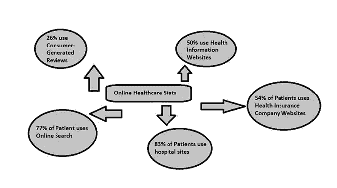
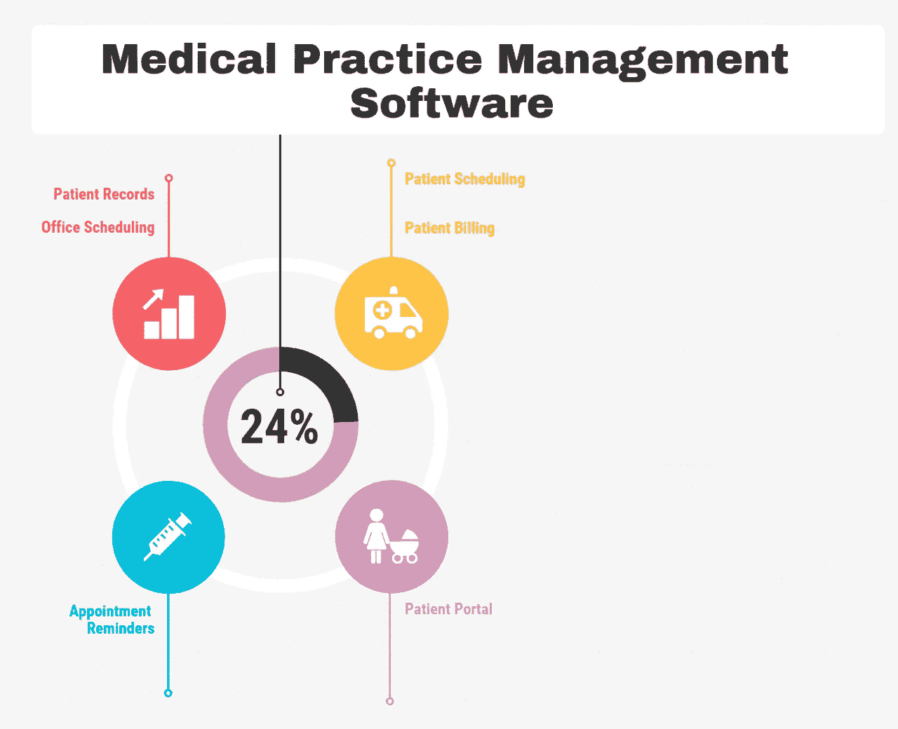
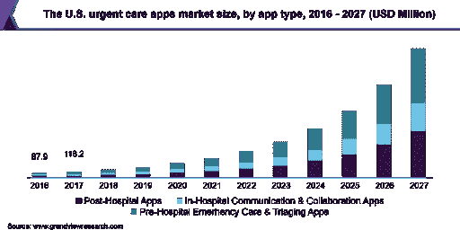
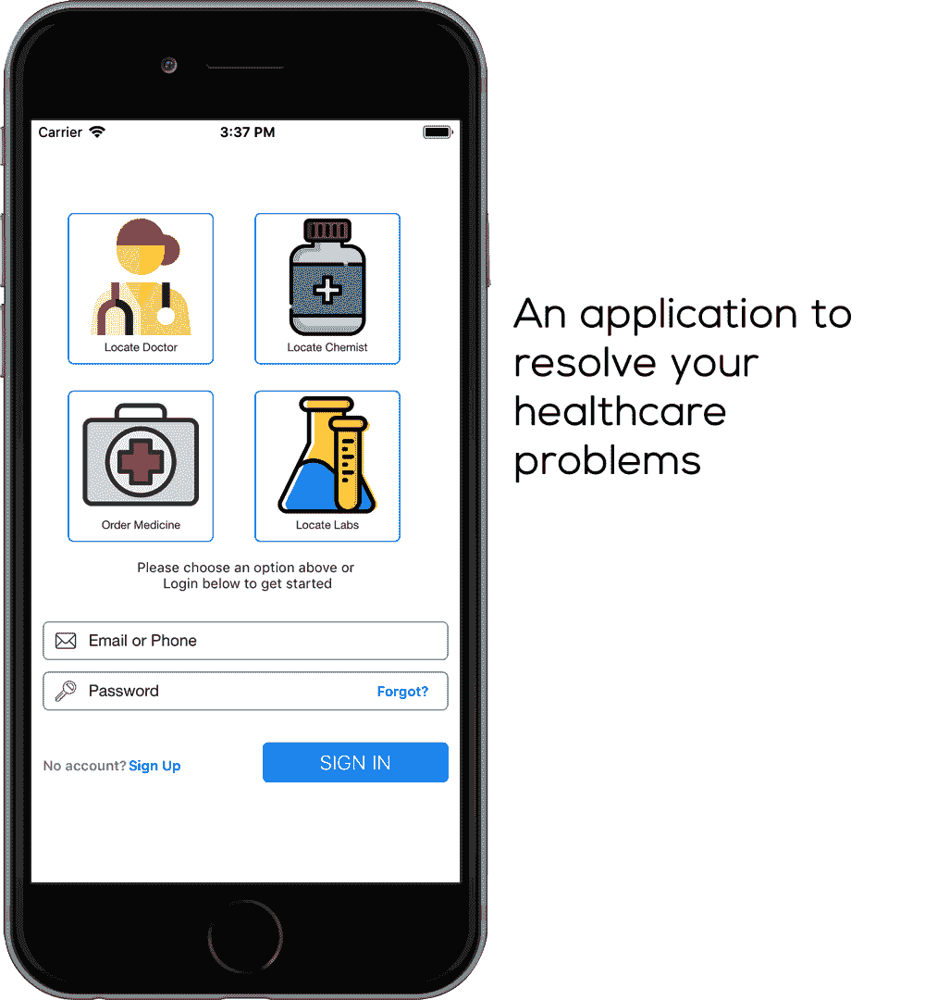
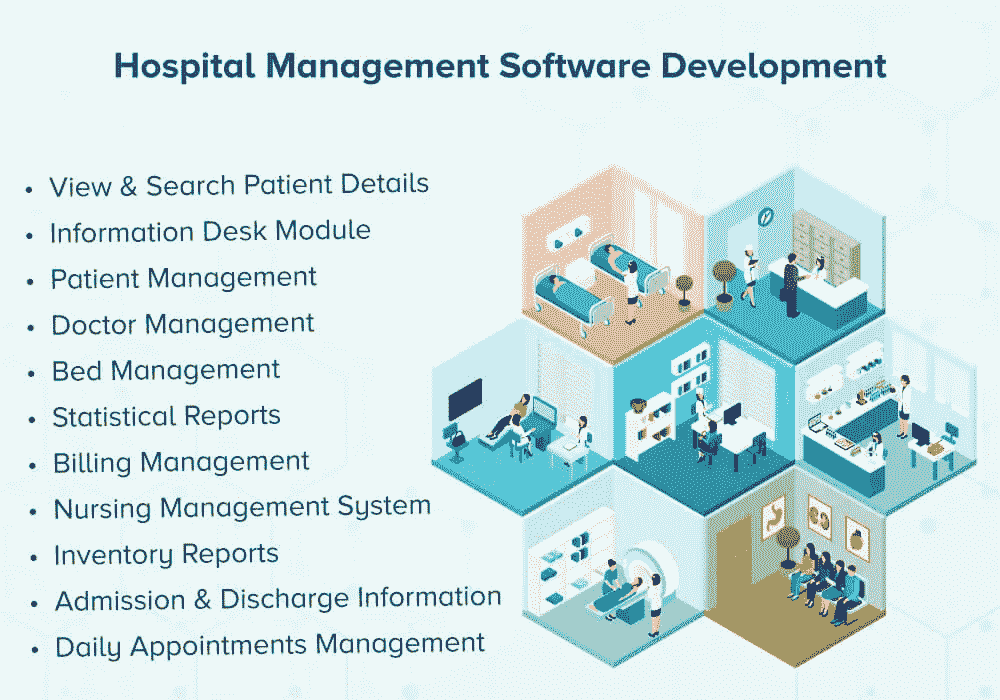

# 了解传统和定制医疗保健软件开发的区别

> 原文：<https://medium.com/geekculture/know-the-difference-between-traditional-custom-healthcare-software-development-5d5ff3fc9f83?source=collection_archive---------38----------------------->

如今，技术已经进入了几乎每一个商业领域。企业正在拥抱技术及其进步。现在，我们生活在一个竞争激烈的世界里，技术提供了急需的优势。它重塑了整个运作。

没有哪个行业不受科技影响，医疗保健行业也不例外。该行业很快意识到技术的重要性，并相应地调整技术以促进运营。

医疗保健行业使用技术不仅是为了减少工作量，也是为了提高绩效。如今，医疗保健应用程序开发已成为重要的解决方案之一。

根据一项软件外包调查，到 2025 年(T5)，这个市场将以 5.8%的 T2 CAGR 增长到 T4 的 193 亿美元。不出所料，这一细分市场非常庞大，占据了接近 31%的重要市场份额。

此外，从 DMN 3 中，我收集了一些关于在线医疗系统的发人深省的统计数据，这些数据表明:

*   如今，83%的患者使用医院网站。
*   77%的患者在线预约医疗
*   50%的患者使用健康信息网站。
*   77%的患者在预约前会先浏览谷歌、必应等搜索引擎

有了这些事实和数据，你可以很快衡量技术给医疗保健行业带来的影响，医疗保健软件开发也不例外。

但是你知道吗？开发定制的医疗保健软件不同于传统的医疗保健软件开发过程。为了创建有效的软件解决方案，您需要深入的分析、知识和技术实现。医疗保健应用程序开发的需求与日俱增。

这个博客将让你更深入地了解传统的和有效的医疗保健软件开发之间的区别。此外，您将会看到在当前时代，它是如何加快优质高效的医疗保健软件的发展步伐的。许多行业都希望 [**雇佣应用开发者**](https://www.pixelcrayons.com/hire-app-developers) 来获得高质量的应用，以满足持续的需求。

那么，我们开始吧。

# 什么是传统软件开发？

传统的软件开发是开发简单软件的过程。但这一过程并不涉及先进技术的整合。它只提供简单的解决方案，而不是动态的解决方案。对于初学者来说是极好的。

# 什么是定制医疗保健软件解决方案？

定制医疗保健软件解决方案涉及与所有先进技术保持一致的动态解决方案的开发。在印度医疗保健 [**移动应用程序开发公司**](https://www.pixelcrayons.com/mobile-app-development/) 的帮助下，医疗保健行业迅速采用技术变革。

当今有效的医疗保健软件使得医疗保健行业为患者提供高质量的护理成为可能。根据一份报告，**医疗保健软件**的**市值到 **2023** 可达 299 亿美元**，从 2018 年起 **CAGR 为 7.4%** 。

医疗保健和 IT 系统的集成为向患者提供强大的治疗开辟了道路。它实现了各种流程的自动化。通常，定制医疗保健软件有以下类型:

## 1.医疗实践管理软件

调查报告显示**医疗执业管理软件(MPMS)市场在 2021 年将达到 CAGR 的 8%以上**。十年间，即从 2013 年到 2023 年，全球实践管理软件市场可以以 9.7%的 **CAGR 增长。**

MPMS 帮助医疗专业人员跟踪患者信息和支付细节。这些详细信息以电子方式存储，有助于患者健康监控。

有了它，专业人员可以轻松地访问患者的数据，并帮助他们安全地保存他们的处方。它刺激了医疗保健软件开发的需求。

## 2.急救应用程序

紧急护理应用程序帮助患者跟踪他们的健康状况，并知道他们何时需要紧急医生咨询。该应用程序还允许患者在紧急情况下跳过等待，直接咨询医生。

这些应用程序提供实时视频会话，帮助患者与医生联系并分享他们的详细信息。它使医疗保健服务全天候可用，不受地点限制。

根据一项调查，到 2023 年，紧急护理应用可以创造约**25.151 亿美元的业务**收入**。从 2018 年到 2023 年，中国的 CAGR 增长率将达到 41.3%。**

## 3.电子健康记录软件

电子健康记录软件(EHR)包含详细的患者信息，包括病史、人口统计、实验室结果、过敏等。

根据一项调查，到 2024 年，全球 **EHR 市场的总增长可能达到约 400 亿美元。该软件提供了更好、更有效的数据管理。它降低了额外的纸张成本，并改善了患者护理。**

## 4.电子处方软件

该软件方便患者直接与在线药品共享他们的处方。根据 Statista 的数据，2017 年 77%的药物都是电子处方。从 2018 年到 2023 年，全球电子处方市场可以**以大约 19%的 CAGR 增长。据估计，到 2022 年，这个数字将超过 150 亿美元。**

观看下面的视频，了解电子处方软件是如何工作的。

这些处方比硬拷贝更精确，更容易理解。这也有助于提供更好的反馈。它让医疗专家可以随时查看患者的详细信息，从而有助于改善对患者的护理。

## 5.医院管理软件

医院管理软件控制着医院的行政管理。它处理从患者的详细信息、账单详细信息到医务人员的详细信息和账单详细信息的所有内容。

该软件极大地有助于提高效率。它不仅减少了工作量，还允许医疗专业人员将更多的时间用于患者护理。

根据透明市场研究公司的报告，2018 年至 2026 年间，全球**医院管理软件市场**将以 12.0%的 CAGR**增长。**

# 最后的想法

Covid 疫情让我们意识到，没有什么比健康更重要，我们必须改善我们的医疗保健系统。如果我们都在医院和医疗机构的福利部门工作，那么我们都不会有今天这样一个充满挑战的时期。如果我们在医疗保健领域采用相应的技术进步，这一切在今天仍然是可能的。

这就是我在博客中通过分享传统和定制医疗保健软件之间的区别所解释的。您已经看到了先进的医疗保健软件开发如何在市场上为人们提供高质量的医疗保健服务。包括这一点，您还可以保证您的患者、员工、诊所或医院的数据安全。

如果您在这方面需要任何帮助，请联系印度的 [**医疗保健软件开发公司**](https://www.pixelcrayons.com/healthcare-software-development-services) 。他们会好好指导你，给你提供最好的解决方案。