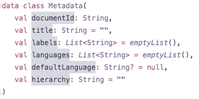

# Kotlin |从元数据列表中创建树结构

> 原文：<https://medium.com/geekculture/kotlin-create-tree-structure-from-a-list-of-metadata-510c787adcf4?source=collection_archive---------4----------------------->

几周前，我有一个项目，我想在一个 web 应用程序上显示一个具有不同条目和层次结构的菜单。上图就是这种树形结构的最终结果。为此，首先，我需要创建菜单结构本身。此时，我得到的唯一输入是一个元数据列表，它具有以下属性:

你们大多数人已经认识到，我们有一个等级制度，这对未来的步骤非常重要。这个层次结构只是一个字符串，用正斜杠分隔。

# 定义类图

首先，我们需要创建一个节点类，它负责结构本身，因为它链接到子地图中它自己的实例。这样，我们可以遍历整个层次结构，并根据需要添加任意多的层次结构级别。

如果当前节点真的只是一个节点，而不是叶节点，因此它不是层次结构中的最后一个，那么它不需要包含元数据。只有叶节点需要元数据。

每个节点都需要有一个标题。叶节点从元数据标题中获取标题，层次节点从它们当前所在的层次步骤中获取标题。

根类继承自节点类。它可以在没有任何构造函数参数的情况下创建，并且只需要一次函数调用就可以创建一个完整的层次树。也有可能在现有的树中只添加一个子树。

# 实现节点类

`getItemOrAddChild`函数只是根据 hierarchyList 的大小创建一个新的叶子或层次节点。

`createLeafNode`函数只是在当前节点的子节点中添加一个新节点。

`createHierarchyNode`函数获取当前层次结构，并将底层层次结构作为新节点添加到当前层次结构中。如果它的子节点已经包含了 currentHierarchy，那么它将获取它并再次经历相同的过程，直到不再有层次结构。

所有这些函数都将返回一个节点，但其中最重要的一个是`getItemOrAddChild`函数，因为它是将从根类中调用的函数。

# 实现根类

如您所见，根类实现了节点类，因此可以访问节点的所有属性和功能。

`createHierarchyList`函数将层次结构字符串拆分成一个可变列表。该列表用于`addChildToTree`功能。它只是调用我们之前在节点类中定义的`getItemOrAddChild`函数，并返回根对象。

`createWholeTree`函数只是为列表中的每一项调用`addChildToTree`函数，并根据标题按字母顺序排序。最后，它还会返回根对象本身。

如果我们用一个元数据列表运行这个函数，它将为我们创建整个树，并将根对象返回给我们。在这个根对象中，我们可以看到第一层的所有叶节点以及更深层次的层次节点。

要显示我们生成的数据结构，请查看我的后续文章，关于[用百里香叶](https://manserpatrice.medium.com/thymeleaf-create-dynamic-hierarchy-trees-with-kotlin-micronaut-4b4449574f85)显示树结构。

# 反射

## 什么进展顺利？

我想最好的情况是，我已经定义了节点类，只需要用根类访问它的函数。根类很容易实现，因为它并不总是引用自己，所以调试和测试也很容易。

## 有哪些需要改进的地方？

开始的时候，我对理解自引用类的整个原理有一些问题。我不知道这个复合模式，首先需要阅读它来完全理解它。下一次 a 遇到这样的问题，我将首先寻找一个合适的构建模式，并以这种方式直接实现它。如果我想出自己的定制解决方案，这会节省我很多时间。