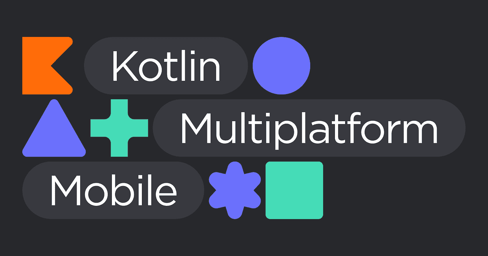
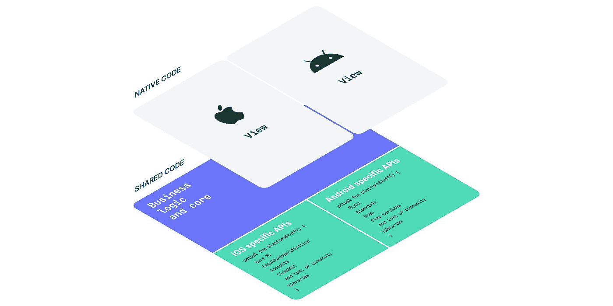

# Kotlin 多平台移动设备 iOS 工程师的热门选择

> 原文：<https://medium.com/geekculture/kotlin-multiplatform-mobile-an-ios-engineers-hot-take-26d08f5eaadb?source=collection_archive---------7----------------------->

*最初发表于*[*【blog.malcolmk.com】*](https://blog.malcolmk.com/kotlin-multiplatform-mobile-an-ios-engineers-hot-take-ckrq8k9i80av8zcs13s1me7go)*。*

在本文中，我将从一个 iOS 工程师的角度讨论为什么我认为 Kotlin 多平台移动设备 *(KMM)* 是跨平台开发的未来。

这是一篇非常自以为是的文章，我很清楚有些人可能会有相反的意见，因此——热选。

> *热拿*(名词) *—一段文字或演讲，尤其是在互联网上，给出某人对某个话题的个人观点，通常是未经仔细思考且很多人很可能不同意的强烈观点* [*剑桥词典*](https://dictionary.cambridge.org/dictionary/english/hot-take)

你有没有下载一个应用程序，打开它，浏览它，并认为有些事情就是感觉不对劲？有没有想过为什么一个应用不流畅，为什么有些元素看起来格格不入？有可能这款应用是使用跨平台框架开发的。

跨平台开发的承诺是“一次编码，随处部署”。虽然像 React-Native 和 Flutter 这样的框架确实很好地实现了这一承诺，但也有一些警告引起了人们的关注。用户界面和最新的平台特性是我觉得这些框架不足的地方。实际上，这可能不是框架的错误，而是工程师没有花时间确保最终结果符合特定的平台标准。

要开发一个好的跨平台应用程序，你必须意识到平台的差异并迎合它们。iOS 有它的人机界面准则，Android 有材质设计。为了让你的应用在设备上感觉舒适，你必须坚持平台原则。

这导致必须为每个平台编写代码，这在开发过程中造成了一些麻烦。“我被许诺写一次，到处部署。但是为了让它看起来漂亮并正常工作，我还是要编码两次？”最终，你可能会陷入一个不理想的境地，你的代码库有太多的 *if* 或 *switch* 语句来迎合特定平台的代码。

> *Kotlin Multiplatform Mobile 允许您为 iOS 和 Android 应用程序的业务逻辑使用单一代码库。您只需要在必要的地方编写特定于平台的代码，例如，实现本机 UI 或使用特定于平台的 API。——*[*Kotlin.org*](https://kotlinlang.org/lp/mobile/)

对于跨平台世界来说，KMM 是一个相对较新的框架 *(Alpha 于 2020 年 8 月发布)*，它使你能够在你的 Android 和 iOS 应用程序之间共享公共代码。这是通过创建一个用 Kotlin 编写的共享模块，然后编译成字节码和原生 iOS 来实现的。

与其他跨平台框架不同，KMM 让您可以选择共享代码的哪些方面。您可以决定尽可能少地共享代码，或者相反。使用 [Cocoapods](https://kotlinlang.org/docs/native-cocoapods.html#use-a-kotlin-gradle-project-as-a-cocoapods-dependency) 和 [SPM](https://johnoreilly.dev/posts/kotlinmultiplatform-swift-package/) 可以将共享代码模块包含在现有项目中。

KMM 目前没有用户界面组件，这允许你保持你的用户界面原生。不需要学习新的 UI 语言。您还可以使用所有最新的平台功能，如 SwiftUI 和 JetPack Compose。

我必须说，JetBrains 团队为 KMM 创建的文档和资源给我留下了深刻的印象。自己看看 [Youtube 频道](https://youtube.com/playlist?list=PLlFc5cFwUnmy_oVc9YQzjasSNoAk4hk_C)和[官方文档](https://kotlinlang.org/docs/mobile/home.html)。⭐️

# 我的主要收获

*   ***灵活性*** ，只分享你想分享的代码。
*   ***编译成字节码*** ，不会像其他跨平台框架一样增加二进制大小。
*   ***原生 UI*** ，可以使用 UIKit 和 SwiftUI。

***1。我一定要学科特林吗？***

是的。要为共享代码模块做贡献，你必须学习一些 Kotlin。这可能是一个很大的学习曲线，但我们作为 iOS 工程师喜欢 Swift 的大部分东西对 Kotlin 来说也是如此。类型安全、可选性和干净的语法在 Kotlin 中都有。

**2*2。我必须在 Android Studio 中编码吗？***

是的。不。可能吧。要成为应用程序共享代码的贡献者，你可能必须使用 Android studio，但对于所有其他本机代码，你仍然可以使用 Xcode。

***3。我将如何调试 Kotlin 代码？***

使用 Android Studio。

***4。库、Cocoapods 和 Swift 包？***

您可以在 iOS 项目中正常使用库、Cocoapods 和包。

***5。KMM 是如何处理并发的？***

使用 Kotlin/Native。请阅读 JetBrains 关于 kot Lin/原生内存管理路线图的[这篇文章](https://blog.jetbrains.com/kotlin/2020/07/kotlin-native-memory-management-roadmap/)以获得更详细的解释。

还有问题吗？参见 Kotlin.org 上[的常见问题页面](https://kotlinlang.org/docs/mobile/faq.html)

老实说，对于跨平台开发来说，没有什么灵丹妙药。让我们来看看缺点:

**1。没有共享 UI**

虽然有些人可能认为这是一个骗局，但另一方面，我认为这是一个职业。我不想有一个共享的用户界面。我宁愿有两个目标，一个在 SwiftUI 中，另一个在 Jetpack Compose 中。KMM 目前没有提供共享 UI 组件的方法。我希望他们保持这种方式，这样应用程序可以保持他们的原生感觉。如果你想共享 UI 组件，那么 ReactNative 或 Flutter 是最合适的。

**2。生产准备就绪**

对于跨平台世界来说，KMM 是一个相当新的玩家，仍然被认为处于开发阶段。一些功能仍处于开发的 alpha/实验阶段。我不认为这是不使用它的理由。来自网飞和 CashApp 的团队已经在生产中使用 KMM。开发团队非常擅长交流组件的稳定性，并且有一个专门的[页面用于这个](https://kotlinlang.org/docs/components-stability.html)。

**3。新的构建工具**

作为一名 iOS 开发人员，我已经习惯了 Xcode 和它的怪癖，比如必须虔诚地清除派生数据。必须学习如何使用 Android Studio 和 Gradle 将是一个主要障碍。共享代码需要在 Android Studio 中调试。对于一个 iOS 工程师来说，你现在需要两个 ide 来开发，而 Android 工程师可以从 Android Studio 完成所有事情。我认为新工具将是 iOS 开发者面临的最大挑战。

**4。联网**

虽然支持使用 Ktor 库进行联网，但是使用 GraphQL 进行联网的开发仍处于试验阶段。我找不到任何与 gRPC 联网的解决方案。这些限制使使用这些技术的团队失去了 KMM。

**4。复杂性**

引入 KMM 或任何跨平台框架都会增加应用程序开发的复杂性。开发生命周期涉及的方面更多。KMM 仍处于起步阶段，肯定会经历一些阵痛。由于社区仍然很小，可能没有足够的在线资源来帮助解决人们可能遇到的一些问题。

也就是说，如果把 KMM 介绍给一个已经有经验丰富的 Android 工程师的团队，我相信学习曲线会加快，因为他们可以帮助你解决你在 Android studio 或 Gradle 上可能遇到的任何错误。

我知道这种情况发生的可能性很小，但是如果 Xcode 有一个 KMM 插件的话，那就太棒了。

使用 KMM 进行应用程序开发还有一些其他的缺点，但是本着保持这篇文章简洁的精神，我们不会讨论它们。我在下面提供了一个参考资料列表，详细介绍了其他一些缺点，比如 ObjC——互操作性、内存处理和多线程。

**场景:** *你在一个有专门的 iOS 和 Android 团队的团队中工作。你正在开发一个新功能。该特性的业务逻辑已经设计好，可以进行开发了。两个团队各走各的路，编写特性代码。测试时间到了，QA 报告说该功能在 Android 上运行良好，但在 iOS 上有问题，反之亦然。*

这是许多人都经历过的情况。拥有一个共享的代码库可能是上述情况的解决方案。应用程序的业务逻辑只有一个真实的来源，这带来了可预测性和稳定性。

我最喜欢 Kotlin 多平台手机的一点是它的灵活性。你只需要分享你决定分享的东西。UI 组件没有被桥接，它们仍然是本机的。代码被编译成字节码。

这些就是我认为 KMM 应该受到 iOS 社区欢迎的原因。它为社区之间的协作创造了环境，并引入了学习新语言和工具的挑战。🤖 🤝🍏

我致力于解决帮助人们的问题。下载我们应用程序的人通常不关心应用程序的制作技术。用户想要的是好的产品，如果 KMM 为团队提供了一种更早交付的方式，那么这就是一个胜利。🚀

我期待着 KMM 的所有新功能和这个社区的发展。感谢阅读我对为什么我作为一名 iOS 工程师喜欢 KMM 的看法！你对 Kotlin 多平台手机有什么看法？

# 资源

1.  [科特林多平台文档](https://kotlinlang.org/docs/mobile/home.html)
2.  [使用 Kotlin 多平台进行移动开发的注意事项](/icerock/the-dos-and-donts-of-mobile-development-with-kotlin-multiplatform-db7c098545c0)
3.  Kotlin 多平台——所有移动应用开发的补救措施？
4.  [Kotlin 多平台——移动应用开发的灵丹妙药？](https://proandroiddev.com/kotlin-multiplatform-a-panacea-for-mobile-app-development-c41ffe850d1b)
5.  [我们询问了一位 iOS 开发者在使用 kot Lin/多平台移动设备后的想法](/kodein-koders/we-asked-an-ios-developer-his-thoughts-after-working-with-kotlin-multiplatform-mobile-b08b8750be33)

*原载于*[*https://blog.malcolmk.com*](https://blog.malcolmk.com/kotlin-multiplatform-mobile-an-ios-engineers-hot-take-ckrq8k9i80av8zcs13s1me7go)*。*