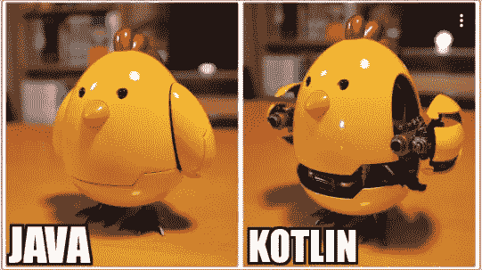

# 科特林:设置状态 vs 后状态

> 原文：<https://medium.com/geekculture/kotlin-setstate-vs-poststate-2cf4111d45f2?source=collection_archive---------12----------------------->

在 KOTLIN 中设置可变动态数据对象的值时，这是一个非常常见的困惑点，所以我想我应该写一篇小文章让人们更好地理解它。



> **postState()**

```
public void postValue(T value) {
        super.postValue(value);
}
```

官方文件指出