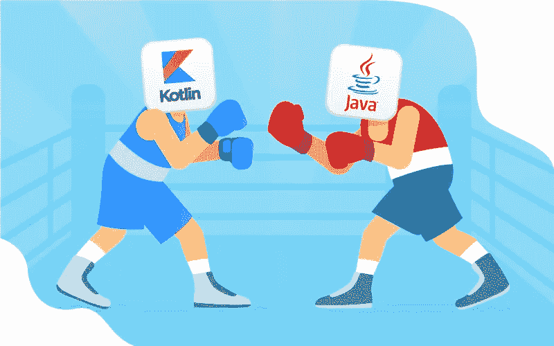

# Kotlin Vs. Java for Android 和 Backend:选择哪个——NIX United

> 原文：<https://medium.com/geekculture/kotlin-vs-java-for-android-and-backend-which-one-to-choose-nix-united-d4c1aaa10524?source=collection_archive---------22----------------------->

Kotlin vs. Java 的战斗就像一场拳击比赛，一个年轻而雄心勃勃的竞争者试图从一个成熟而经验丰富但却年迈的冠军手中夺走冠军头衔。随着我们的前进，获胜者已经确定 Java 和 Kotlin 之间关于最佳 Android 开发编程语言的较量以新竞争者的一致决定而结束。