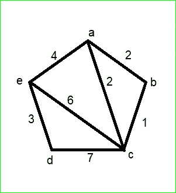
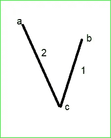
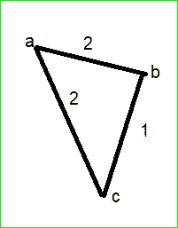
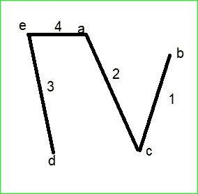
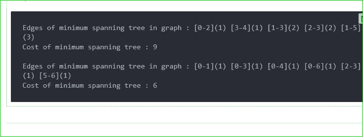

# 使用 PYTHON 的 KRUSKAL 算法

> 原文：<https://medium.com/geekculture/kruskals-algorithm-using-python-9f5c0402647b?source=collection_archive---------5----------------------->

好吧，如果你是一个计算机科学专业的学生，或者是任何包含数据结构概念的交叉学科的学生，那么不理解克鲁斯卡尔算法的概念是不可避免的。

## 使用:

从赋权图中寻找最小生成树。

现在，让我们从最基本的开始。在第一部分，我将从概念上解释这个算法，这样你就可以很容易地理解它。

# **第一部分:**

Weighted graph

## 第一步:根据权重按非递减顺序写边。

边缘重量
(b，c) — 1
(a，c) — 2
(a，b) — 2
(e，d) — 3
(a，e) — 4
(e，c) — 6
(d，c) — 7

## **第二步:开始按非递减顺序选择边，这样选择的边就不会在图中形成回路。**

首先选择(b，c)。
那么选择(a，c)，因为它不形成回路。

Chosen edges

现在，(a，b)被丢弃，因为它在下图中形成了一个回路，这对于最小生成树是不可接受的。

## 步骤 3:继续这个过程，直到所有的顶点都包含在内。

使用上述过程，在(b，c)和(a，c)之后，

(e，d)和(a，e)被接受。最终的图表如下:

这是使用克鲁斯卡尔算法得到的最终图形。

# **第二部分:**

通过编程，它可以用 python 实现，如下所示。

> 通过键入注释的导入列表编号
> 
> 类别边缘:
> 
> def __init__(self，arg_src : int，arg_dst : int，arg _ weight:int):
> self . src = arg _ src
> self . dst = arg _ dst
> self . weight = arg _ weight
> 
> 类别图:
> 
> def __init__(self，num_nodes : int，Edge List:List[Edge]):
> self . num _ nodes = num _ nodes
> self . Edge List = Edge List
> self . parent =[]
> self . rank =[]
> # MST 存储最小生成树的边
> self.mst = []
> 
> def FindParent (self，node : int) :
> #带路径压缩。
> 如果节点！= self . parent[node]:
> self . parent[node]= self。find parent(self.parent[node])
> 返回 self . parent[node]
> 
> #无路径压缩
> # if node = = self . parent[node]:
> #返回节点
> #返回 self。find parent(self . parent[节点])
> 
> def KruskalMST (self):
> 
> #基于属性(权重)对边类的对象进行排序
> self . Edge list . Sort(key = lambda Edge:Edge . weight)
> 
> self . parent =[None]* self . num _ nodes
> self . rank =[None]* self . num _ nodes
> 
> 对于范围内的 n(self . num _ nodes):
> self . parent[n]= n #每个节点在开始时都是自身的父节点
> self.rank[n] = 0 #每个节点的秩在开始时都是 0
> 
> 对于 self.edgelist 中的 edge:
> root 1 = self。find parent(edge . src)
> root 2 = self。FindParent(edge.dst)
> 
> #源节点和目的节点的父节点不在同一个子集
> #如果 root1！= root 2:
> self . MST . append(edge)
> if self . rank[root 1]<self . rank[root 2]:
> self . parent[root 1]= root 2
> self . rank[root 2]+= 1
> else:
> self . parent[root 2]= root 1
> self . rank[root 1]+= 1
> 
> 打印(" \ n 图中最小生成树的 ges:"，end=' ')
> cost = 0
> 对于 self.mst 中的边:
> 打印("["+str(edge . src)+"-"+str(edge . dst)+")("+str(edge . weight)+")，end = ' ')
> cost+= edge . weight
> 打印(" \ n 最小生成树的 cost:"+str(cost))
> 
> def main():
> 
> # Edge(源，目的地，权重)
> num_nodes = 6
> e1 = Edge(0，1，4)
> e2 = Edge(0，2，1)
> e3 = Edge(0，3，5)
> e4 = Edge(1，3，2)
> e5 = Edge(1，4，3)
> e6 = Edge(1，5，3)
> e7 = Edge(2，3，2)
> e8 = Edge(2
> 
> g1 = Graph(num_nodes，[e1，e2，e3，e4，e5，e6，e7，e8，e9，e10])
> g1。克鲁斯卡尔姆斯特
> 
> num_nodes = 7
> a =边(0，1，1)
> b =边(0，2，2)
> c =边(0，3，1)
> d =边(0，4，1)
> e =边(0，5，2)
> f =边(0，6，1)
> g =边(1，2，2)
> h =边(1，6，2)
> i =边(2
> 
> g2 = Graph(num_nodes，[a，b，c，d，e，f，g，h，I，j，k，l])
> g2。克鲁斯卡尔姆斯特
> 
> if _ _ name _ _ = = " _ _ main _ _ ":
> main()

## **输出:**

Code referenced from algotree.org

## 这是关于 Kruskal 算法的所有内容，CS 专业的学生可能需要了解这些内容，以提高他们在编程领域解决问题的能力。

谢谢你。