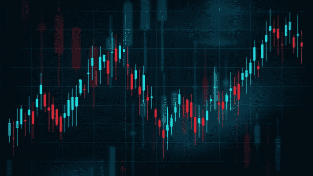

# k 氏烛台系统。检测金融市场的趋势和逆转。

> 原文：<https://medium.com/geekculture/ks-candlestick-system-detecting-trends-reversals-in-the-financial-markets-4c8b56e47645?source=collection_archive---------11----------------------->

## 呈现出类似于著名的 Heikin-Ashi 的烛台系统。

www.pxfuel.com

蜡烛图是金融和技术分析领域的瑰宝之一。它使用 OHLC 数据的总和来确定可能的方向和市场心理，并已成为…