# KuanKua:数字化未数字化语言的新平台

> 原文：<https://medium.com/geekculture/kuankua-a-new-platform-to-digitize-undigitized-languages-50eea2de9a1c?source=collection_archive---------19----------------------->

这篇博文介绍了我开发的一个名为 KuanKua 的新网络应用，它是一个保存和访问不同非数字化语言的数字记录的平台。该网站的主要目的是作为一个自然语言处理和其他类似语言研究的语言数据库。

# 什么是宽跨？

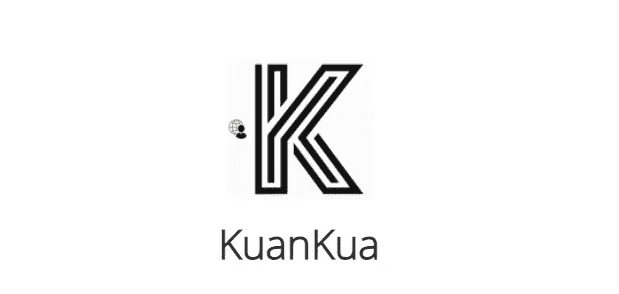

KuanKua ，以阿姆哈拉语的语言单词命名，是我编写的一个单页 web 应用程序(前端使用 JavaScript，后端使用 Ruby on Rails ),目标是解决有关非洲语言的数字信息的缺乏。作为一名埃塞俄比亚人，当我在为埃塞俄比亚的官方语言阿姆哈拉语开发拼写检查软件时，我亲眼目睹了这种信息的缺乏并深受其影响。为了解决这个问题，我想创建一个平台，让每个非洲人都有机会通过帮助数字化他们的语言来留下自己的印记。

因此，KuanKua 是一个任何人都可以轻松访问的平台，用于保存他们所讲语言的数字记录。它让任何人都可以轻松地直接为自己语言的保存和数字化做出贡献。这反过来提高了人们对当前技术进步的接近度，如自然语言处理和其他语言相关技术。

你可以在这里阅读我详细的初始项目建议书以及这个项目背后的动机[。](http://andykeidelfund.com/blog)

# 特征

接下来的部分将介绍 KuanKua 的不同特点。

## 目录

这个 web 应用程序有一个功能，允许注册和未注册用户为他们选择的任何语言创建目录。为此，他们只需点击“+新目录”按钮，该按钮位于目录页面的右上角。

The New Directory Button to Create New Directories

单击该按钮后，将打开一个表单，允许用户指定他/她想要创建的目录的不同属性。该表单如下所示:

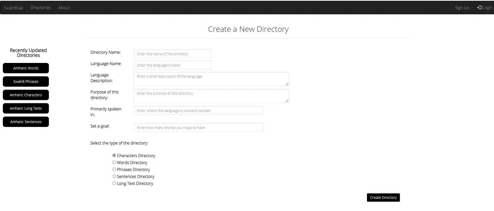

The New Directory Form

通过这个表单，任何用户都可以指定条目的名称、语言、目的、目标数量以及目录的类型等属性。此信息将显示在新目录的顶部，以及目录列表中目录名称的正下方。

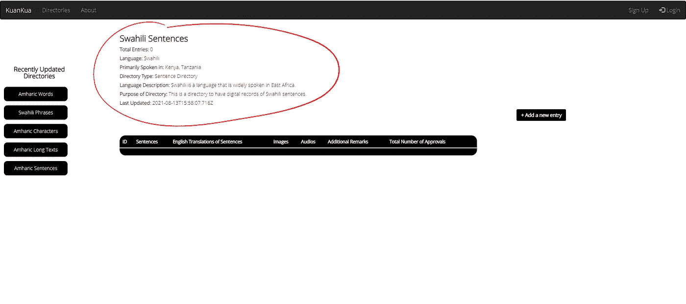

Directory Information at the Top of a Directory

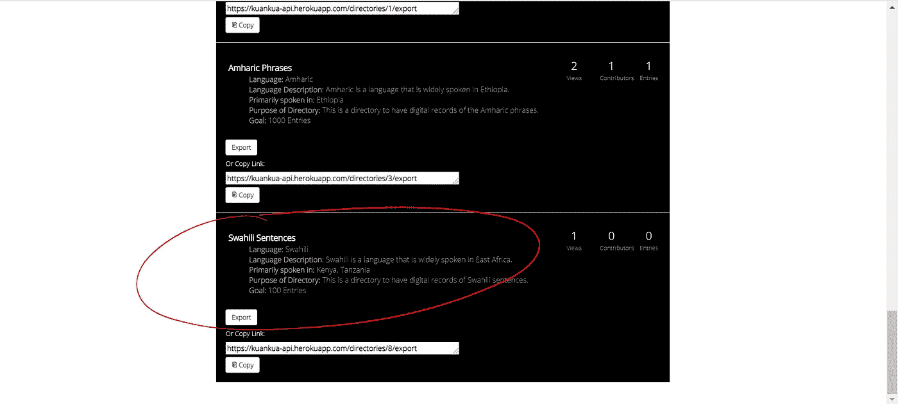

Directory Information for Each Directory in the Directories List

## 进入

要向任何目录添加新条目，请打开要添加条目的目录，然后单击“+ Add a New Entry”按钮，这将显示一个与给定目录的条目类型相对应的表单。有 5 种不同类型的条目/目录(即字符、单词、短语、句子和长文本)，因此，当根据目录的类型添加新条目时，有 5 种不同的显示形式。

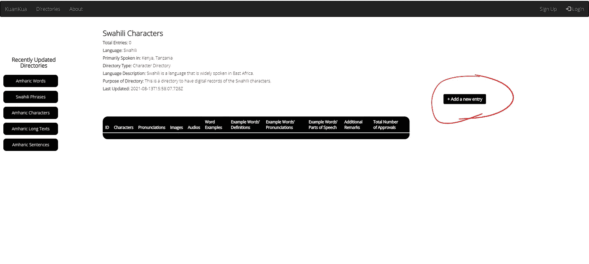

Add a New Entry Button

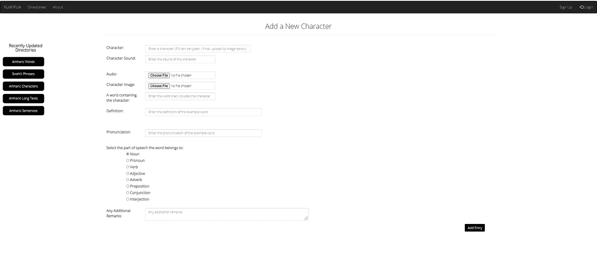

A New Character Entry Form

## 批准

KuanKua 的另一个特点是，注册用户可以通过点击与特定条目对应的“批准”按钮来批准给定的条目。这将更新为该特定条目显示的批准数量。

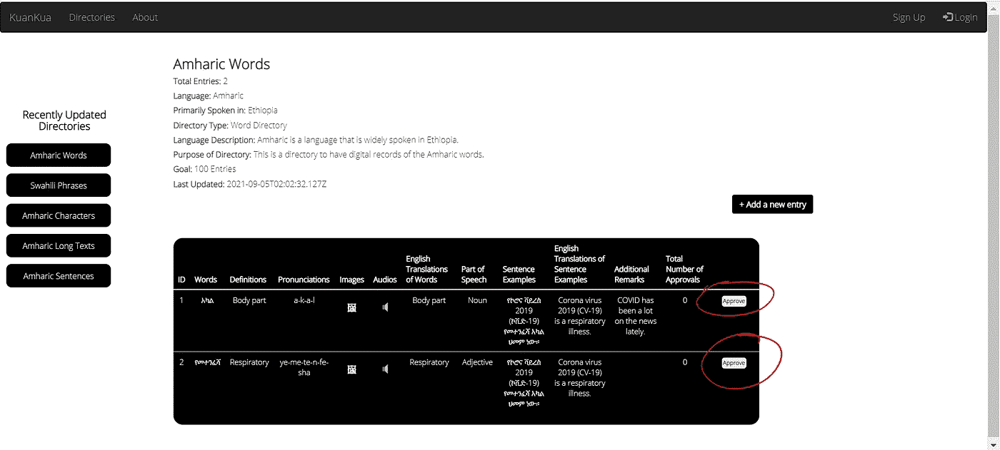

The Approve Button

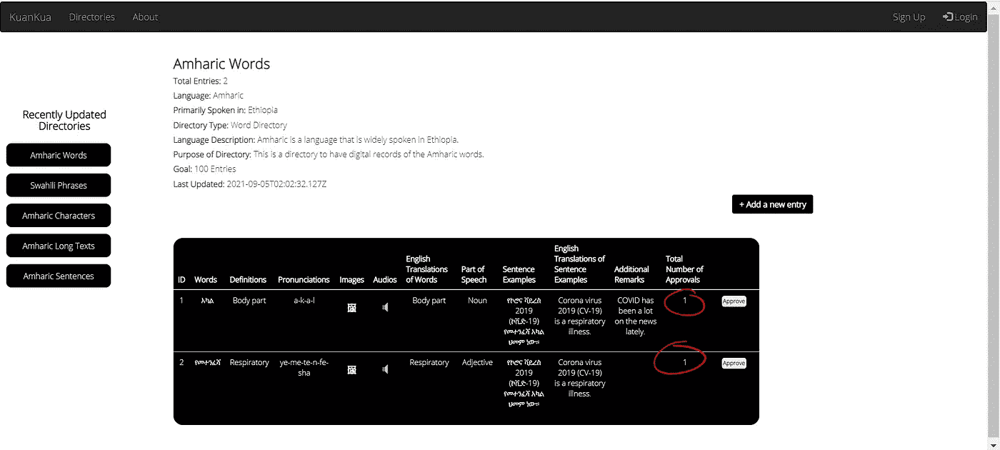

Updated Number of Approvals After Clicking on Approve

## 最近更新的目录

此功能指的是所有页面左侧的列，该列显示最近更新的五个目录的列表。人们可以只看这一栏，看看他们创建的任何目录最近是否被更新过。

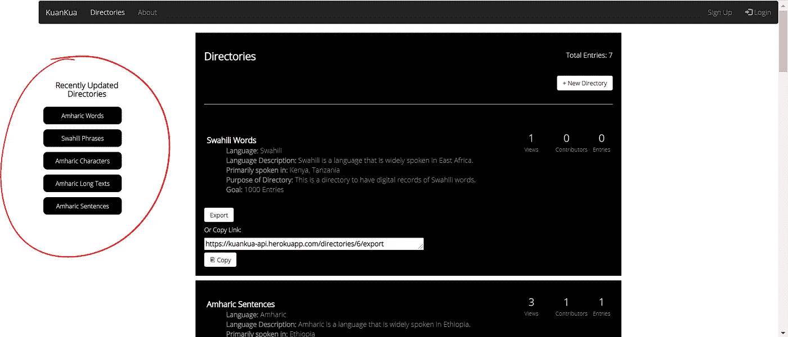

The Recently Updated Directories List

## 导出和复制链接

此功能允许用户使用现有目录中已经存在的数据。通过点击给定目录的“导出”按钮，或者通过复制文本区域中的链接并在选项卡上打开它，任何人都可以以 JSON 格式访问目录中的条目数据。

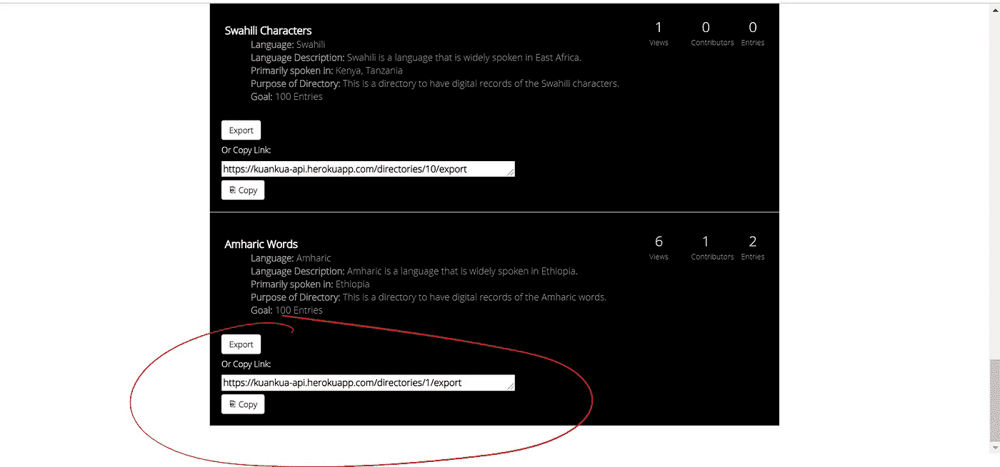

Export and Copy Link Options

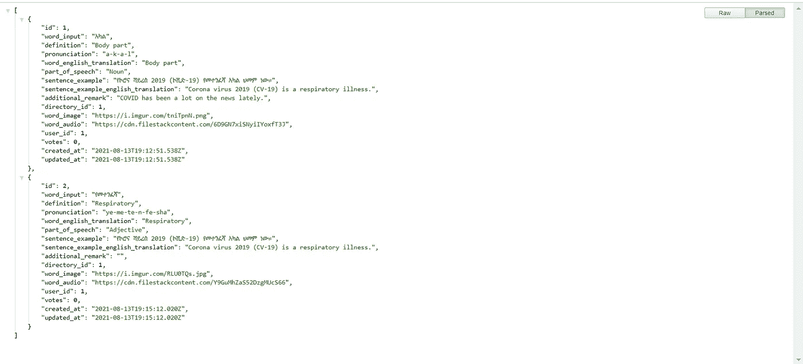

JSON-formatted Data from the Amharic Words Directory

注意:JSON 数据被很好地格式化了，因为我使用了 JSON 格式化程序 Chrome 扩展。如果没有这个扩展，导出的 JSON 数据将如下所示:

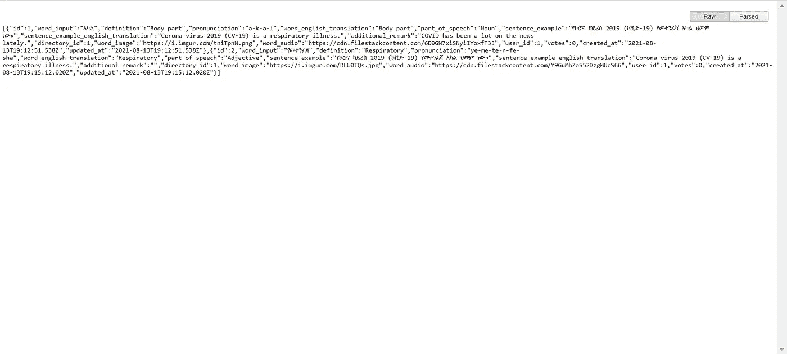

JSON-formatted Data from the Amharic Words Directory

## 帐户和个人资料(注册和登录)

为了更好的用户体验、目录管理和协作，KuanKua 还允许用户创建自己的帐户。使用注册表单注册后，他们可以随时重新登录到他们的帐户，从他们离开的地方继续。此外，该帐户功能还可以更容易地与他人共享用户的联系信息，因为用户只需在注册时输入该信息，其他任何用户都可以在之后轻松查看该信息。

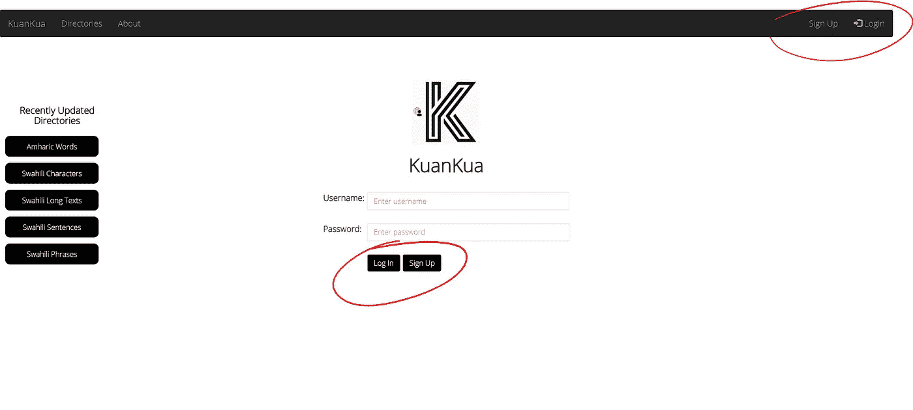

Sign Up and Log In Options

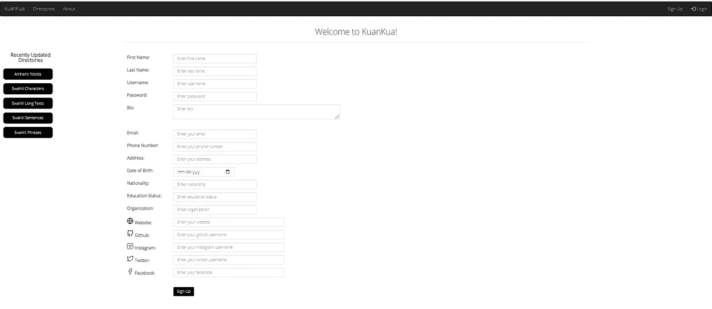

The Sign Up Form

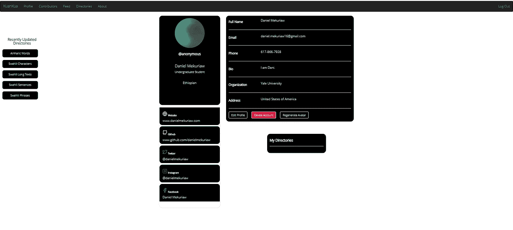

The Profile Page of a Given User

用户的个人资料页面显示了用户注册时输入的所有信息，并且可以使用“编辑个人资料”按钮进行编辑。用户也可以通过“删除帐户”选项选择删除他/她的帐户。此外,“我的目录”部分显示登录用户创建的目录，以及每个目录在实现目标条目数方面取得的进展。

## 用户交互

KuanKua 允许其用户之间的互动，这是一个在数字语言学项目上进行合作的理想平台。特别是，它允许用户相互跟踪并查看彼此的联系信息。这可以通过导航到“Contributors”页面并使用对应于每个列出的用户的“Follow”按钮与任何列出的用户进行交互来实现。

## 饲料

KuanKua 还可以帮助你跟踪你所关注的用户的动向。通过导航到“Feed”，你可以看到你关注的用户的活动。如果他们创建任何新的目录或跟随其他人，你将被更新。了解您的活动将在关注您的用户的订阅源上更新也很重要。

由于“Follow”和“Feed”功能在外部服务器上部署网站后存在一些问题，所以我没有包括它们如何工作的图片演示。目前，我正在修复这个问题和其他问题，以帮助 KuanKua 变得完全正常。

# 后续步骤

KuanKua 的下一步主要是修复外部部署错误，添加其他有用的功能并优化它以获得用户友好的体验。截至目前，该网站的主要功能“目录”功能正常工作，但一些页面需要一段时间才能加载，如前所述，“关注”和“订阅”功能存在一些部署错误。此外，日志状态管理和“批准”功能也有一些小问题需要解决。

展望未来，在解决上述问题的同时，我计划增加一个外部认证，一个注册和使用 KuanKua 作为专家(语言专家)的选项，以便验证条目，并为通过手机访问网站的用户提供移动浏览器视图。根据这个 web 应用程序的成功，我计划将其重新创建为一个具有多个页面的网站(它目前是一个只支持 DOM 操作的单页面 web 应用程序)，也可能是一个移动应用程序。

总而言之，我已经走了很长的路来创建 KuanKua，我希望在未来的几个月和几年里，我能够以我希望的方式改进它。我相信它有潜力成为未来更大、更实际的项目的基础，这些项目将基于 KuanKua 创建、组织、更新和存储的数据集。正如我在最初的建议中所说的那样，我对 KuanKua 的最终设想是，通过克服发展中国家普遍存在的获取和受益于技术的障碍，它将使世界、发达国家和发展中国家更加接近。

我希望你通过创建一个目录并为你选择的语言添加条目来尝试一下！

你可以在[点击](https://youtu.be/AI0xSKnFw0c)查看 KuanKua 的本地版本演示。

> 如果您有任何问题、意见或建议，请在下面的评论中留下。我会尽可能快地做出回应。

# 参考作品

 [## 新闻-耶鲁大学安迪·凯德尔基金

### 请经常回来查看更新和新闻。

andykeidelfund.com](http://andykeidelfund.com/blog)  [## 宽宽

kuankua.github.io](https://kuankua.github.io/front-end/#)