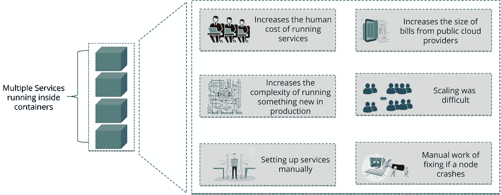
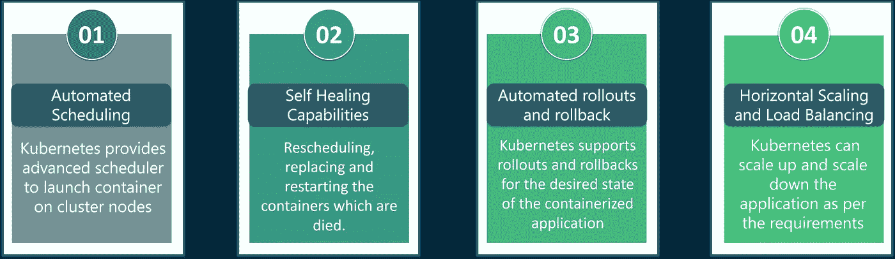

# 库贝涅特斯

> 原文：<https://medium.com/geekculture/kubenetes-b9f17df6f8b5?source=collection_archive---------21----------------------->

这是什么？我们为什么需要它？

Credits : [Wallpaper Flare](https://www.wallpaperflare.com/electronics-kubernetes-ukraine-l-viv-headset-headphones-wallpaper-evoaq)

假设您已经创建了一个应用程序，假设它已经使用 Docker 部署在 3 个不同的服务器上，并且您的应用程序开始获得大量流量。

现在我们可以假设您使用了 docker 容器来打包应用程序，认为 Docker 应该使您的应用程序在任何环境下都能工作。但是现在，随着流量每分钟都在增长，您的应用程序也需要快速扩展。从 3/4 台服务器增长到您可能需要的 40 多台服务器需要时间和精力。除此之外，还要管理容器，决定哪个容器应该放在哪里，监控容器，并确保它们在死亡时重新启动！创建更多的实例，重新启动死的实例，处理运行周期和其他重要的方面需要你付出大量的努力和工作。

The need for Kubernetes

这就是 Kubernetes 发挥作用的地方！Kubernetes(又名 k8s 或“kube”)是一个开源的容器编排平台，可以自动部署、管理和扩展容器化的应用程序。

kubernetes 集群由一组称为节点的工作机组成，它们运行容器化的应用程序。每个集群至少有一个工作节点。因此，如果一个节点出现故障，其他节点仍然可以访问您的应用程序，因为在集群中，多个节点被分组。

每个节点都包含一个容器运行时、Kubelet(用于根据来自 Kubernetes 控制平面的请求启动、停止和管理单个容器)和 kube-proxy(用于联网和负载平衡)。

Kubernetes 的一些特点:

*   自动推出和回滚
    Kubernetes 逐步推出对您的应用程序或其配置的更改，同时监控应用程序的健康状况，以确保它不会同时终止您的所有实例。如果出现问题，Kubernetes 将为您回滚更改。
*   服务发现和负载平衡
    Kubernetes 为一组 Pods 提供它们自己的 IP 地址和一个 DNS 名称，并且可以在它们之间进行负载平衡
*   存储协调
    您可以自动挂载您选择的存储系统，无论是从本地存储、公共云提供商如 [GCP](https://cloud.google.com/storage/) 或 [AWS](https://aws.amazon.com/products/storage/) ，还是网络存储系统如 NFS、iSCSI、Gluster、Ceph、Cinder 或 Flocker。
*   除了服务之外，Kubernetes 还可以管理您的批处理和 CI 工作负载，如果需要的话，替换失败的容器。
*   IPv4/IPv6 双栈
    向 pod 和服务分配 IPv4 和 IPv6 地址

Some Features of Kubernetes

以及更多功能！详细文档的链接如下！感谢您的阅读！