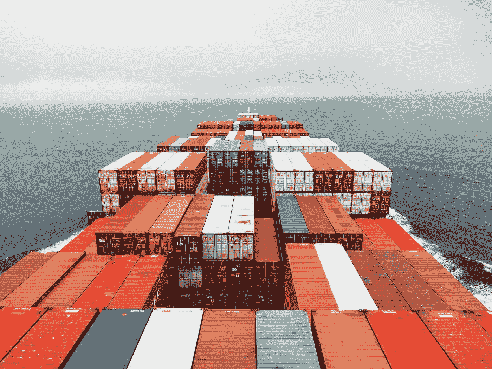

# Kubernetes 高级主题:初始化容器

> 原文：<https://medium.com/geekculture/kubernetes-advanced-topics-init-containers-65030ea0041a?source=collection_archive---------10----------------------->

## 了解 Init 容器如何为 Kubernetes 中的工作负载提供额外的功能

Photo by [Rinson Chory](https://unsplash.com/@nessa_rin?utm_source=medium&utm_medium=referral) on [Unsplash](https://unsplash.com?utm_source=medium&utm_medium=referral)

新的开发模式以更加分散和协作的方式带来了许多新的挑战，我们如何管理依赖性对我们的成功至关重要。