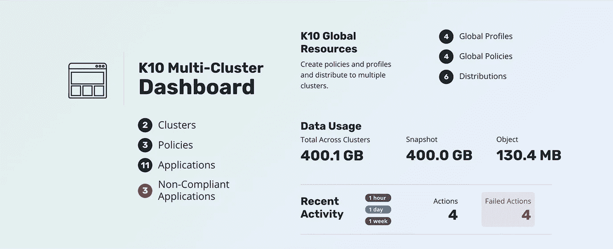
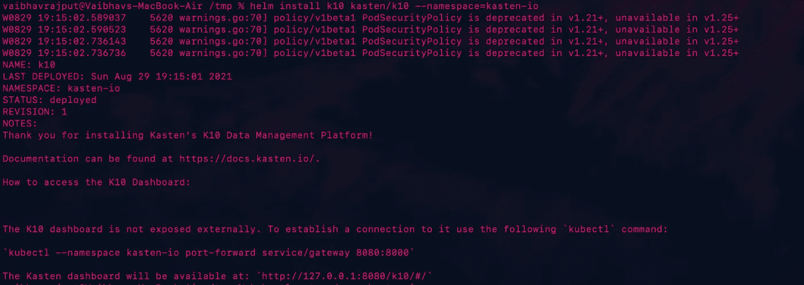
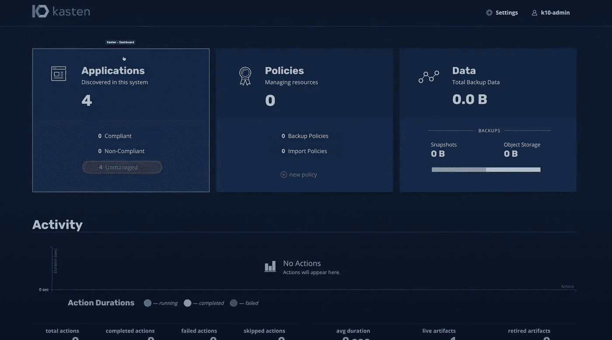
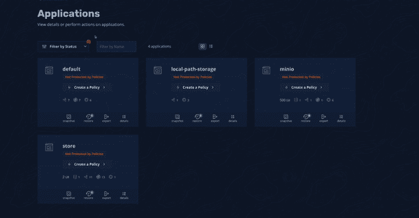
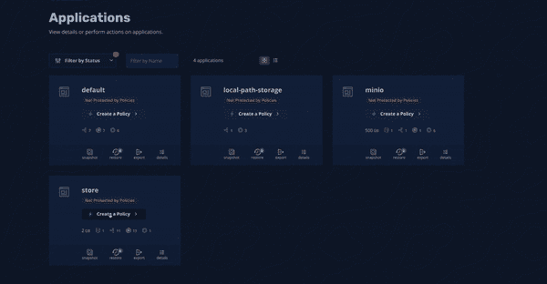

# Kubernetes 备份和恢复现在变得毫不费力

> 原文：<https://medium.com/geekculture/kubernetes-backup-restore-is-now-effortless-e788fccd8cde?source=collection_archive---------4----------------------->

如果您曾经尝试过跨平台复制 Kubernetes 集群，您会非常了解我将要谈到的痛苦。随着应用程序变得越来越大，备份和恢复/复制它的麻烦也越来越多。最终，您会编写一堆定制脚本来快照您的 pod、服务、数据存储、配置图、机密…这些脚本变得非常复杂，难以维护。

许多 Kubernetes 分销商，通常是云，确实提供了备份卷的选项，但同样，它们是通用的，因此可以部分解决您的问题。让我们不要忘记，这将不包括集群状态。

# 解决方法是什么？

有许多工具试图解决这个问题，但目前为止 [Kasten K10](https://www.kasten.io/product/) 是最接近成为端到端解决方案的。

K10 与几乎所有主要的数据服务、Kubernetes 发行版和存储基础架构兼容，成为适用于所有人的单一解决方案。


Kasten K10 ecosystem

除此之外，K10 还提供了多集群支持，这提供了一个包含汇总结果的单一控制面板



# 入门指南

要开始，你需要安装[头盔](https://helm.sh/)并添加卡斯滕头盔图表报告。为此，只需安装您喜欢的[舵释放](https://github.com/helm/helm/releases)并运行以下命令

```
helm repo add kasten https://charts.kasten.io/
```

然后，我运行一个可选但习惯性的命令，即

```
helm repo update
```

遵循这一点，创建一个名称空间以保持健康

```
kubectl create namespace kasten-io
```

然后安装舵图

```
helm install k10 kasten/k10 --namespace=kasten-io
```

完成后，您应该会看到类似这样的内容



初始化面板(一堆面板)需要一些时间，一旦完成，您就可以运行指定的`port-forward`命令来查看仪表板。因为我在我的本地系统上运行它，环回 IP 为我工作；您可能需要根据您的基础设施更改主机名。

# 我们去散步吧

登录到仪表板后，您会看到类似这样的内容。
另外，您可以为您的仪表板[添加联合登录，如下所示](https://blog.kasten.io/posts/using-azure-ad-with-kasten-k10-for-authentication-and-authorization)



这个丰富而现代的仪表板提供了一组图表，这些图表是通过 Prometheus 实例从收集的指标中创建的。



这里我们部署了 4 个示例应用程序，我们可以看到详细信息，如永久卷声明、部署、服务等。

你一定注意到了突出显示的文字“T1”和“T2”。这意味着我们尚未创建任何备份策略。



为此，单击**创建策略**按钮，并选择快照频率、快照保留时间等详细信息，选择资源(应用程序名称或标签)的参数，[S3 和过滤器等备份的导出位置](https://docs.kasten.io/latest/usage/configuration.html#k10-config)。

这些策略也可以通过使用本地 Kubernetes APIs 和用`apiVersion: config.kio.kasten.io/v1alpha1`
编写熟悉的 YAML 来实现自动化，以供进一步参考，[点击这里](https://docs.kasten.io/latest/api/policies.html)。

# 离别赠言

总有进一步加强您的数据管理的空间，您可以通过[设置松弛备份失败的警报](https://blog.kasten.io/posts/how-to-set-up-alerts-in-kasten-k10-to-immediately-catch-failed-backups)和[启用勒索软件保护](https://blog.kasten.io/ransomware-protection-for-kubernetes-applications)来开始。