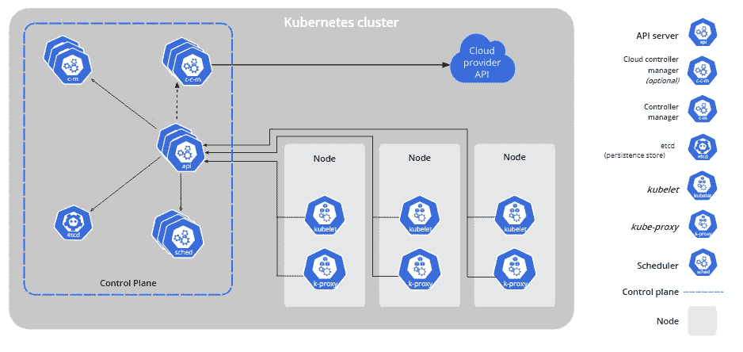

# 不到 5 分钟的 Kubernetes 基础知识

> 原文：<https://medium.com/geekculture/kubernetes-basics-in-under-5-mins-c80cda99ccbb?source=collection_archive---------14----------------------->

## 使用 K8s 的容器编排

Photo by [Garrett parker](https://unsplash.com/@garrettpsystems?utm_source=medium&utm_medium=referral) on [Unsplash](https://unsplash.com?utm_source=medium&utm_medium=referral)

如果你是一名技术人员，我几乎可以肯定你在某个时候听过这个术语。不用担心，如果不是。在本文中，我们将介绍 [Kubernetes](https://en.wikipedia.org/wiki/Kubernetes) 的基础知识及其高级架构。Kubernetes 是一个容器编排系统。容器编排是对在容器中运行的单个 web 服务器的管理。所以，我们需要容器来编排它们。

在我们深入细节之前，让我们简单了解一下容器的概念，因为理解容器是 Kubernetes 的先决条件。

## 那么，什么是容器呢？

容器能够包装所有的应用程序代码和依赖项，从而使运行应用程序所需的一切都可以跨平台交付。值得注意的是，Kubernetes 不是 Docker 的替代品，而是一种补充。如果多克是个婴儿，K8 就是个保姆。

## 为什么是 Kubernetes？

假设你有一个容器，接下来怎么办？你可以部署它。但是部署单个实例只能满足有限数量的最终用户的需求。如果你想把它扩展到百万用户呢？如果你的申请失败了怎么办？如果托管实例的系统出现故障怎么办？

一种方法是手动操作。但这并不务实。我来告诉你为什么。手动管理这些容器实例既费力又耗时。有什么解决办法？你答对了！Kubernetes 可以帮你做重活。它帮助我们将基于微服务的应用程序部署到 Kubernetes 管理的集群中，使容器高度可用和可伸缩。

> Kubernetes 是一个开放源码的弹性框架，它自动化了容器的伸缩、部署和操作。您需要的只是一个现成的容器，其余的可以由 K8s 来处理。

## 特征

*   **自动回滚/恢复，无需停机** —它逐步推出对您的应用或其配置的更改，同时监控应用运行状况，以确保它不会同时终止您的所有实例。如果出现问题，Kubernetes 将为您回滚更改[1]。
*   **可扩展性** —基于 CPU 使用率的自动水平扩展。
*   **配置管理/机密** —用于设置环境变量的配置映射命令行参数，机密允许您存储和管理敏感信息，如密码、OAuth 令牌和 ssh 密钥。
*   **自我修复/容错** —重新启动失败的容器，在节点死亡时替换和重新调度容器，终止不响应的容器

## 它是如何工作的？

豆荚——K8 星团的最小单位。一个容器放在一个容器上。pod 本身驻留在一个称为 worker 节点的节点中。工人从主节点接受指令。主节点告诉我们如何运行应用程序，以及需要哪些配置来维护应用程序的状态。

## 库伯内特建筑

*   主网点
*   工作节点

Kubernetes Cluster[1]

## 主网点

*   **API 服务** —主要组件并保持所需状态。这是唯一暴露在外界的组件。用户可以使用 YAML /JSON 文件指定所需的状态(希望如何运行应用程序)。该文件可能包含诸如要制作多少副本、容器数量等细节。
*   **调度器** —调度我们需要在 K8 集群中运行的 pod。豆荚本质上是易变的，也就是说，它们会活过来——完成它们的工作，然后死去。每当新的 pod 出现时，调度器维护并确保 pod 被分配给一个工作节点。
*   **控制器** —控制工作节点中的操作和发生的事情。控制工作节点的容量和运行状况检查。Ex-调出新的节点/单元。
*   **数据存储** —存储从 K8 集群生成的数据的键值数据存储。

## 工作节点

a) **kubelet** —在工作节点上运行的代理，它确保节点内的所有 pod 都在运行并与 API 服务对话。如果你熟悉 Linux 生态系统，这基本上是一个守护进程。

b) **kube 代理** —维护网络相关规则，如防火墙，暴露于外部网络/外部世界。

c) **容器运行时** —这可能是 Docker 之类的服务容器运行时，它提供了一个环境，确保容器拥有运行所需的一切。

d) **箱**—K8 集群中最小的单元，基本上包含一个或多个集装箱。理想情况下，每个应用程序应该有一个容器，但这取决于您的需求。

我希望这能让您对它的工作原理有一个简单的了解。我说的就是这些！更多信息，请参见[本](https://github.com/kubernetes/kubernetes)。🎉

# 外卖食品

Kubernetes 彻底改变了软件开发🚧通过使容器化的应用程序高度可用和可伸缩。Kubernetes 可以解决一些传统问题，如网络问题。它还支持将数据中心外包给不同的云服务提供商。

Kubernetes 可以带你到云端，真的！☁️

## 参考

[1][https://kubernetes.io/](https://kubernetes.io/)

[https://www.vmware.com/topics/glossary/content/kubernetes](https://www.vmware.com/topics/glossary/content/kubernetes)

如果您有兴趣了解更多关于容器的信息，请参见下文。

 [## Docker 101:你想知道的关于 Docker 的一切

### docker——如果你曾经被它花哨的名字吓到，想知道它是什么——这篇文章就是为你准备的。

towardsdatascience.com](https://towardsdatascience.com/docker-101-all-you-wanted-to-know-about-docker-2dd0cb476f03)