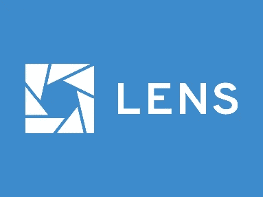
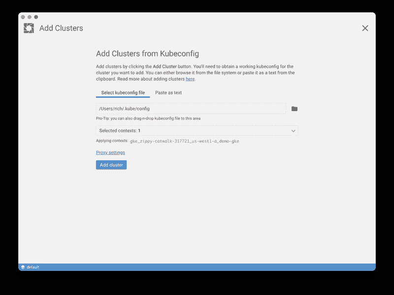
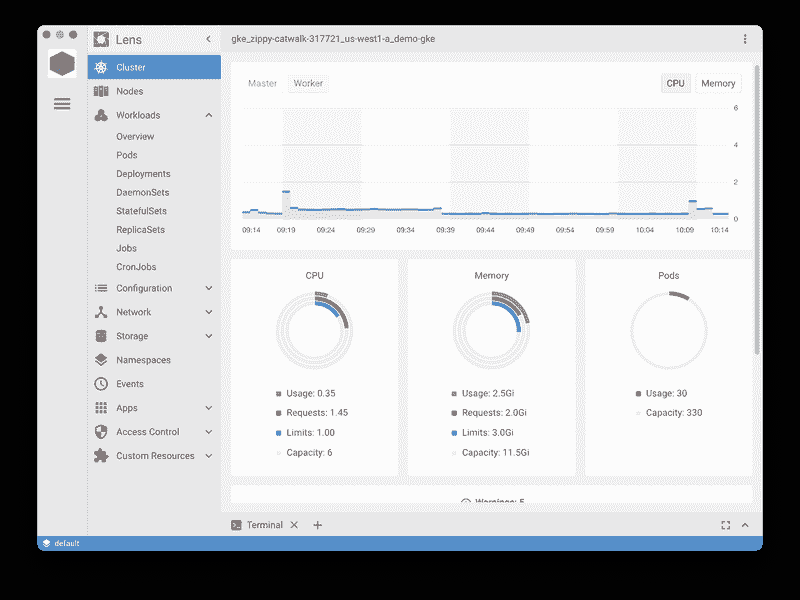
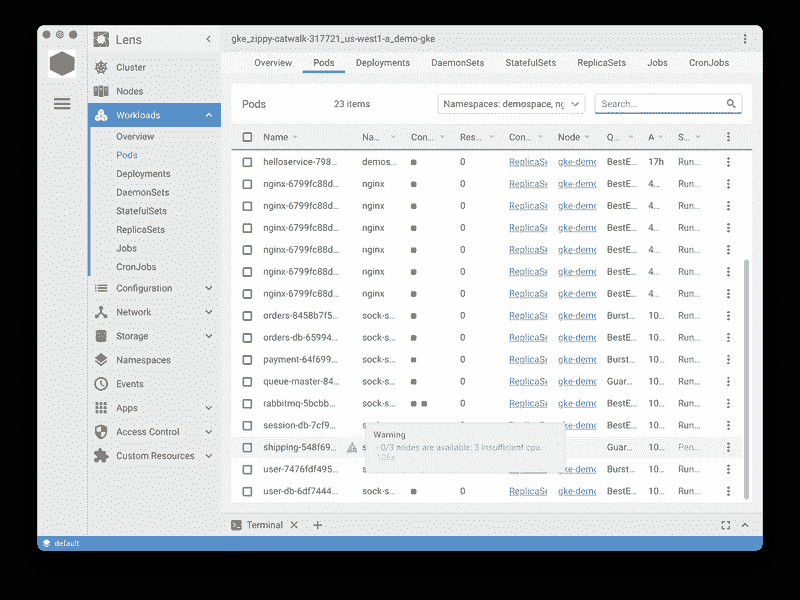
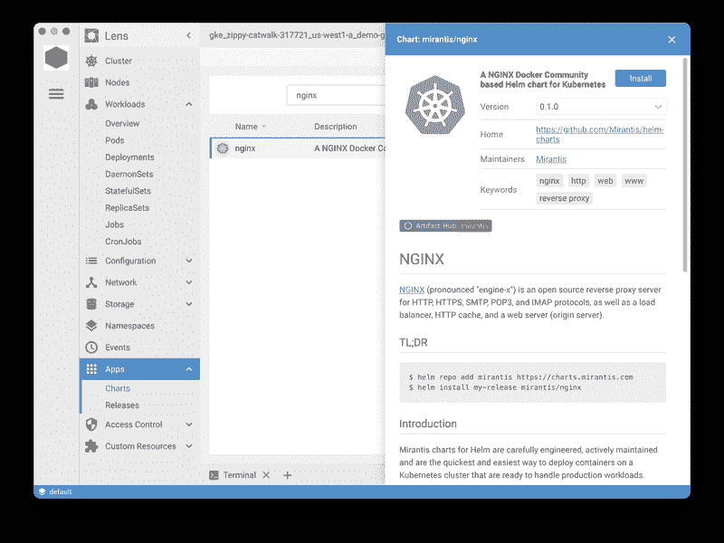
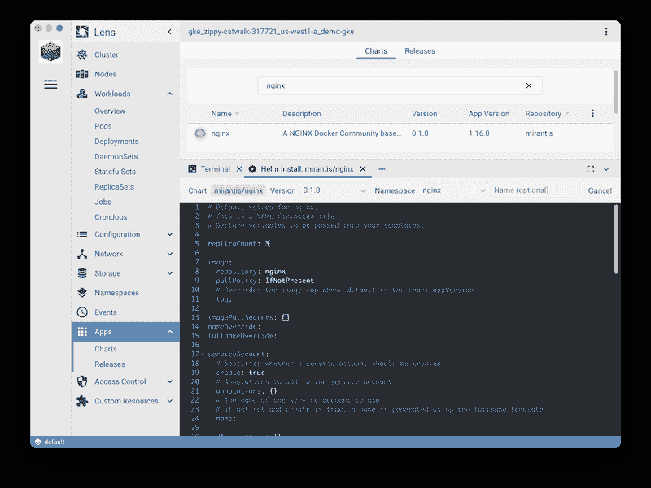
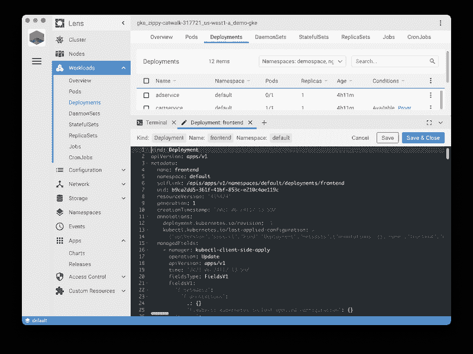

# Kubernetes 仪表板:透镜

> 原文：<https://medium.com/geekculture/kubernetes-dashboards-lens-96454492e5c8?source=collection_archive---------41----------------------->

里奇·巴勒斯

对于我们中的一些人来说，像 kubectl 这样的命令行工具是与 Kubernetes 集群交互的好方法，但是许多人更喜欢图形界面。Kubernetes 有一个[内置的仪表盘](https://kubernetes.io/docs/tasks/access-application-cluster/web-ui-dashboard/)，但是有些人在寻找它不支持的功能。在这个系列中，我们将看看 Kubernetes 可用的其他一些仪表板，以及它们必须提供什么。

我们将从最受欢迎的替代品之一开始，透镜。Lens 团队将他们的工具描述为“用于开发的 Kubernetes IDE”，这是一个非常强大的工具。Lens 最初是专有的，但是 [Mirantis 在 2020 年 8 月收购了它](https://techcrunch.com/2020/08/13/mirantis-acquires-lens-an-ide-for-kubernetes/)，并且开源了[的代码](https://github.com/lensapp/lens)。这是一个基于电子的应用程序，你可以在本地电脑上运行。它允许对您的 Kubernetes 集群进行读写访问。

# 添加集群

使用 Lens 连接到 Kubernetes 集群很容易。如果您有一个指向集群的本地 Kubeconfig 文件，您可以将其导入到 Lens 中进行连接。

Lens 允许您配置多个集群进行管理，并在它们之间轻松切换。

Lens 中的度量非常方便。

不过，Lens 将无法显示指标，直到您[将其配置为与 Prometheus](https://docs.k8slens.dev/main/clusters/settings/#prometheus) 一起工作。如果您的集群中没有 Prometheus 实例，您可以直接从 Lens 轻松添加一个。右键单击 UI 左上角的群集图标，然后选择“Settings”。在那里，您可以安装一个已经设置好的 Prometheus 实例来使用 Lens。在应用之前，您还可以预览 Prometheus 的 Kubernetes 清单。

如果你已经运行了普罗米修斯，你可以[配置它](https://github.com/lensapp/lens/blob/master/troubleshooting/custom-prometheus.md)与镜头一起工作。

# 管理对象

您可以查看集群中对象的状态，包括 pod、部署、名称空间、网络、存储，甚至自定义资源。Lens 是快速识别运行不正常的 pod 并了解原因的好方法。

如您所见，在这个视图中，我选择了多个名称空间来查看窗格。我只需将鼠标悬停在一个处于挂起状态的 pod 上，就可以了解原因。这些都是可以用 kubectl 表现出来的，但是有些人更喜欢图形化的视图。

如果您的用户拥有正确的访问权限，Lens 将允许您在集群中进行更改。这可能是非常好的，也可能是非常坏的，取决于具体情况。如果你是一家使用 GitOps 的商店，你可能不希望个别开发人员或平台工程师在你的代码工作流之外对状态进行修改。但是，如果您使用的是开发集群，这可能没问题。这完全取决于你的团队如何工作。

你可以用 Lens 做的一件事是从舵图安装应用程序。点按左侧菜单中的应用程序图标，然后您可以搜索您想要安装的图表。这比去[神器中心](https://artifacthub.io/)并在那里追踪一张图表要方便得多，这对于评估新的头盔图表非常有用。

单击安装按钮后，您会看到一个屏幕，您可以在其中直接编辑 YAML 进行更改。在这个例子中，我将 NGINX 副本的数量从一个改为三个。

您还可以像使用 [kubectl edit](https://jamesdefabia.github.io/docs/user-guide/kubectl/kubectl_edit/) 一样编辑集群中正在运行的对象。

同样，这不太可能是大多数团队想在生产环境中做的事情，但是对于还不熟悉 kubectl 的人，或者在孤立的开发环境中工作的人来说，这可能是很好的。同样需要注意的是，用户可以在 Lens 中进行的更改也可以在 kubectl 中进行，因此防止在 GitOps 工作流之外进行更改的真正方法是使用[基于角色的访问控制(RBAC)](https://kubernetes.io/docs/reference/access-authn-authz/rbac/) 权限。

# 扩展ˌ扩张

扩展是 Lens 中的一个新特性，它允许你编写自定义代码来扩展 Lens，或者重用其他人构建的扩展。现在 GitHub 上有一些共享的扩展[。希望会有更多的出现。Kubecost 刚刚发布了一个扩展](https://github.com/lensapp/lens-extensions)，用于在 Lens 中跟踪您的成本指标。

如果你想尝试构建自己的镜头扩展，文档中有一个[开发指南。推荐使用 Typescript，您也可以](https://api-docs.k8slens.dev/v4.2.5/extensions/get-started/overview/)[为您的扩展编写测试](https://api-docs.k8slens.dev/v4.2.5/extensions/testing-and-publishing/testing/)。如果您喜欢使用 Lens，并且熟悉 JavaScript/Typescript，这可能值得一试。

# 结论

Lens 有很多很棒的功能，它是一个独立的应用程序，而不是内置的 Kubernetes 仪表盘。我们使用工具的方式各不相同，这就是为什么 Kubernetes 有如此多样的图形用户界面是件好事。

如果你用 Kubernetes，那就值得看一看 Lens。

在我系列的下一篇文章中，我将关注另一个受欢迎的 Kubernetes 用户界面[头灯](https://github.com/kinvolk/headlamp)，稍后我们将关注官方的 [Kubernetes 仪表盘](https://kubernetes.io/docs/tasks/access-application-cluster/web-ui-dashboard/)。敬请关注。

*最初发布于*[*https://loft . sh*](https://loft.sh/blog/kubernetes-dashboards-lens/)*。*