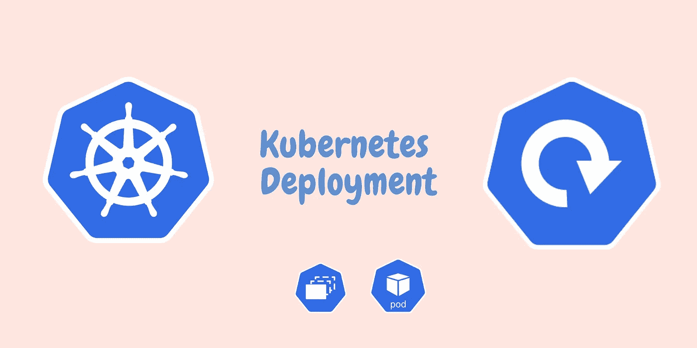

# Kubernetes 部署说明

> 原文：<https://medium.com/geekculture/kubernetes-deployment-explained-9b2b89dd3977?source=collection_archive---------1----------------------->

了解什么是 Kubernetes 集群中的部署，并了解部署对象的优点。

Kubernetes Deployment Example

之前我们已经了解了 Kubernetes 集群中的[复制控制器和复制集](/geekculture/replication-controller-vs-replicasets-in-kubernetes-7b780e4d09d5)。在本文中，我们将了解 Kubernetes 集群中的部署以及如何创建部署 YAML 文件。我们将讨论 Kubernetes 部署的优势，例如如何…