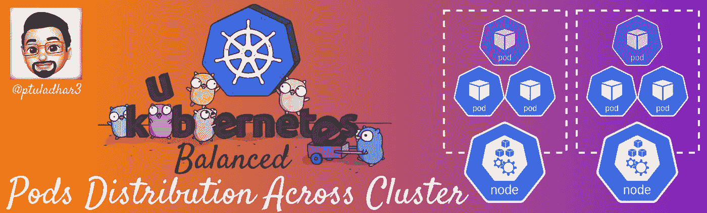
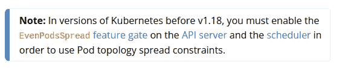

# Kubernetes:在集群节点上均匀分布 pod

> 原文：<https://medium.com/geekculture/kubernetes-distributing-pods-evenly-across-cluster-c6bdc9b49699?source=collection_archive---------2----------------------->

# **简介**

管理集群中的 pod 分布很困难。Kubernetes 的荚果亲和性和反亲和性特征允许对荚果放置进行一些控制。然而，这些特性只能解决部分 Pods 分发用例。

为了实现高可用性和高效的集群资源利用，通常需要在集群中均匀分布 pod。

因此， [PodTopologySpread](https://kubernetes.io/docs/concepts/workloads/pods/pod-topology-spread-constraints/) 调度插件就是为了填补这一空白而设计的。自 Kubernetes v1.19 以来，该插件已达到稳定状态。

*Source:* [*Pod Topology Spread Constraints*](https://kubernetes.io/docs/concepts/workloads/pods/pod-topology-spread-constraints/)

通过一个示例了解如何使用拓扑分布约束(Kubernetes 的一个特性)在集群节点上以绝对均匀的方式分配 Pods 工作负载。

## ***👉*** *此处阅读更多:**[https://ptuladhar.gumroad.com/l/kubernetes-pod-distribution](https://ptuladhar.gumroad.com/l/kubernetes-pod-distribution)*

*   *[https://kubernetes . io/blog/2020/05/introducing-podtopologyspread/](https://kubernetes.io/blog/2020/05/introducing-podtopologyspread/)*