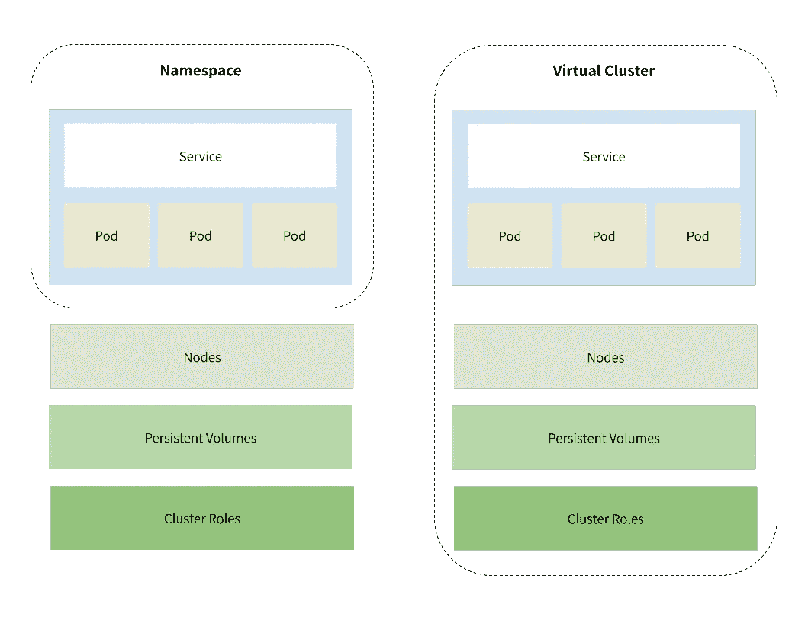
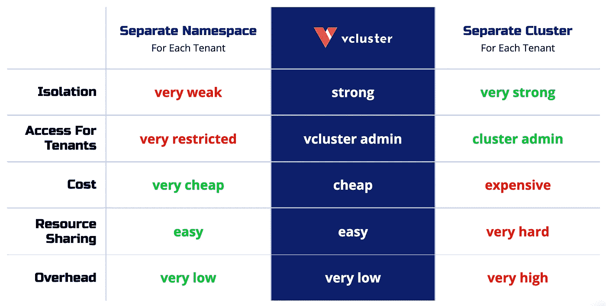
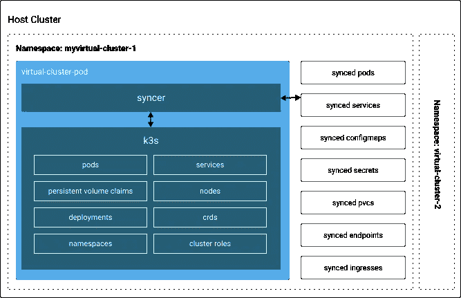

# Kubernetes 名称空间与虚拟集群

> 原文：<https://medium.com/geekculture/kubernetes-namespaces-vs-virtual-clusters-cc8731752972?source=collection_archive---------15----------------------->

作者:Sanket Makhija

如果您需要启动一个 Kubernetes 环境来运行您的端到端测试，您会怎么做？当然，您希望您的设置能够反映生产情况，但是启动一个 Kubernetes 集群(或多个集群)是资源密集型的，而且速度很慢。因此，您可以考虑在已经运行的集群中使用名称空间来实现这种隔离环境。

*名称空间*是运行在单个物理 Kubernetes 集群中的相对隔离的环境。您可以用名称空间为您的每个测试运行创建一个新的环境，但是它们有一些限制。

例如，如果您的应用程序需要创建集群范围的资源(节点、持久卷、存储类等)。)，名称空间不是很合适。他们只能通过您的主机集群访问这些资源，如果您需要环境之间真正的隔离，这是行不通的。

[*虚拟集群*](https://loft.sh/blog/introduction-into-virtual-clusters-in-kubernetes/?__hstc=76629258.d1019f5bcd77ef2f85491f50431248f7.1624054255764.1624054255764.1624054255764.1&__hssc=76629258.1.1624054255765&__hsfp=664985226) (或*虚拟集群*)是在 Kubernetes 集群中创建集群的另一种解决方案。虚拟集群创建了更强的关注点分离，同时保持了对集群级资源的访问，而名称空间不能单独访问这些资源。

名称空间和虚拟集群都是运行孤立的 Kubernetes 工作负载的基本工具，但是区别可能很大。本文将探讨在 Kubernetes 中使用名称空间和虚拟集群的利弊。在此过程中，您将了解每种情况下的具体用例，以便在您的情况下做出最佳决策。

# 名称空间

名称空间旨在将集群划分为多个环境，在这些环境中，用户分布在共享同一个 Kubernetes 集群的几个团队或项目中。它们有独立的服务和 pod，并提供了命名资源的范围，但不能嵌套在彼此内部，并且仍然可以相互通信。

# 为什么要使用名称空间？

如果您与许多独立部署应用程序并拥有许多专用资源的团队一起运行一个复杂的应用程序，那么您的默认名称空间将很快变得难以导航。此外，在一个名称空间中运行数百个服务很难理解连接了什么，因此名称空间是在集群中对资源进行逻辑分组的一种很好的方式。

微服务是名称空间的一个很好的用例。它们有助于避免命名冲突，并通过使多个服务更难使用同一个数据库来鼓励关注点的分离。同时，有意义的时候可以分享一些资源。

名称空间的另一个常见用例是分离登台和开发环境。例如，如果您使用一个[弹性堆栈](https://www.elastic.co/log-monitoring)进行日志记录，您可以将它部署在一个集群中，并在两个环境中使用。这种方法有一些明显的缺点(我将在下一节中讨论)，但是值得指出的是，这是一种常用的方法。

名称空间允许在多个团队之间划分集群的资源，但也允许您实现资源配额。

因此，假设您有一个资源有限的开发集群，并且您希望为每个团队的应用程序提供一部分资源。您可以为每个命名空间定义资源配额，以限制每个命名空间可以使用多少 CPU 或 RAM。这可以防止一个团队的应用程序消耗太多内存，导致应用程序的其他部分开始出现故障。

最后，名称空间增强了基于角色的访问控制。例如，可以设置权限，使得团队可以在他们的名称空间中创建、更新和删除资源，但是他们不能在其他名称空间中进行类似的操作。这最大限度地降低了新工程师意外干扰另一个团队的应用程序的风险。

# 名称空间的限制

虽然名称空间是一些轻度隔离的好工具，但它们本身并不是完整的 Kubernetes 集群，这意味着当您依赖于基于名称空间的隔离时，会遇到一些严重的风险和限制。

首先，所有的名称空间都使用相同的 [Kubernetes 控制平面](https://kubernetes.io/docs/concepts/overview/components/#control-plane-components)，因此 API 服务器、etcd、调度器和控制器管理器在名称空间之间共享。不幸的是，这意味着您不能在一个名称空间内的任何 Kubernetes 级资源上运行定制配置。

其次，Kubernetes 中的一些组件没有命名空间。它们只是全局地存在于集群中，您不能使用名称空间来隔离它们。例如，可以在整个集群中访问持久性卷。因此，即使您隔离了上面提到的弹性日志服务，另一个名称空间中的服务也可以连接到同一个卷，并向其中读取或写入数据。

这一限制也适用于其他重要资源，如入口控制器、节点和存储类。因此，如果您的一个微服务需要根据增加的负载来启动新节点，您不能在名称空间级别完成，您需要在 Kubernetes 集群级别完成。

需要更高级别的可配置性或更好的资源隔离的团队通常必须建立多个集群。如上所述，这可能非常昂贵，而且启动速度也非常慢。每个集群都必须创建一个额外的 API 服务器、控制器管理器、etcd 和 kubelet。

幸运的是，还有另一个解决方案:虚拟集群。

# 虚拟集群

虚拟 Kubernetes 集群允许您在现有的 Kubernetes 集群中构建新的 Kubernetes 集群。这个虚拟集群实现了更高程度的隔离，使您能够运行更加可定制的 Kubernetes 环境，而无需每次都提供新的物理集群。

虽然运行虚拟集群有[几种不同的方式，但是](https://loft.sh/blog/introduction-into-virtual-clusters-in-kubernetes/?__hstc=76629258.d1019f5bcd77ef2f85491f50431248f7.1624054255764.1624054255764.1624054255764.1&__hssc=76629258.1.1624054255765&__hsfp=664985226#existing-solutions-for-virtual-clusters) [Loft Labs](https://loft.sh/?__hstc=76629258.d1019f5bcd77ef2f85491f50431248f7.1624054255764.1624054255764.1624054255764.1&__hssc=76629258.1.1624054255765&__hsfp=664985226) 的一个流行解决方案在您现有的 Kubernetes 集群中使用了一个名为 [k3s](https://k3s.io/) 的轻量级 Kubernetes 实现。集群在一个名称空间内运行，具有虚拟身份，并使用自己的核心 Kubernetes 资源，这些资源与主机集群同步。

> *“除了同步虚拟和主机集群资源之外，虚拟机管理程序还将某些 Kubernetes API 请求重定向到主机集群，例如端口转发或 pod/服务代理。它实际上充当了虚拟集群的反向代理。”—* [*虚拟集群简介*](https://loft.sh/blog/introduction-into-virtual-clusters-in-kubernetes/?__hstc=76629258.d1019f5bcd77ef2f85491f50431248f7.1624054255764.1624054255764.1624054255764.1&__hssc=76629258.1.1624054255765&__hsfp=664985226)

# 为什么要使用虚拟集群？

虚拟集群[解决了名称空间带来的许多问题](https://loft.sh/blog/virtual-clusters-for-kubernetes-benefits-use-cases/?__hstc=76629258.d1019f5bcd77ef2f85491f50431248f7.1624054255764.1624054255764.1624054255764.1&__hssc=76629258.1.1624054255765&__hsfp=664985226)。

因为您可以在一个名称空间中拥有多个虚拟集群，所以它们比传统的 Kubernetes 集群便宜得多，并且需要较少的管理和维护工作。这使得它们非常适合运行实验、持续集成和设置沙盒环境。

在许多情况下，虚拟集群也比名称空间提供了更多的稳定性。虚拟集群创建自己的 Kubernetes 资源对象，这些对象存储在其数据存储中。主机集群不知道这些资源。

像这样的隔离对于弹性来说是极好的。如上所述，使用基于名称空间的隔离的工程师仍然可以访问 Kubernetes 级别的资源，如持久卷或 etcd 配置。如果一个工程师破坏了这些共享资源中的一个，那么依赖它的所有团队都可能失败。

最后，虚拟集群可以独立于物理集群进行配置。这非常适合多租户，例如让您的客户能够运行新环境，或者为您的销售团队快速设置演示应用程序。

# 虚拟集群的局限性

虽然虚拟集群提供了比名称空间更高的隔离级别，但是它们也有其局限性。首先，因为它们运行在同一个主机集群上，所以不适合信任度非常低的情况——传统集群仍然会提供更高程度的隔离。

虚拟集群目前也不支持 Kubernetes 的所有特性。例如，虚拟存储类、容器运行时和网络插件在 vclusters 中不可用，因此您要么必须限制对应用程序中这些功能的访问，要么回退到主机集群。

# 运行虚拟集群

要开始使用 vclusters，[查看 Loft](https://loft.sh/?__hstc=76629258.d1019f5bcd77ef2f85491f50431248f7.1624054255764.1624054255764.1624054255764.1&__hssc=76629258.1.1624054255765&__hsfp=664985226) 。它可以在任何 Kubernetes 主机上运行，并且可以在仅仅五分钟内完成[安装。](https://loft.sh/features/virtual-kubernetes-clusters?__hstc=76629258.d1019f5bcd77ef2f85491f50431248f7.1624054255764.1624054255764.1624054255764.1&__hssc=76629258.1.1624054255765&__hsfp=664985226)

当创建一个虚拟集群时，Loft 构建一个新的名称空间和一个轻量级集群。然后，vcluster 的虚拟机管理程序会在虚拟集群和底层主机集群之间同步 Kubernetes 资源。

您的开发人员可以在任何需要隔离环境的时候使用这个虚拟集群。因为他们对主机集群的访问级别不同，所以您可以放心，他们不太可能因为部署不当而导致整个应用程序瘫痪。

为了帮助您节省基础设施成本，Loft 还提供了一种[睡眠模式](https://loft.sh/docs/self-service/sleep-mode?__hstc=76629258.d1019f5bcd77ef2f85491f50431248f7.1624054255764.1624054255764.1624054255764.1&__hssc=76629258.1.1624054255765&__hsfp=664985226#:~:text=The%20sleep%20mode%20feature%20in,the%20space%20or%20virtual%20clusters.)，可以自动缩减 vcluster 的资源。要开始，查看[阁楼快速入门](https://loft.sh/docs/quickstart?__hstc=76629258.d1019f5bcd77ef2f85491f50431248f7.1624054255764.1624054255764.1624054255764.1&__hssc=76629258.1.1624054255765&__hsfp=664985226)指南。

# 结论

对于在一个集群中运行多个环境，名称空间有时是一个可以接受的选择。它们在 Kubernetes 中提供有限的用户权限、使用配额和一些独立的资源。在你沿着这条路走得太远之前，一定要了解一下[最佳实践](https://cloud.google.com/blog/products/containers-kubernetes/kubernetes-best-practices-organizing-with-namespaces)和局限性。

虚拟集群通过为更稳定、更有弹性和更灵活的 Kubernetes 环境提供更充分的隔离，在许多方面改进了名称空间。它们既可用于开发工作负载，也可用于生产工作负载，与传统集群相比，可帮助您节省资金。要了解更多信息或开始使用虚拟集群，请查看 [Loft](https://loft.sh/?__hstc=76629258.d1019f5bcd77ef2f85491f50431248f7.1624054255764.1624054255764.1624054255764.1&__hssc=76629258.1.1624054255765&__hsfp=664985226) 。

[Didssph](https://unsplash.com/@didsss) 在 [Unsplash](https://unsplash.com/) 上拍照。

*原发布于*[*https://loft . sh*](https://loft.sh/blog/kubernetes-namespaces-vs-virtual-clusters/)*。*