# kubernetes Pods & Docker Containers:在 Windows 10 Home 中使用虚拟盒子旋转虚拟机

> 原文：<https://medium.com/geekculture/kubernetes-pods-docker-containers-spin-vm-using-virtual-box-in-windows-10-home-d3be783ff087?source=collection_archive---------15----------------------->

## 托管虚拟机管理程序:类型 2 + MicroK8s + Docker Hub

## Kubernetes 滚动更新和声明式部署

Windows 10 Home + Virtual Box VM’s + Ubuntu + Spring Boot + Docker + Kubernetes

# 范围

本文解释了如何使用声明式部署来创建 Kubernetes pods 和服务。它通过从 Docker Hub 获取更新的映像来执行滚动更新。

这个练习在主机操作系统 Windows 10 家庭版中完成。由于 Home edition 不提供 Hyper-V(第 1 类虚拟机管理程序),因此需要安装 Oracle Virtual Box 作为托管的第 2 类虚拟机管理程序，以便在虚拟机中以 Ubuntu 操作系统作为来宾来运行虚拟机。

**要试用这个练习，要求读者具备以下*****中的任意一个:**
**选项 1** 。Unix/Linux 风格的操作系统，安装 Docker 和 Kubernetes。(非 Windows)
(或)
**选项 2** 。带有 Hyper-V、虚拟机、Docker 和 Kubernetes 的 Windows 操作系统。
(或)
***选项 3*** *。Windows 10 家庭版，配有 Oracle Virtual Box、虚拟机、Docker、Kubernetes。* ***(本文基于选项 3 设置)****

*我们设计了构建为容器映像的 Spring boot 微服务。图像将被标记并 ***推/上传*** 到 Docker Hub。Kubernetes 将执行声明式部署，并将映像作为滚动更新，用于 Spring boot 应用程序中的未来更改。*

*上面的动画图显示了安装在其他产品之上的每个产品，其中 Spring Boot、Docker 和 Kubernetes 安装在 Ubuntu 客户操作系统中，如 ***选项 3*** *中所列。**

# *先决条件*

1.  *Windows 10 家庭版(最低)*
2.  *Oracle 虚拟机箱 6.1 版*
3.  *Ubuntu 操作系统 ISO 镜像*
4.  *码头中心账户*
5.  *码头工人*
6.  *Kubernetes - MicroK8s(试验台，单节点集群)*
7.  *Spring Boot 管理依赖性和设计微服务*

*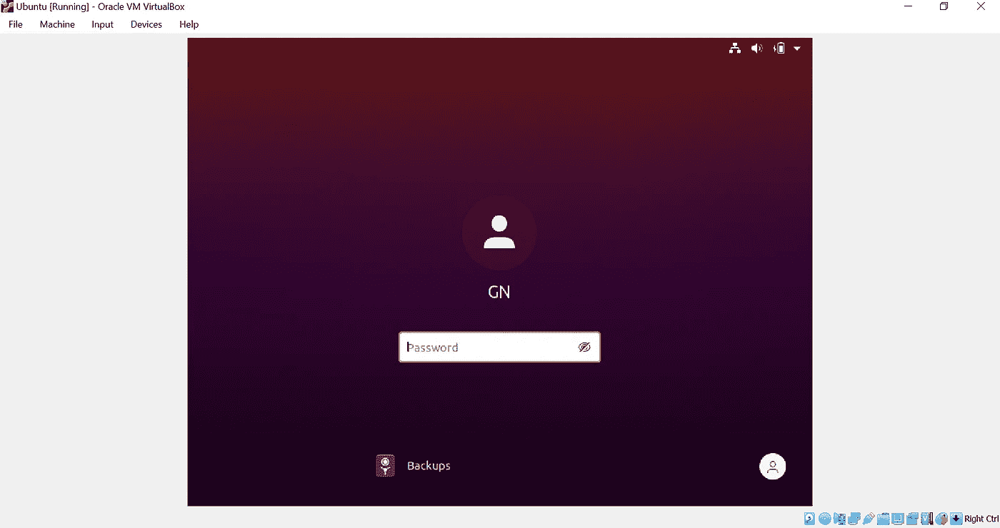*

*Ubuntu Guest OS running in Virtual Machine*

# *安装 Docker 和依赖项*

*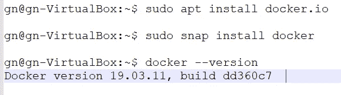*

*command to Install docker, and its dependencies*

# *安装 Oracle JDK 1.8 版*

*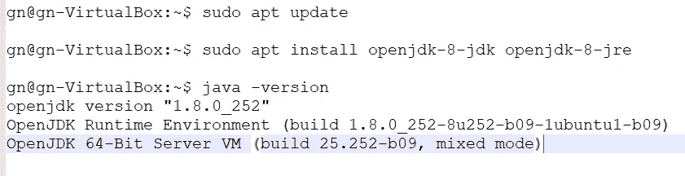*

*command to Install Open JDK v1.8*

# *设置 JAVA_HOME 和 JRE_HOME 环境变量*

*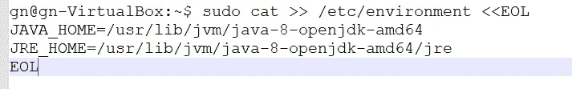*

*SET Environment variables*

# *安装 Maven*

*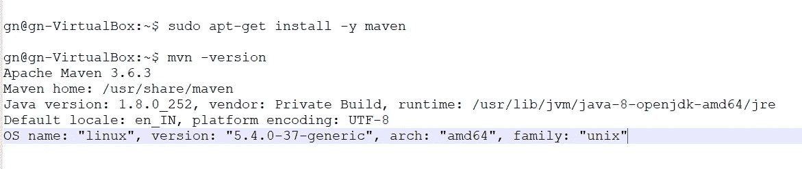*

*command to Install Maven*

# *创建 Spring Boot 微服务*

1.  *创建一个简单的 spring boot 微服务，按照下面的命令打包并运行。*

*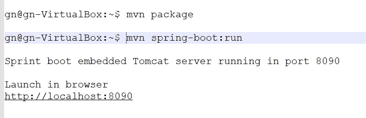*

*Package, Run, Launch*

# *构建映像和运行容器的步骤*

1.  *创建 Dockerfile 文件*

*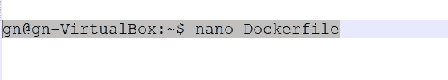*

*command to create Dockerfile*

*2.在 Dockerfile 中添加以下内容并保存。我们将容器端口 8090 公开为映射到容器外部的端口 8080。*

*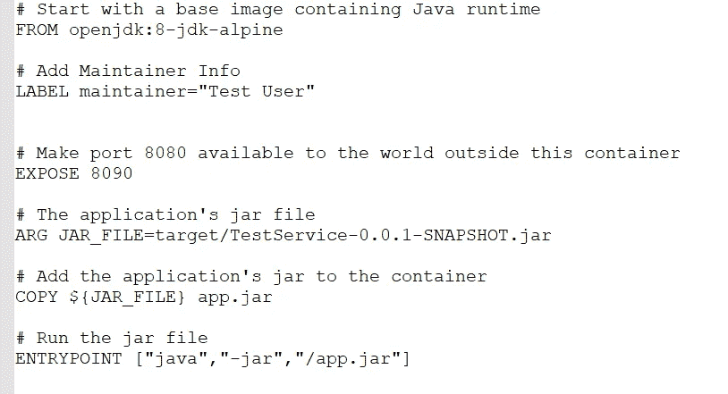*

*contents in Dockerfile*

*3.构建图像*

*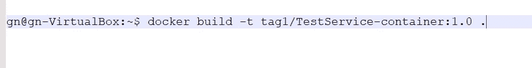*

*Build Image*

*上面的命令将查找在当前目录中创建的 Dockerfile。)点*

*4.检查图像是否成功创建。*

*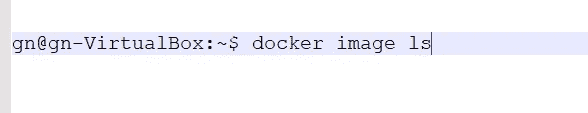*

*List docker images*

*5.运行容器*

*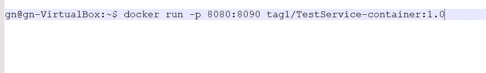*

*Run Container*

*我们将容器的端口 8090 公开给本地机器的端口 8080。
该应用程序可在 [http://localhost:8080](http://localhost:8080) 上访问。*

*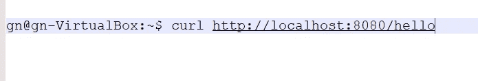*

*cURL command to execute API*

# *标记并将图像推送到 Docker Hub*

*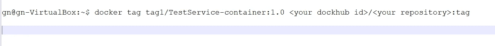*

*在将图像推送到 Docker hub 之前，需要执行以下步骤:
1 .在码头中心创建码头 id。这是 Docker Hub 用户名。
2。一旦您有了 Docker ID，您必须授权 Docker 连接到 Docker Hub 帐户。
3。在你上传你的图片之前，上传到 Docker Hub 的图片必须有一个 ***用户名/图片:标签*** 4 格式的名称。 ***用户名*** 是你的 Docker ID， ***图片*** 是图片的名称， ***标签*** 是一个可选的附加属性——通常它用来表示图片的版本。
5。要根据此格式重命名图像，请运行以下命令:*

*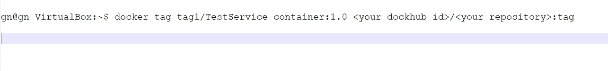*

*command to Tag image to the format of Docker Hub account*

*6.将新创建的映像推送到 Docker Hub。*

*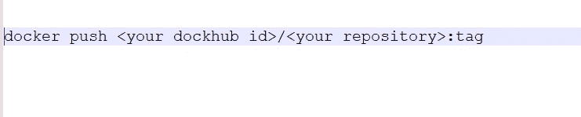*

*command to Push image to Docker Hub*

# *kubernetes——容器编制者*

## *安装 Kubernetes-micro k8s(试验台)*

1.  ****为什么要****MicroK8s****Testbed？***
    有时候您可能想释放 Kubernetes 的单个节点实例。比方说，你正在开发一个应用程序或服务，你需要测试它。在投入生产之前，为什么不在 Kubernetes 测试平台上部署它呢？或者，您可能正在寻求改进您的 Kubernetes 开发。与成熟的 Kubernetes 集群不同，单个节点是开发和测试的最佳实例之一。*

*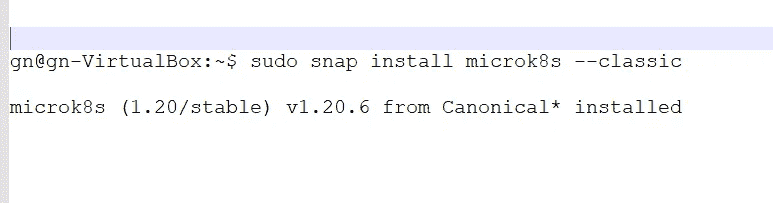*

*command to Install MicroK8s — Kubernetes*

*2.**启动/停止 MicroK8s***

*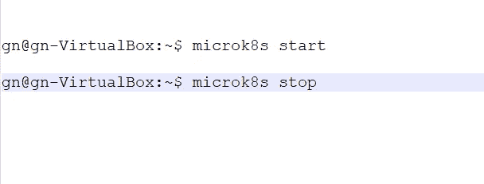*

*command to start and stop MicroK8s*

*3.**检查状态并访问仪表板。***

*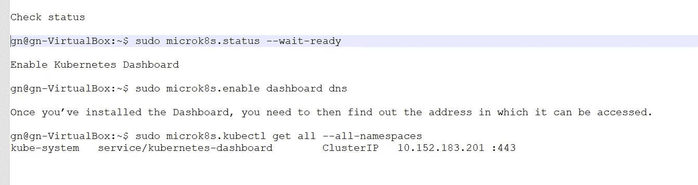*

*command to Check Status and find IP of Kubernetes dashboard*

# *用于访问 Kubernetes 仪表板的令牌*

*Kubernetes 仪表板需要令牌才能访问。你怎么找到那个令牌的？首先，您必须使用以下命令让 Microk8s 列出所有可用的秘密:*

1.  *列表机密*

*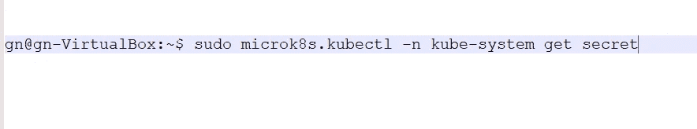*

*command to find Kubernetes dashboard secret*

*2.检索服务的秘密令牌*

*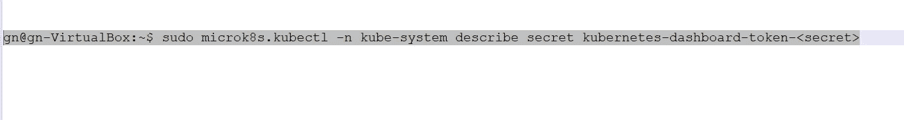*

*command to retrieve Kubernetes dashboard token*

*3.使用令牌登录仪表板*

*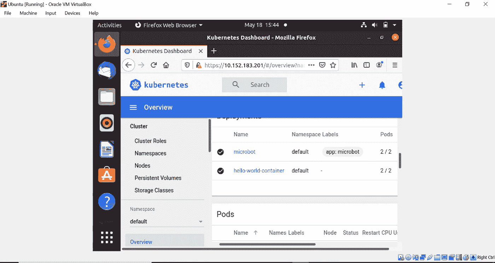*

*Kubernetes — MicroK8s dashboard*

# *准备 Kubernetes 声明性部署*

1.  *为了让 Kubernetes 访问 Docker Hub 映像，将您在 Kubernetes 集群中的 Docker 凭据设置为一个秘密，您可以选择任何名称<anysecretname>。</anysecretname>*
2.  *该命令将采用以下参数:
    <your-Registry-server>是您的私有 Docker 注册表 FQDN。将[https://index.docker.io/v2/](https://index.docker.io/v2/)用于 DockerHub。
    <你的名字>是你的码头工人用户名。
    < your-pword >是你的 Docker 密码。
    <你的-email >是你的 Docker email。*
3.  *在 Kubernetes 集群中创建秘密以从 Docker Hub 访问图像。*

*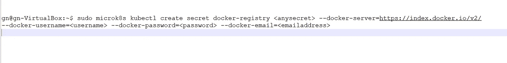*

*command to create secret in Kubernetes cluster*

*4.创建声明式部署—***deployment . YAML*** *我们可以将* 提供的 **D *部署*** *类*和 ***服务*** *类*配置在单个 ***yaml*** 文件中如下所示。
用 ***(3 破折号)*** 把它们分开就行了*

*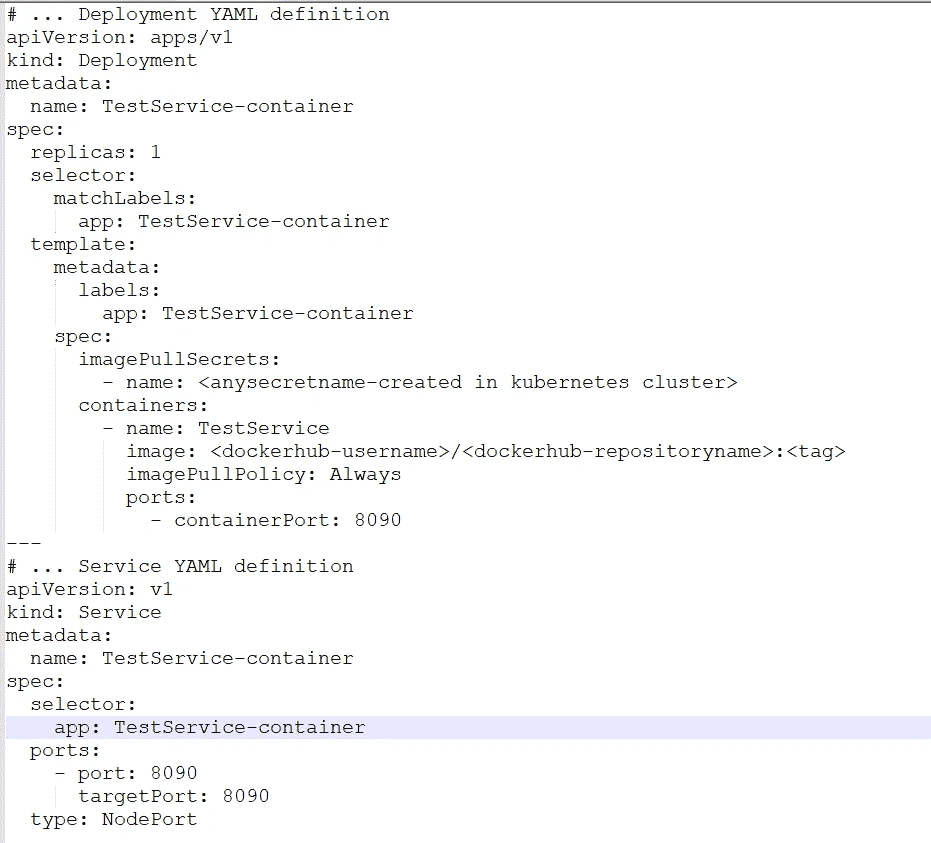*

*Deployment kind and Service kind configuration for Declarative deployment*

*5.创建部署、单元、服务*

*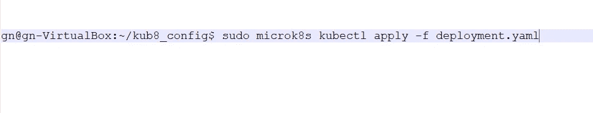*

*command to create Deployment, Pods, Services*

*6.库伯内特斯的鱼鳞荚*

*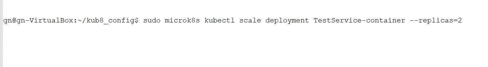*

*command to Scale Pods in Kubernetes cluster*

*7.查找服务 IP、Pod IP 以访问服务*

*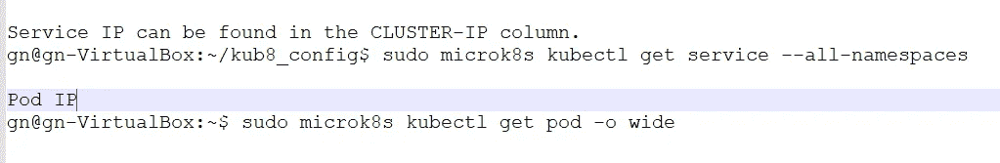*

*command to find Service IP, Pod IP*

*8.访问 Kubernetes 集群之外的服务
要访问 Kubernetes 集群之外的微服务，应该使用 ***节点端口*** ，它又映射到 Pod。
要找到 ***节点端口*** ，发出命令:*

**

*Find NodePort to access service from outside Kubernetes cluster*

****Node-IP:Node port***
[http://localhost:31312/](http://localhost:31312/hello)k8*

*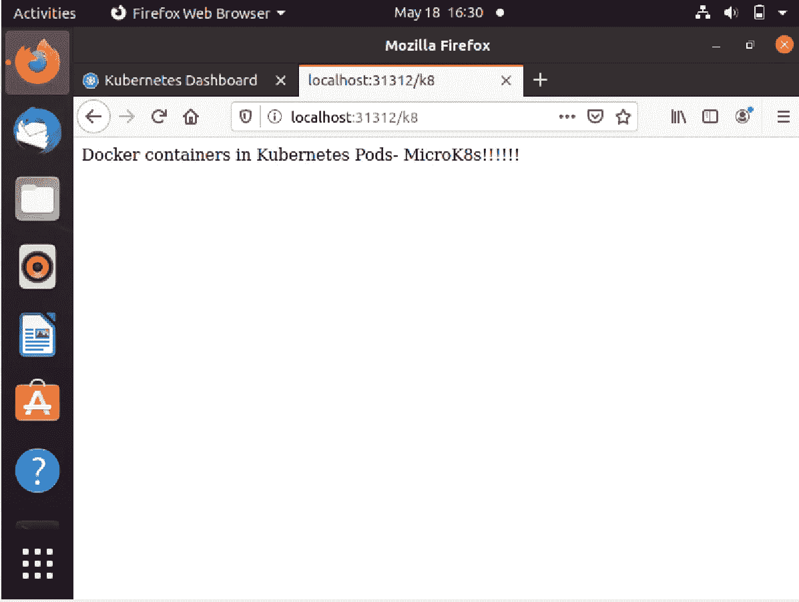*

*Microservice accessed from outside Kubernetes cluster*

# *Kubernetes 滚动更新*

*到目前为止，我们在 Kubernetes 中看到的配置不需要在应用程序的任何未来更新中重复。
更新后的应用需要重新构建，镜像需要推送到 Docker Hub。
Kubernetes 将使用以下命令获取修改后的映像版本，并执行滚动更新，这将使部署在 Kubernetes 集群中的应用程序能够向用户提供最新的更改。*

*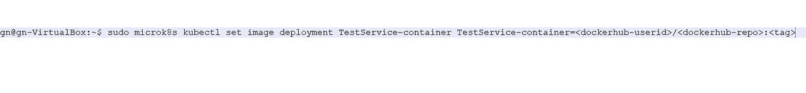*

*command to execute Rolling updates — Kubernetes cluster*

# *结论*

*本文解释了 Docker、Kubernetes、Java platform、Maven 和 Spring Boot 的安装和配置。主要重点是理解如何构建 Docker 映像和运行容器。创建和扩展 Kubernetes Pods、服务、声明式部署和滚动更新。*

***出版于 2021 年 5 月 18 日***

> ***其他媒体文章，*由* Ganesh Nagalingam***
> 
> *[使用 JAPA 访问者模式探索语法树和补救代码气味](/geekculture/quest-syntax-tree-and-remedy-code-smell-using-japa-visitor-patterns-f023a89842cf)*
> 
> *[*异步 WebSocket 消息中间件和微服务*](/nerd-for-tech/asynchronous-websocket-messaging-middleware-and-microservices-1a50a8f14e4b)*
> 
> *[*通过 CORS*](/geekculture/amalgamate-angular-with-spring-cloud-architecture-through-cors-7f13b5fdb98f) 融合棱角与春云建筑*
> 
> *[多代理洞察 Apache Kafka 集群架构](/geekculture/multi-broker-insights-into-apache-kafka-cluster-architecture-617b0abfc53e)*
> 
> *[*远程队列定义:IBM MQ v 9.2*](https://ganeshblog.medium.com/remote-queue-definition-ibm-mq-v9-2-c3ec4f568dab?source=user_profile---------5----------------------------)*
> 
> *[*联合 OKTA IdP 与 WSO2 API Manager 作为 Spring boot 微服务集成的网关*](https://ganesh-nagalingam.medium.com/federate-okta-idp-wso2-api-manager-as-gateway-to-spring-boot-microservices-integration-ba567567e81)*
> 
> *[整合服务提供商(sp)和 OKTA 身份提供商(IdP)](https://ganesh-nagalingam.medium.com/integrate-service-providers-sps-with-okta-identity-provider-idp-ce64a4e262ae)*
> 
> *[*将 IBM 业务流程管理器与混合 MobileFirst 应用程序集成*](https://ganeshblog.medium.com/integrate-ibm-business-process-manager-with-hybrid-mobilefirst-application-5aed20841bf3?source=user_profile---------2----------------------------)*
> 
> *[*Kerberos V5:Windows 10 Home 中使用 Apache directory studio 的 SSO 认证*](https://ganeshblog.medium.com/kerberos-v5-sso-authentication-in-windows-10-home-using-apache-directory-studio-fb0151899185?source=user_profile---------3----------------------------)*
> 
> *[*将 IBM WebSphere Service Registry and Repository 与 IBM Process Server 集成*](https://ganeshblog.medium.com/integrate-ibm-websphere-service-registry-and-repository-with-ibm-process-server-f97eeb0e2ea?source=user_profile---------6----------------------------)*