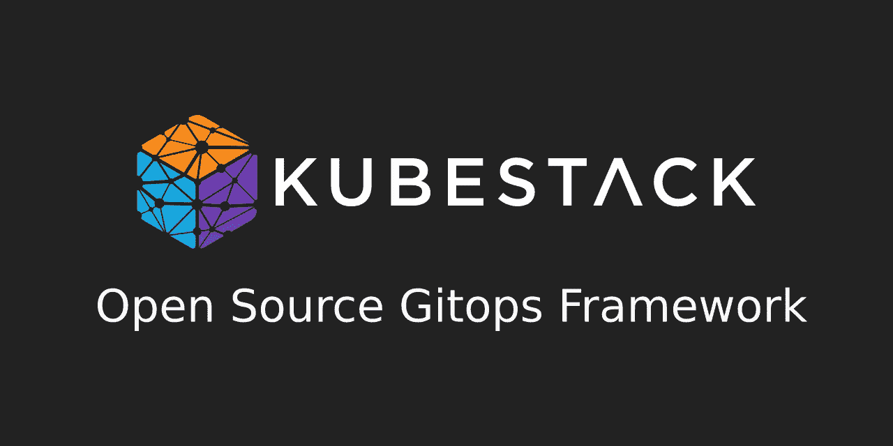
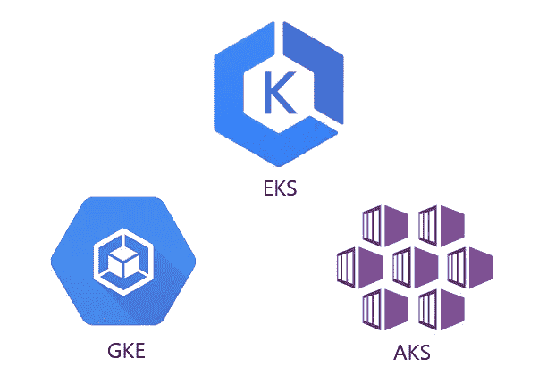
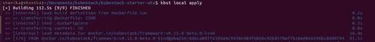
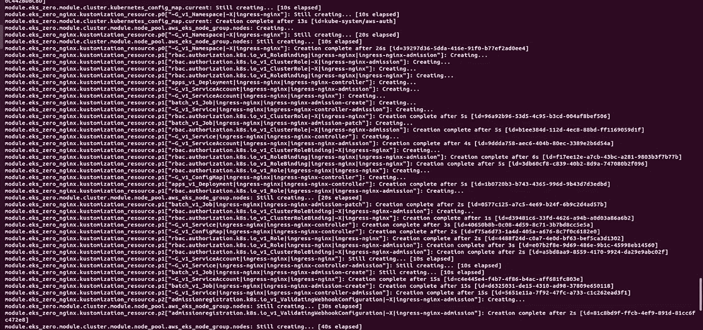
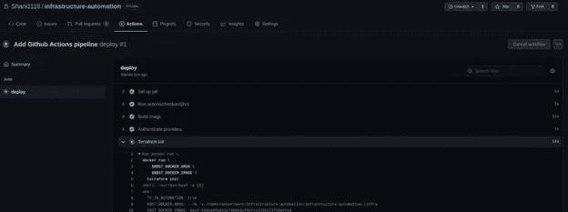
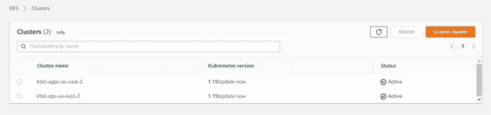

# KubeStack —必须使用

> 原文：<https://medium.com/geekculture/kubestack-a-must-use-117a32efd427?source=collection_archive---------11----------------------->

## 一个开源、易用的 GitOps 框架

自动化是新的趋势。自动化帮助并影响了许多行业，但在我看来，IT 行业从中获益最大。在自动化这个巨大的话题中，GitOps 吸引了从全栈工程师到 SREs 和 DevOps 专业人员的大量关注。GitOps 是一种为云原生应用程序应用连续部署的方法。这是一种使用开发人员友好的方法(如 Git 和持续部署)部署应用程序的方式。

每当 Git 存储库中发生变化时，没有什么比自动部署存储在其中的配置更好的了。如果您是使用 Kubernetes 的开发人员，那么您一定遇到过从头开始重复部署应用程序的困难。舵图缓解了其中的一些痛点，但没有引入开箱即用的完美自动化。幸运的是，有一个新的开源框架将帮助您为 Kubernetes (K8s)构建基础设施自动化。KubeStack 是一个开源的 Terraform 框架，面向希望实现基础设施自动化的团队。

Image Source — [https://github.com/kbst](https://github.com/kbst) (Authorized by Owner)

KubeStack 是一个与 Terraform 生态系统集成良好的框架。KubeStack 支持用于 Kustomize 和 Terraform 集成的 Terraform 模块和提供程序。KubeStack 与亚马逊网络服务、谷歌云平台和 Azure 等主要云提供商进行了整合。它使用各自的云平台提供商来管理 K8s 集群，即亚马逊的 EKS、Azure 的 AKS 和谷歌的 GKE。在这个框架中，集群基础设施和集群服务是使用 Terraform 模块定义的。

KubeStack 的另一大特点是它是一个开源框架。有一些特性使它从竞争中脱颖而出，成为最受欢迎的自动化框架。为团队提供稳定的 GitOps 工作流、简化测试过的 Terraform 模块、重用测试过的 Terraform 模块的能力、加快应用程序开发速度等特性使自动化更加顺畅和高效。这是一个理想的解决方案，因为很容易将 KubeStack 与多个云 K8s 提供商(如 EKS、AKS 和 GKE)集成。

Image by Author

KubeStack 对我来说非常容易理解和安装，因为它有文档和教程。KubeStack 文档写得很好，即使对于初学者也很容易理解。我用 AWS 平台尝试了 KubeStack 框架。这些命令和逐步指导教程对我的理解很有帮助。

[KubeStack 安装](https://www.kubestack.com/framework/documentation/tutorial-get-started)包括三个主要步骤。

1.  在当地发展
2.  供应基础设施
3.  设置自动化

我将详细介绍这些步骤，并解释我使用 KubeStack 的经历。

# 在当地发展

在我看来，这是 KubeStack 中最好的元素之一。开发人员可以在本地环境中模拟配置。多棒啊。如果您正在使用多个环境，比如开发、质量保证和生产，我确信这个特性会派上用场。您可以在本地机器上模拟您在特定环境中为云所做的配置更改。因此，您不必担心在将您的更改部署到云时可能出现的错误。

通过利用本地主机开发，您可以降低与云提供商进行交互以排除故障和修复错误配置的成本。本地环境是通过使用一种称为 KinD(Docker 中的 Kubernetes)的技术创建的，其中 K8s 节点作为 Docker 容器在本地运行。

如你所见，KubeStack 也是快速高效的。在初始阶段，在本地构建我的配置只花了 112.5 秒。

# 供应基础设施

这是教程的第二部分。如果您对本地更改感到满意，在这一步中，您可以将其移动到您首选的云提供商基础架构。KubeStack 中有一个特殊的容器用于引导。该容器提供了与其他云提供商 CLI 工具类似的工具。

在这个阶段，您将创建 GitOps 存储库。为此，您需要设置身份验证方法和 Terraform 配置的远程状态。在此阶段创建了两个 Terraform 工作空间，称为应用程序和运营。在此阶段，远程状态配置应用于两个工作区。我跟随教程，这对我来说很容易设置。这些工作区创建 AWS 资源，例如:

*   VPC 和子网配置
*   路由表和 RT 关联
*   互联网网关
*   Route53 托管区域和相应的 route 53 记录
*   安全组
*   IAM 角色、策略和实例配置文件
*   EKS 集群—集群服务，节点组
*   Kustomization 资源—

在应用配置更改之后，需要将更改提交给 git，以便在 GitOps 过程中遵循。

# 设置自动化

这是 KubeStack 工作流程中我最喜欢的一步。在这个阶段，通过添加管道和实现 GitOps 工作流来创建自动化流程。

我创建了一个名为“**infra structure-automation**”的新存储库，并将本地存储库推给它。在为管道设置凭证之后，为 GitOps 流创建管道就像单击一个按钮一样简单。KubeStack 教程包含管道文件，我所要做的就是遵循教程中的命令。

将更改推送到远程 repo 后，可以在发出拉请求时显示管道更改。

就这样，我能够在很短的时间内在 AWS 中部署 K8s 集群。

总的来说，我对 KubeStack 的体验非常满意。这个过程花费了一个多小时，而我能够在两分钟内使用 GitOps 工作流进行部署。如果您链接您的存储库来触发自动化管道运行，您将能够为您的部署节省大量时间。KubeStack 是 K8S 项目的优秀自动化框架工具。我向任何 SRE 和 DevOps 工程同事推荐这一框架，并了解它如何简化您的日常运营工作。