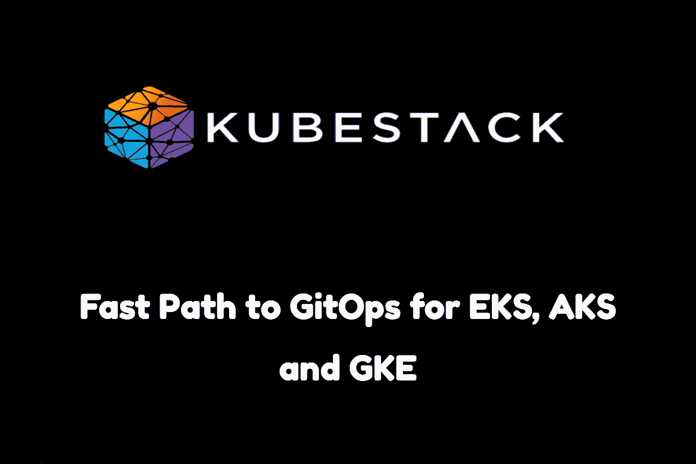
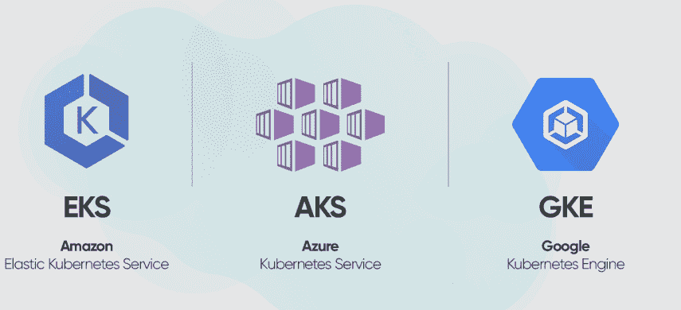
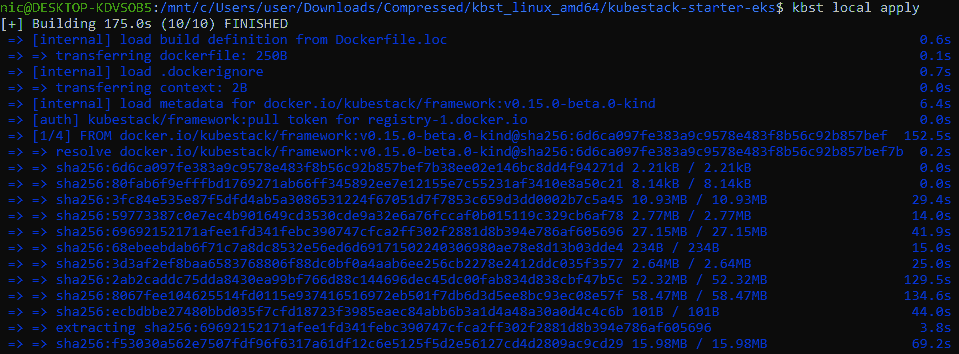
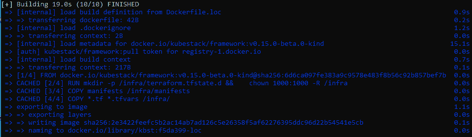
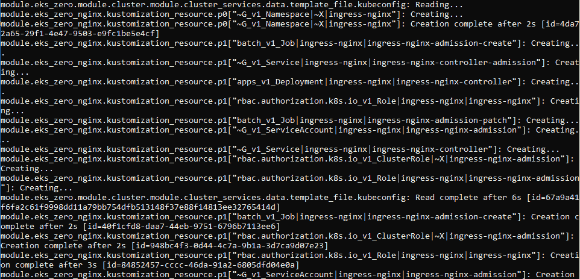

# KubeStack-GitOps 快速制作！

> 原文：<https://medium.com/geekculture/kubestack-gitops-made-fast-176ba9d49a96?source=collection_archive---------16----------------------->

一个开源的 GitOps 框架。

Image by Author

# 介绍

随着对云提供商依赖的增加，在容器中部署服务是当今的一个大话题。维护容器的过程可能很麻烦，这就是为什么我们使用像 Kubernetes 这样的容器编排器。AWS、Google 和 Azure 将 Kubernetes 作为托管服务提供，但如果通过编码来完成，获得一个全功能的集群并在其背后创建一个 GitOps 工作流可能会很紧张。

如果您曾经使用过 Kubernetes，那么您一定遇到过从头开始反复部署应用程序的挑战。虽然舵图试图使它更容易，但他们并没有为此带来一个完美的自动化。如果存储在 Git 存储库中的配置在发生变化时自动部署，那会更好。多亏了 KubeStack，这是一个新的开源框架，将帮助 Kubernetes (K8s)用户建立基础设施自动化。在这篇文章中，我将根据我在使用这个框架时的经历给出我对这个框架的真实看法。

# 了解 KubeStack

[KubeStack](https://www.kubestack.com/) 是一个 GitOps 框架，集成了 Kustomize 和 Terraform，帮助团队构建基础设施自动化，让 Kubernetes 享受框架的好处。KubeStack 框架与 Terraform 生态系统进行了本机集成。它维护了许多 Terraform 模块和一个用于集成 Terraform 和 Kustomize 的 Terraform 提供程序。

KubeStack 附带了许多特性，这些特性使它不同于其他自动化框架。其中一些功能包括应用程序开发的高速率，提供经过测试的 Terraform 模块以供重用，以及为团队提供稳定的 GitOps 工作流。Kubestack 还集成了领先的云提供商，如 Azure、谷歌云平台和 AWS(亚马逊网络服务)。它附带了用于云的 Terraform 提供程序来管理 K8s 集群。其中包括 Azure 的 AKS，谷歌的 GKE，亚马逊的 EKS。

Image Source: [www.dev.to](http://www.dev.to)

KubeStack 附带了大量的文档，指导您如何安装和使用它。在下一节中，我将带您完成 KubeStack 的安装过程。我也将分享我在使用 AWS 云提供商测试 Kubestack 时的经验。

# 安装 KubeStack

让我带您了解安装 KubeStack 所需的 3 个步骤:

**第一步:在当地发展**

这一步完全是本地的，不需要任何云资源。它让开发人员有机会在本地环境中尝试配置，以模拟实际的云配置。这个特性是 KubeStack 最伟大的元素之一。如果您正在使用多个环境，如开发、生产和 QA，那么它会非常有用。

当执行一些配置任务时，您必须进行多次迭代才能正确完成。KubeStack 的本地开发环境使您能够迭代将在生产环境中使用的相同结果。更好的是，它会随着更改自动更新，并立即给出反馈，而不必每次都等待 CI/CD 管道运行。

KubeStack 的本地开发环境也有助于开发人员降低他们的云成本，因为他们不必与云提供商交互来识别和修复错误配置。这也意味着开发人员不必担心将变更部署到云时可能出现的错误。

我使用 KinD(Docker 中的 Kubernetes)技术设置本地环境，其中 Kubernetes 节点作为 Docker 容器在本地运行。

Image by Author

从上面的图片来看，在初始阶段，我只花了 175 秒来构建我的本地配置。后续构建比初始构建花费的时间少得多。

Image by Author

这说明 KubeStack 是一个快速高效的 GitOps 框架。

**步骤 2:配置基础设施**

如果您对 Kubestack 在本地开发阶段的表现感到满意，您可以将其转移到所选择的云提供商基础架构。你可以选择 AWS，Azure，或者 Google。

这一步骤包括:

1.  设置身份验证。
2.  设置远程状态。
3.  引导您的基础设施。
4.  正在设置 DNS。

Kubestack 附带了一个特殊的容器，可用于引导云基础设施。该容器还可以轻松提供云提供商 CLI 工具等先决条件。

在这一步中，您必须创建一个 GitOps 存储库并设置身份验证方法。Terraform 需要远程状态来运行 CI/CD，因此，您也必须设置它。我创建了一个 AWS S3 存储桶，并配置了 Terraform 以将其用于远程状态。我还创建了两个工作区，即 *ops* 和*app。*

Image by Author

一旦完成了更改，您应该退出引导容器并将它们提交给 git。

**第三步:设置自动化**

这一步包括通过添加管道和实现 GitOps 工作流来创建自动化流程。自动化流程包括:

1.  推动您的存储库。
2.  设置管道凭据。
3.  添加管道文件。
4.  遵循 GitOps 流程。

对我来说，遵循以上 4 个步骤很容易。我创建了一个新的存储库，然后将我的本地存储库放入其中。然后，我使用 base64 设置了管道凭证，并为 GitOps 流创建了管道。对我来说，添加、提交和推送管道很容易。

我最终设法将更改推送到远程存储库，管道更改显示在一个 pull 请求之后。对我来说，在 AWS 中部署 Kubernetes 集群既简单又快捷。

KubeStack [文档](https://www.kubestack.com/framework/documentation/tutorial-get-started)提供了设置 KubeStack 所需的所有步骤和命令，我的工作就是跟进。还提供了管道文件。

# 库贝斯塔克:最后的想法

我使用 [KubeStack](https://www.kubestack.com/) 的体验很好。从本地开发到设置自动化，这一过程变得简单而快速。KubeStack 在线文档上提供的步骤让我更加容易。通过将存储库设置为自动触发管道运行，您将节省大量执行部署所需的时间。我会向任何参与 Kubernetes 项目的个人推荐 KubeStack。它会让你的工作更容易，更快！