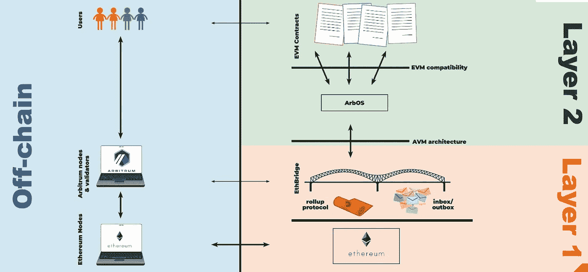
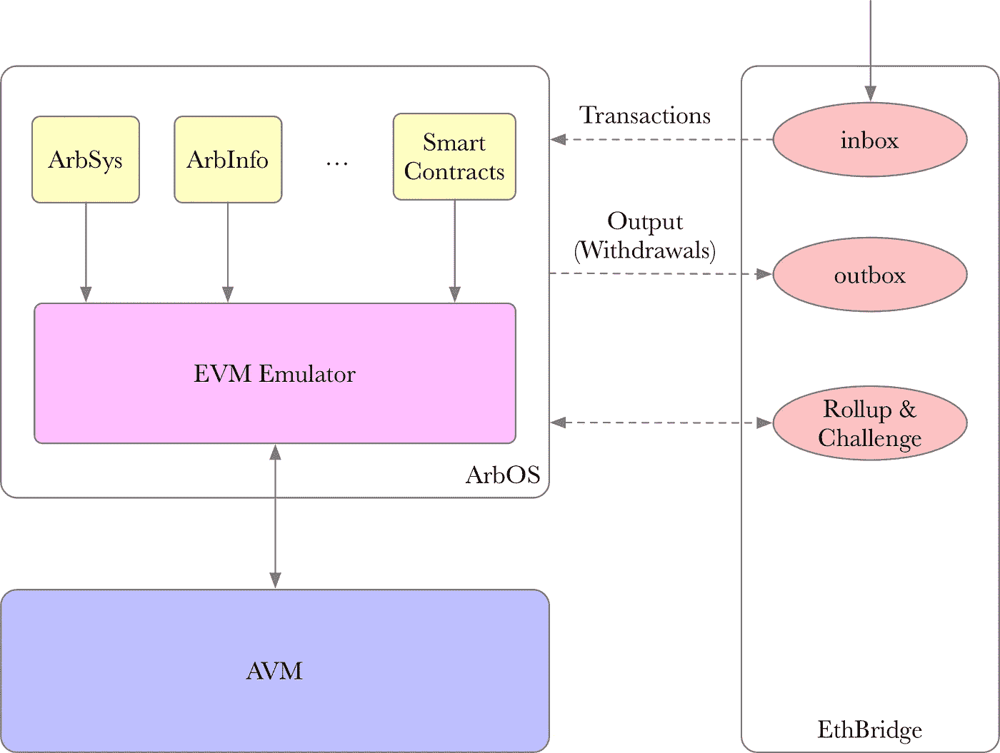
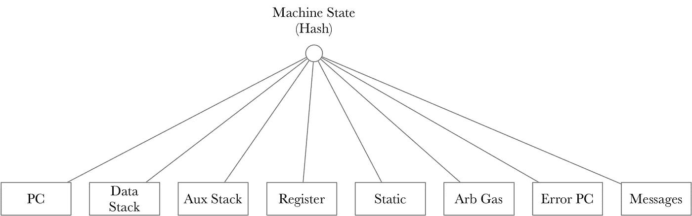
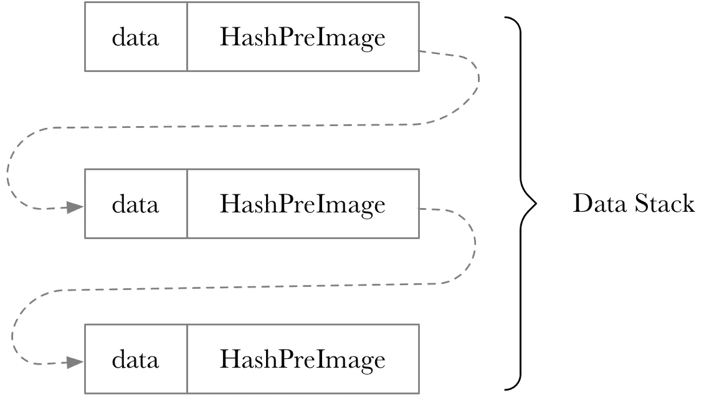
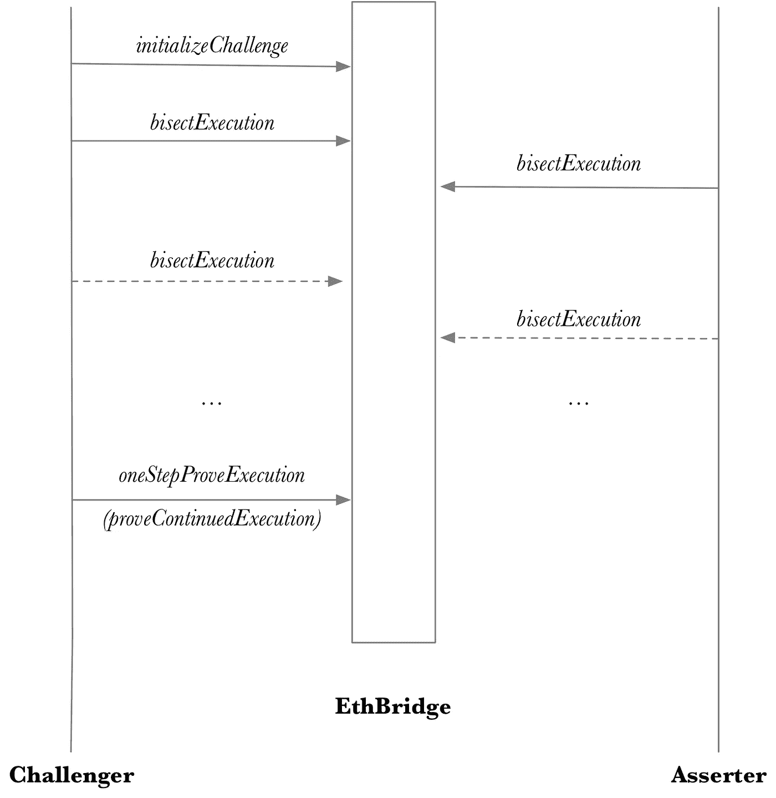
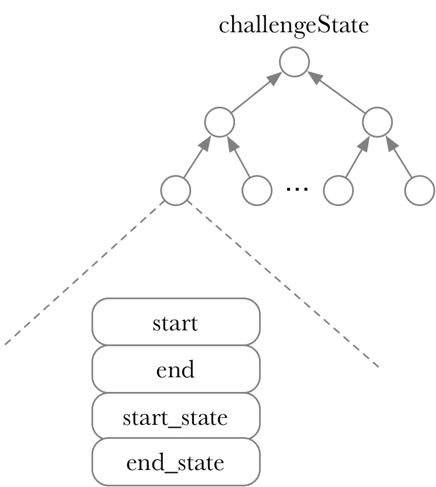
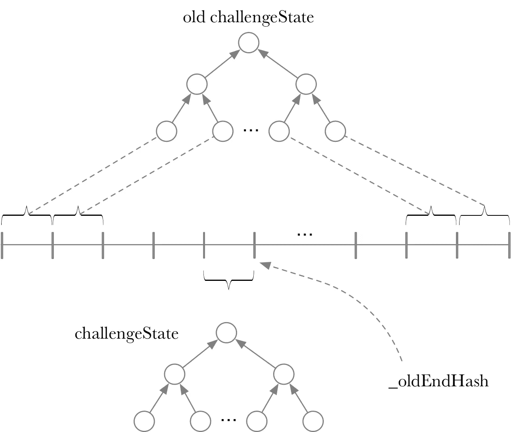

# L2——深入阿尔比特鲁姆

> 原文：<https://medium.com/geekculture/l2-deep-dive-into-arbitrum-ab2dd4c9c4bf?source=collection_archive---------30----------------------->

Arbitrum 是解决方案第 2 层汇总之一。与乐观主义类似，状态终结采取“挑战”机制来提供保障。乐观的挑战机制是在层 1 中完全模拟一个事务，然后验证执行后状态的正确性。这种方法需要第一层的 EVM 模拟环境，比较复杂。另一方面，Arbitrum challenge 要轻便和方便得多。它在第 1 层执行(AVM)以验证这种执行的正确性。在 Arbitrum 简介中提到，整个挑战需要大约 500 字节的数据和大约 9w 的气体。为了采用这种轻量级的挑战机制，Arbitrum 实现了 AVM，并在 AVM 上执行了 EVM 权限。AVM 的优点是基础结构是为易于证明而设计的。

Arbitrum 的开发者文档详细介绍了 Arbitrum 的架构和设计。如果你对 AVM 和 L1/L2 互动的细节感兴趣，你可以去看看“Arbitrum 内幕”这一章:

[https://developer . offchainlabs . com/docs/developer _ quick start](https://developer.offchainlabs.com/docs/developer_quickstart)

# 总体框架

Arbitrum 的开发者文档列出了每个模块之间的关系:



Arbitrum 系统主要由 3 部分组成(指自上而下图的右侧):EthBridge。AVM 执行环境和 ArbOS。EthBridge 主要实现收件箱/发件箱和汇总协议的管理。EthBridge 在第 1 层实现。阿尔伯斯在 AVM 处决了 EVM。简而言之，Arbitrum 在第二层实现 AVM，然后在虚拟机上模拟 EVM 执行环境。之所以用 AVM 模拟 EVM，是因为为了方便第一层挑战，AVM 状态容易表达。

这里列出了与 EthBridge 和 AVM 执行环境相关的源代码:

https://github.com/OffchainLabs/arbitrum.git

ArbOS 的源代码:

【https://github.com/OffchainLabs/arb-os.git 

我们将进一步分解它，因为这个模块关系图过于笼统:



EthBridge 主要实现了三部分功能:收件箱、发件箱和汇总协议。在收件箱中“保存”交易信息，这些信息将被“同步”到 ArbOS 以供执行。发件箱中“保存”L2 到 L1 的交易，主要是取款交易。汇总协议主要用于状态存储和质询。请注意:Arbitrum 中的所有交易首先提交给 L1，然后交给 ArbOS 执行。除了 ArbOS 中的几个外部接口，它大部分实现了 EVM 仿真。整个模拟器是在 AVM 上实现的。EVM 模拟器是用 mini 实现的，Arbitrum 实现了 AVM mini 语言编译器。因此，总的来说，Arbitrum 定义了新的硬件(机器)和命令，并实现了高级语言 mini。Arbitrum 使用 mini 语言实现了 EVM 模拟器来执行相关事务。

# AVM 州

由于所有交易都发生在 AVM，交易执行州可以用 AVM 州来表示。AVM 相关的实现源代码在 arbitrum/packages/arb-avm-cpp 中列出。



AVM 状态由 PC 机、堆栈、寄存器等组成。AVM 状态是这些状态的散列值的组合散列结果。

AVM 是用 c++实现的。AVM 的逻辑是在 machinestate.cpp 中的 machineHash 函数上实现的，AVM 的特点是除了执行之外，还可以相对容易地表达执行状态(证明)。让我们深入研究 AVM 的基本数据结构。AVM 的基本信息结构包括:

```
using value =
    std::variant<Tuple, uint256_t, CodePointStub, HashPreImage, Buffer>;

enum ValueTypes { NUM, CODEPT, HASH_PRE_IMAGE, TUPLE, BUFFER = 12, CODE_POINT_STUB = 13 };
```

*   uint256_t —整数类型
*   CodePoint —当前代码的命令表达式
*   元组—由 8 个值组成。元组中的元素可以是另一个元组。
*   缓冲区—数组，在 2⁶⁴.处长度最长
*   HashPreImage —固定哈希类型，hashValue = hash(value，prevHashValue)

除了数据可视化，每个数据类型的 hash 也很容易计算。

## 代码点

CodePoint 类型将多个操作捆绑在一起。每个代码点不仅保存当前操作，还保存前一个代码点的哈希信息。这样所有的操作都可以联系在一起。当前代码点可以表示当前操作，也可以显示操作的依赖关系。CodePoint 的类型在以下位置定义:packages/ARB-AVM-CPP/AVM _ values/include/AVM _ values/code point . HPP。

```
struct CodePoint {
    Operation op;
    uint256_t nextHash; CodePoint(Operation op_, uint256_t nextHash_)
        : op(op_), nextHash(nextHash_) {} bool isError() const {
        return nextHash == 0 && op == Operation{static_cast<OpCode>(0)};
    }
};
```

## 元组

元组类型由 RawTuple 实现。RawTuple 由一对值集配置。元组限制为最多 8 个值。

```
struct RawTuple {
    HashPreImage cachedPreImage;
    std::vector<value> data;
    bool deferredHashing = true; RawTuple() : cachedPreImage({}, 0), deferredHashing(true) {}
};
```

元组类型定义在:packages/ARB-AVM-CPP/AVM _ values/include/AVM _ values/tuple . HPP 中。

基于对基本类型的理解，DataStack 可以用一系列元组来实现:



总之，诸如 PC、堆栈和寄存器等状态可以用散列结果来表示。整个 AVM 状态用所有这些拼接数据的散列的散列值来表示。

# 汇总挑战

当向 L1 提交状态存在冲突时，断言者和挑战者都首先对状态进行划分，找到冲突点。确定冲突点后，双方可以提供执行环境。然后，L1 执行相关操作，以确保提交的状态是正确的。L1 挑战的处理逻辑在 ARB-bridge-eth/contracts/challenge/challenge . sol 中实现。整个挑战机制带有一个超时保证方法。为了突出核心流程，简化流程如下所示:



Challenger 通过调用函数 initializeChallenge 发起挑战。然后挑战者和断言者用平分执行的函数找到不可分割的冲突点。确认冲突点后，Challenger 使用函数 oneStepProveExecution 检查状态是否正确。

*   初始化挑战

```
function initializeChallenge(
         IOneStepProof[] calldata _executors,
         address _resultReceiver,
         bytes32 _executionHash,
         uint256 _maxMessageCount,
         address _asserter,
         address _challenger,
         uint256 _asserterTimeLeft,
         uint256 _challengerTimeLeft,
         IBridge _bridge
     ) external override {
         ...
        asserter = _asserter;
         challenger = _challenger;
         ...
         turn = Turn.Challenger;
         challengeState = _executionHash;
         ...
     }
```

initializeChallenge 设置挑战者和断言者，以及被挑战的状态(保存在 challengeState)。challengeState 由单等分或多等分的 merkle 树的根组成。



整个执行过程可以分成多个小过程(二分法)。二等分由开始和结束气体和状态表示。

话轮用于记录交互顺序。转=转。挑战者，揭示挑战者在挑战初始化后发起除法。

*   二分执行

等分执行选择先前分割的干线，并在可能的情况下再次分割:



等分执行功能定义如下:

```
function bisectExecution(
         bytes32[] calldata _merkleNodes,                                                            
         uint256 _merkleRoute,                                                                       
         uint256 _challengedSegmentStart,                                                            
         uint256 _challengedSegmentLength,                                                           
         bytes32 _oldEndHash,
         uint256 _gasUsedBefore,
         bytes32 _assertionRest,                                                                     
         bytes32[] calldata _chainHashes                                                             
     ) external onlyOnTurn {
```

_chainHashes 是重分界点的状态。如果需要第二次分割，则需要满足分割点的计数:

```
uint256 private constant EXECUTION_BISECTION_DEGREE = 400;

        require(
             _chainHashes.length ==                                                                  
                 bisectionDegree(_challengedSegmentLength, EXECUTION_BISECTION_DEGREE) + 1,          
             "CUT_COUNT"
         );
```

简而言之，每个部门必须将该部分分成 400 块。

_oldEndHash 用于验证该状态的分割段属于前一个分割段之一。需要检查有效性:

```
require(_chainHashes[_chainHashes.length - 1] != _oldEndHash, "SAME_END");                  

         require(
             _chainHashes[0] == ChallengeLib.assertionHash(_gasUsedBefore, _assertionRest),          
             "segment pre-fields"                                                                    
         );  
         require(_chainHashes[0] != UNREACHABLE_ASSERTION, "UNREACHABLE_START");                     

         require(
             _gasUsedBefore < _challengedSegmentStart.add(_challengedSegmentLength),                 
             "invalid segment length"                                                                
         );
```

初始状态正确。此划分不能超出上一个划分的范围，并且上一个状态必须不同于上一个划分的结束状态。

```
bytes32 bisectionHash =                                                                     
             ChallengeLib.bisectionChunkHash(                                                        
                 _challengedSegmentStart,                                                            
                 _challengedSegmentLength,
                 _chainHashes[0],
                 _oldEndHash
             );
         verifySegmentProof(bisectionHash, _merkleNodes, _merkleRoute);
```

通过检查 merkle 树的路径，验证起始和结束状态属于以前的分部之一:

```
updateBisectionRoot(_chainHashes, _challengedSegmentStart, _challengedSegmentLength);
```

更新部门的相应挑战等级。

*   一步到位执行

当除法达到极限时，挑战者提供初始状态(初始状态的证明)，并由 L1 据此计算。计算结果应该不同于 _oldEndHash。不一致意味着挑战者成功地证明了之前的计算不正确。

```
(uint64 gasUsed, uint256 totalMessagesRead, bytes32[4] memory proofFields) =
                 executors[prover].executeStep(
                     bridge,
                     _initialMessagesRead,
                     [_initialSendAcc, _initialLogAcc],
                     _executionProof,
                     _bufferProof
                 );
```

用 executeStep 计算正确的结束状态。executeStep 在 packages/ARB-bridge-eth/contracts/arch/onestepproofcommon . sol 中实现，核心是函数 executeOp，从当前上下文读取 Op，执行，更新状态。感兴趣的人可以去看看。

```
rootHash = ChallengeLib.bisectionChunkHash(
                 _challengedSegmentStart,
                 _challengedSegmentLength,
                 oneStepProofExecutionBefore(
                     _initialMessagesRead,
                     _initialSendAcc,
                     _initialLogAcc,
                     _initialState,
                     proofFields
                 ),
                 _oldEndHash
             );
         }

         verifySegmentProof(rootHash, _merkleNodes, _merkleRoute);
```

*   确保初始状态和结束日期是上次质询状态的一个版本。初始状态由提供的证明计算得到。

```
 require(
                 _oldEndHash !=
                     oneStepProofExecutionAfter(
                         _initialSendAcc,
                         _initialLogAcc,
                         _initialState,
                         gasUsed,
                         totalMessagesRead,
                         proofFields
                     ),
                 "WRONG_END"
             );
```

验证 _oldEndHash 与计算结果不同。同样，不一致意味着提交的状态不正确。

```
_currentWin();
```

完成计算后，确定获胜者。

**结论:**

Arbitrum 是第 2 层汇总的解决方案。它利用挑战机制来保证汇总状态的全局。为了引入轻量级挑战机制，Arbitrum 定义了 AVM，一种可以方便地证明执行状态的虚拟机，并与编译器一起设计了迷你语言。EVM 执行环境是在 AVM 上模拟的，与 EVM 兼容。在挑战过程中，师将段分成 400 块，L1 执行几个命令来确保状态正确。