# 实验室:分析 IMDb 数据

> 原文：<https://medium.com/geekculture/lab-analyzing-imdb-data-e88ff55123d6?source=collection_archive---------11----------------------->

在这个实验室里，我完成了一系列探索 IMDb 电影分级数据的练习。我对 IMDB 的电影数据进行了基本的探索性数据分析，试图回答如下问题:每种类型的平均评分是多少？一部电影里有多少不同的演员？

**基础级**

让我们导入必要的库:

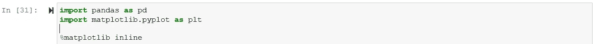

## 读入“imdb_1000.csv ”,并将其存储在名为“movies”的数据帧中。

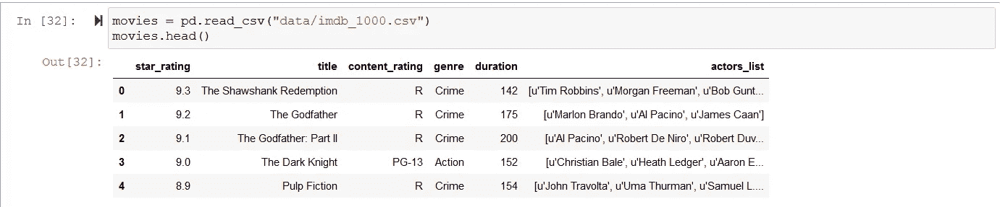

## 检查行数和列数

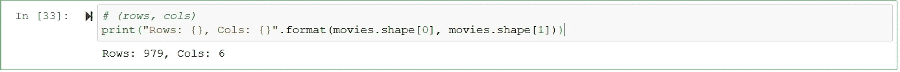

## 检查每列的数据类型。

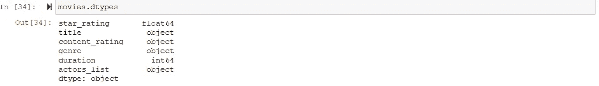

## 计算平均电影时长。

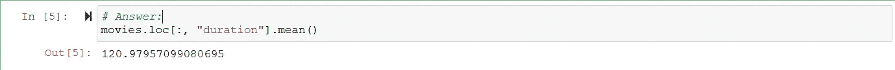

## 按时长对数据帧进行排序，找出最短和最长的电影。

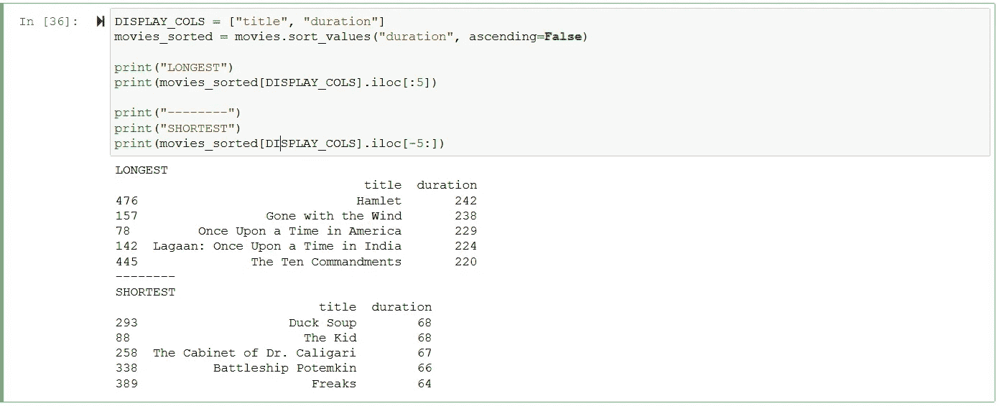

## 创建一个时间长度直方图，选择一个“适当”的媒体夹数量。

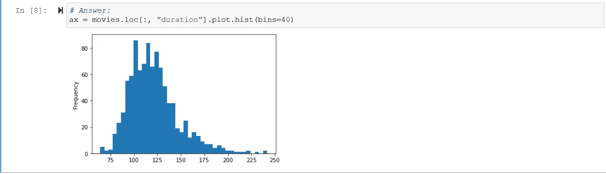

## 使用盒状图显示相同数据。

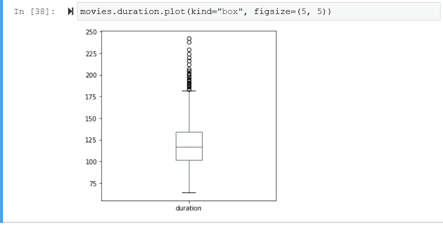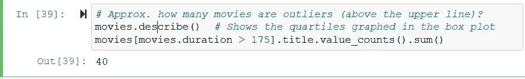

# 中间能级

## 计算有多少部电影具有每种内容分级。

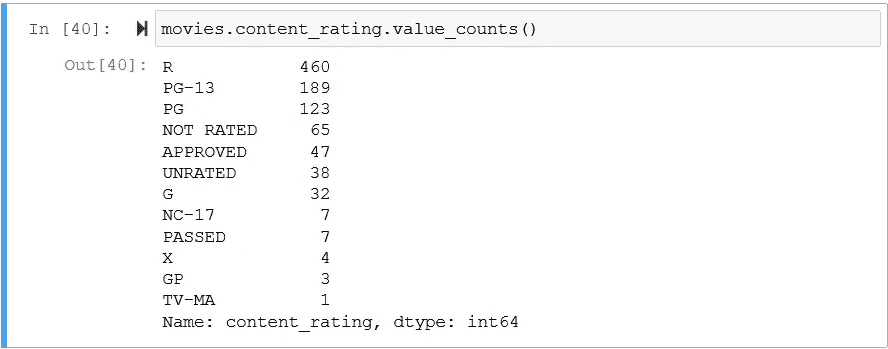

## 使用可视化来显示相同的数据，包括一个标题以及 x 和 y 标签。

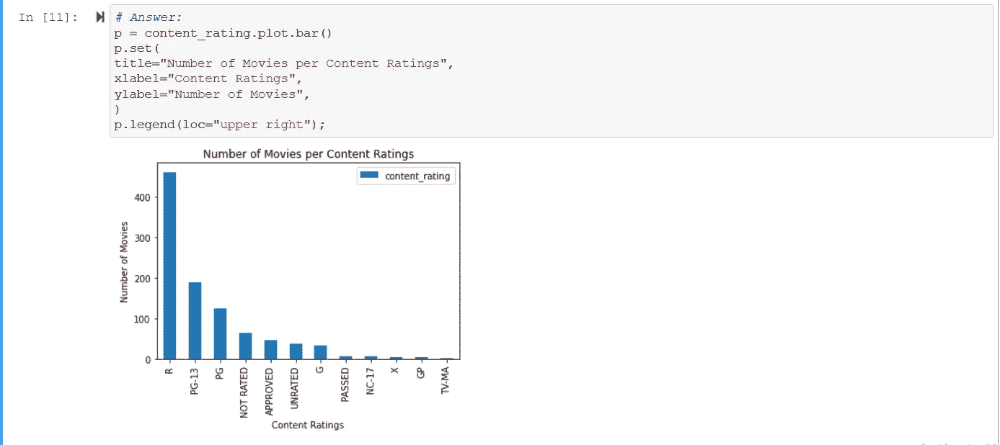

## 将以下内容分级转换为“未分级”:未分级、批准、通过、一般。

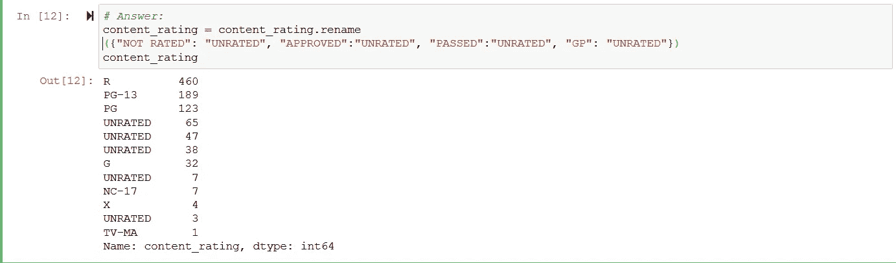

## 将以下内容分级转换为“NC-17”:X，TV-MA。

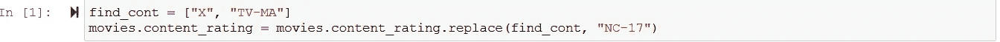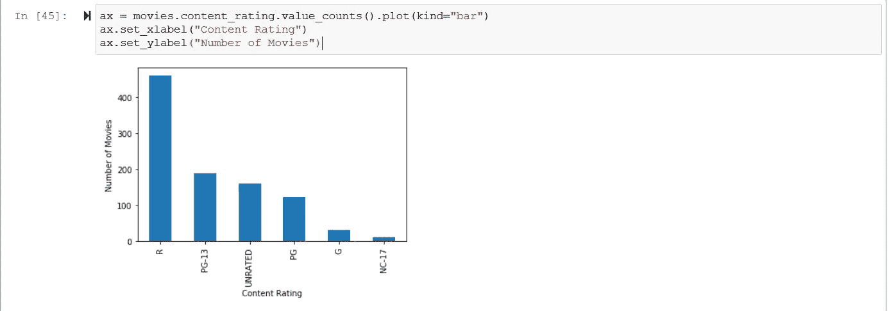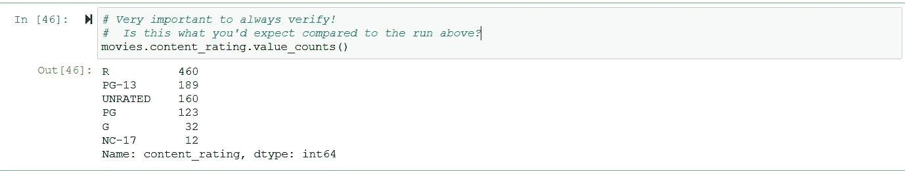

## 计算每列中缺失值的数量。

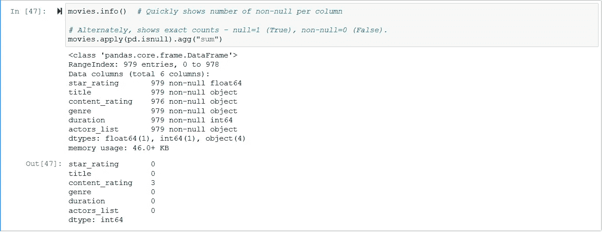

## 如果有缺少的值:检查它们，然后用“合理的”值填充它们。

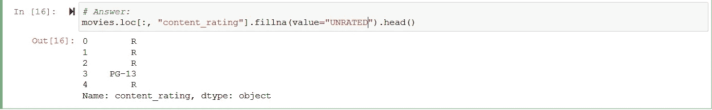

## 计算 2 小时或更长时间的电影的平均星级，并与短于 2 小时的电影的平均星级进行比较。

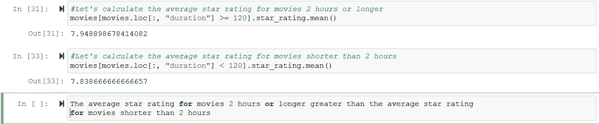

## 用可视化来检测时长和星级是否有关系。

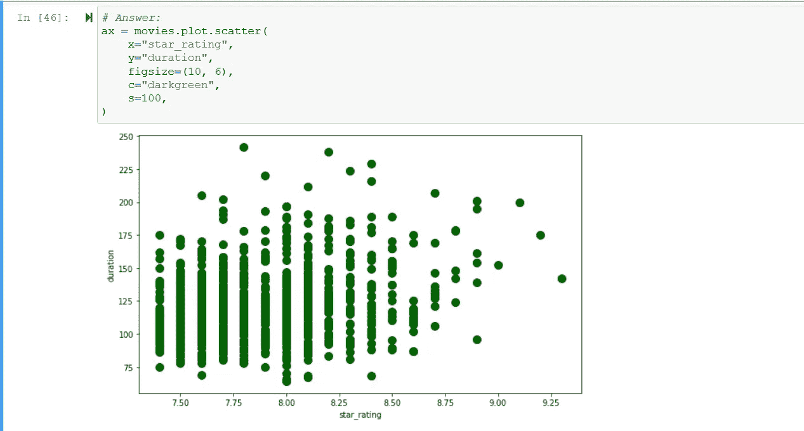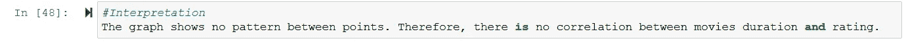

## 计算每个流派的平均持续时间。

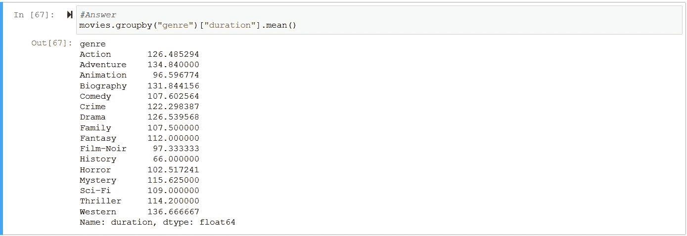

# 优等

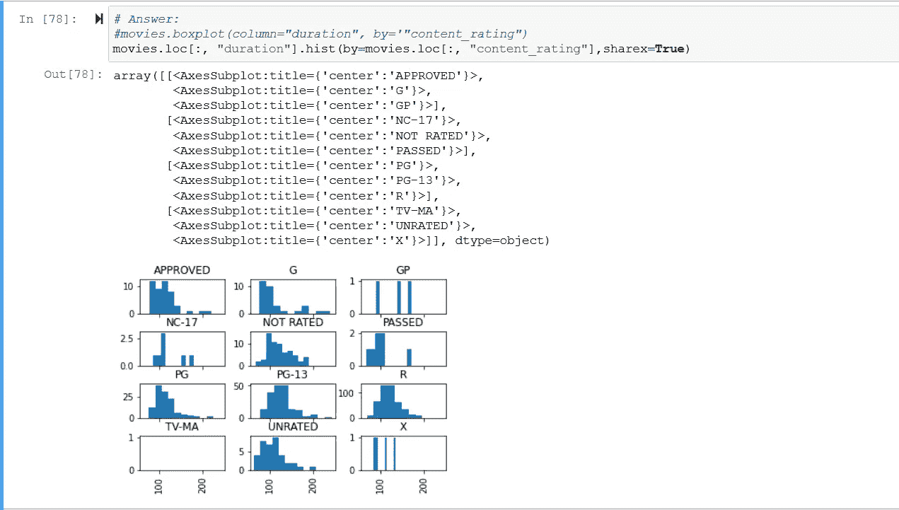

## 找到每种类型中星级最高的电影的标题

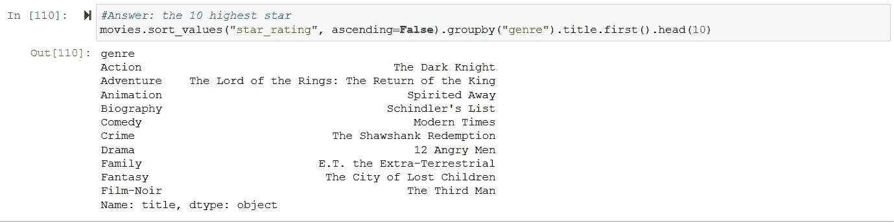

## 检查是否有多个同名电影，如果有，确定它们是否实际上是重复的。

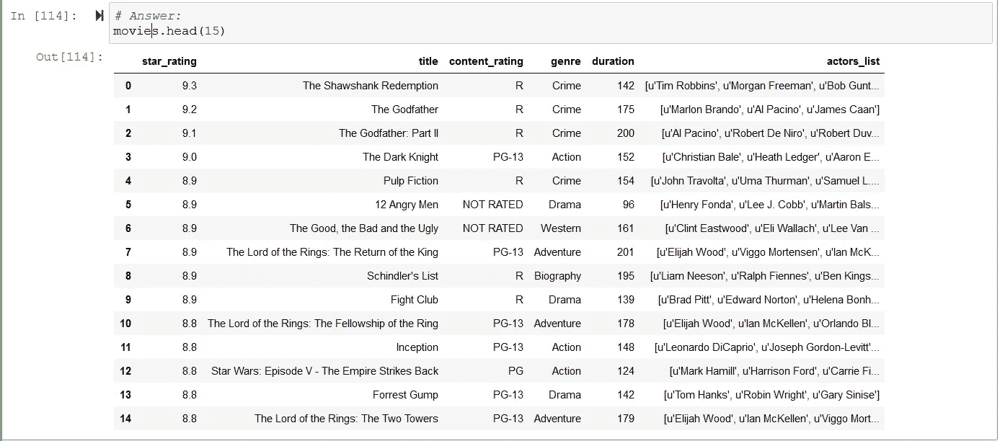

## 计算每种类型的平均星级，但只包括至少有 10 部电影的类型

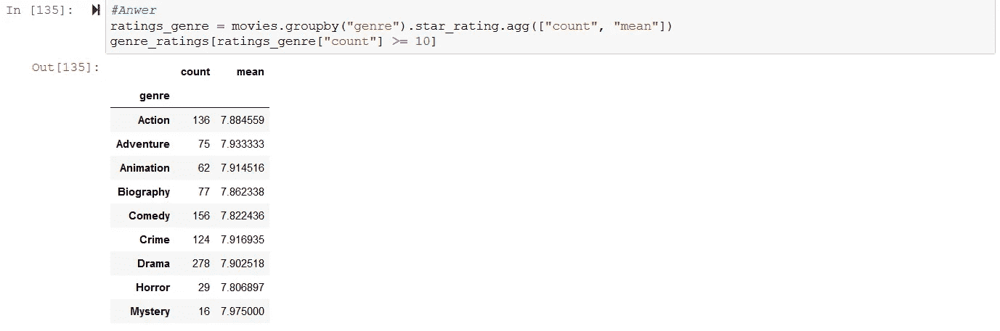