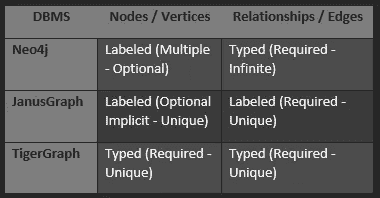
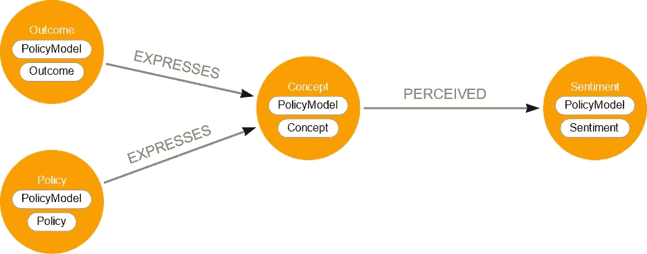
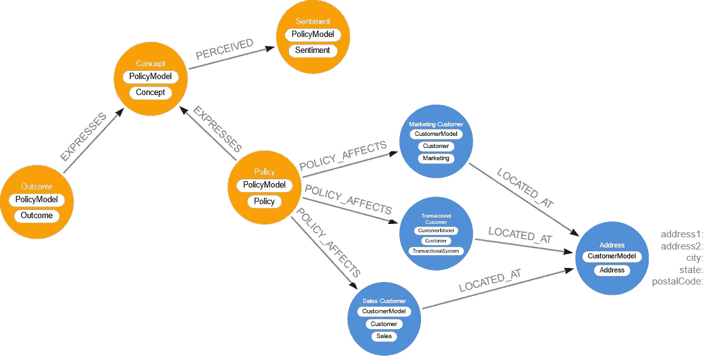
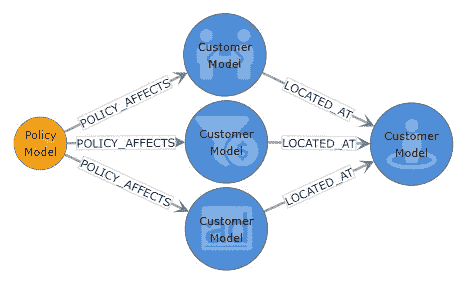
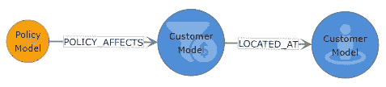
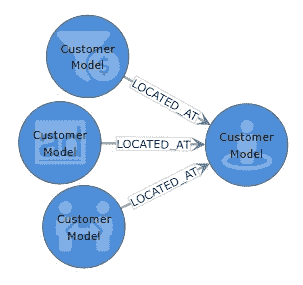
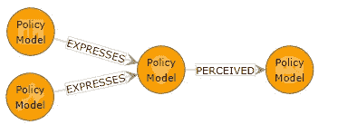
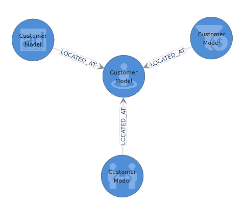
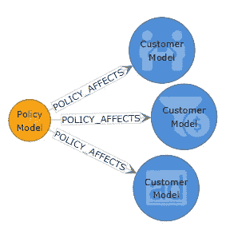

# 带标签的与带类型的属性图—所有的图数据库都不相同

> 原文：<https://medium.com/geekculture/labeled-vs-typed-property-graphs-all-graph-databases-are-not-the-same-efdbc782f099?source=collection_archive---------10----------------------->

Neo4j, JanusGraph, and TigerGraph logos

  N 根据 [DB-Engines](https://db-engines.com/en/ranking/graph+dbms) 排名，Neo4j、JanusGraph 和 TigerGraph 是排名前三的原生属性图形数据库管理系统，但是根据每个供应商关于如何实现图形数据类型和标签的设计决策，存在能力差异。有两种不同的属性图数据库:类型属性图和标签属性图。本文的目的是讨论并阐明标签属性图(LPG)的底层架构，并对比其与类型属性图的一些关键差异。本文没有讨论资源描述框架(RDF)图，它是类型图，而不是属性图。

从类型化和标签化的一些简单定义开始会有所帮助:

*   类型:类型是一种特定的数据或对象。在图形世界中，类型是一个特定的节点或关系(顶点或边)。图中被类型化的对象是唯一的，并且在行为上与强类型编程语言中的对象类非常相似。
    -类型通常是对象的强制或必需属性。
*   标签:标签是标识数据或对象的种类、集合或类别的文本字符串。在图形世界中，标签标识节点或关系(顶点或边)。
    -图形中被标记的对象是可选的，不一定是唯一的。
    -被标记的对象类似于指示某种类型的分组或类别的标签。
    -一个图形对象可以应用多个标签。

先不说定义，让我们进入细节。在前 3 个原生图 DBMSs 中，Neo4j 是唯一真正标记的属性图，而 JanusGraph 和 TigerGraph 是类型化属性图。下表概述了 3 个图形 DBMSs 中的每一个如何处理类型化和标签化属性。

Table showing typed vs labeled Nodes and relationships by DBMS

Neo4j 对关系进行了类型化，对节点进行了标记。Neo4j 中的节点标签是可选的，一个节点可以有多个标签，也可以没有标签。Neo4j 中的标签在不同种类或不同组的节点之间不必是唯一的。Neo4j 中的关系是类型化的，并且是必需的，但是在这三个 DBMSs 中，只有 Neo4j 允许非唯一的无限关系具有相同的类型，即使是在完全不同种类或集合的节点之间。

JanusGraph 在节点上有可选的标签，但是如果没有指定标签，数据库会隐式地给节点一个标签。JanusGraph 中的节点在不同种类的节点之间必须是唯一的。JanusGraph 关系被标记，并且要求节点集之间的名称是唯一的。

TigerGraph 对于节点和关系都有必需的和唯一的类型。TigerGraph 中的每个节点必须是唯一的命名类型。TigerGraph 中的关系在不同的节点集之间必须具有唯一的关系名称类型。

JanusGraph 和 TigerGraph 都采用面向对象的类结构方法来构建节点和关系。就像在编程语言的强类型面向对象类库中一样，所有的类和对象名都必须是唯一的。这种设计架构要求并强制每个命名类都有模式。例如，如果一个节点被命名为“person ”,那么其他类型的节点都不能被命名为“person”。这迫使所有名为“person”的实体具有相同的数据模式。在面向对象语言中，这被称为“强类型”语言。强类型语言在编程和编码方面具有优势，因为它确保同名的对象都是具有相同属性的相同类型的对象。这可以防止 bug 和编码错误。

JanusGraph 和 TigerGraph 本质上是“强类型”图形数据库管理系统，因为它们都强制关系和节点使用唯一的名称，并确保命名的关系只能存在于两个不同的节点类型之间。如果 TigerGraph 或 JanusGraph 中不同类型的节点之间存在关系，则必须提供唯一的关系名称。类似地，如果需要节点名的新结构，它必须是新的节点类型或“对象类”。

# 关系(边缘)

Neo4j 的架构完全不同。尽管它具有强类型关系，但它维护可以有多个标签的非类型节点。因为 Neo4j 中的节点不是强类型的，所以在具有不同名称的各种节点集之间创建关系没有限制。事实上，你可以用相同的东西来命名图中的每一个关系，Neo4j 可以毫无问题地处理它。例如，此图显示了三种不同节点类型之间的相同关系类型。结果—表达->概念和政策—表达->概念。

[Arrows.app](https://arrows.app/) illustration of a graph using duplicate relationship types

Neo4j 是唯一支持这种图形模型的属性图形数据库管理系统。JanusGraph 和 TigerGraph 都需要两个 EXPRESSES 关系的唯一关系名。如果 EXPRESSES 关系有多个属性，那么那些模式细节将需要在 TigerGraph 和 JanusGraph 中的每个唯一关系名称之间重复。

当使用图形数据科学(GDS)算法和机器学习(ML)或人工智能(AI)算法时，在图形模式中复制关系名称的能力提供了一个主要优势。“Match(n1)-[r:EXPRESSES]-(n2)Return n1，r，N2”查询将返回所有具有 expresss 关系类型的对象。要在任何其他图形数据库中执行这种类型的查询，需要用 UNION 对每个关系进行单独的查询，以获得单个结果集。虽然这看起来不是一个大问题，但它会极大地影响数据科学工作流，尤其是在数据摄取过程中涉及多个数据源时。调整和摆弄 GDS、ML 和 AI 算法通常需要数据科学家进行数十次或数百次手动调整。快速而容易地获得算法所需数据的能力是繁琐而细致的。必须确保每个唯一的关系名称都包含在查询中，这很容易出错。通过允许在关系中使用重复的关系名称，Neo4j 的架构使数据架构师能够从多个系统中获取相似的实体，并使用相同的关系类型将它们关联到模型中。

这个设计特性特别有用的一个常见例子是在地理图中。许多类型的节点都有地址。创建名为 LOCATED_AT 或 LOCATES_IN 的单一关系类型以在具有某种类型的地址或地理位置的所有节点之间使用的能力允许数据科学家非常容易地对这些类型的关系进行加权和分配重要性。这在结合几种类型的图表分析时很重要，如页面排名、相似性、接近度等。Neo4j 旨在完成这种类型的发现工作，而 TigerGraph 和 JanusGraph 都需要几个变通办法和一系列更长的查询才能获得可比的结果。

# 节点(顶点)

在使用节点标签方面，Neo4j 也有突出的架构优势。JanusGraph 和 TigerGraph 都要求节点具有唯一的名称类型。虽然 JanusGraph 使用术语“标签”来应用于节点和关系，但它们不是真正的标签，而只是节点名或关系名…换句话说，JanusGraph 标签实际上是类型名。对 JanusGraph 和 TigerGraph 的唯一节点类型的限制要求同名的所有对象保持相同的属性。相比之下，Neo4j 允许一个节点有多个非唯一标签。当在数据科学环境中对图表模式建模并从数百或数千个来源获取数十亿个节点时，这一简单的功能提供了巨大的灵活性。与传统的关系数据库相比，标记属性图(LPG)数据库的优势之一是能够在不一致的数据集之间创建关系。在几乎所有商业智能工具使用的经典星型模式中，数据必须经过整合和清理才能使用。LPG 数据库的一个巨大优势是，它们可以在任何事物之间形成关系，而不管粒度级别或数据是否一致。

例如，我们需要分析来自三个系统的客户数据。交易订购系统、销售系统和营销系统。所有三个系统都有相似但明显不同的客户模式。这三个系统中的客户都有客户名称，但是每个系统都在不同的模式结构中存储其他相关的详细信息。交易系统可以将地址存储在地址簿表中，而销售系统可以将地址存储在位置分支中。同样，营销系统可以将客户地址直接存储在客户表中。因为 JanusGraph 和 TigerGraph 都要求节点名具有唯一的名称，所以这两种图形 DBMSs 都要求您在创建图形和将数据接收到图形中之前决定如何使用模式。来自所有三个系统的客户和地址数据在被吸收到任何一个图表中之前都必须进行调整和讨论。

lpg 提供的一个主要优势是发现未知的能力。然而，对于 JanusGraph 和 TigerGraph，将数据纳入图表的简单操作甚至需要在开始数据科学工作流中的发现或实验流程之前做出几个模式和数据架构决策。这就是 Neo4j 提供显著优势的地方。因为 Neo4j 中的节点不是强类型的，并且在接收之前不需要预定义的模式，所以来自所有三个系统的客户和地址信息都可以被拉入 Neo4j，而没有外部数据一致性、争论或数据整形。三个系统中每个系统的原始结构保持不变，每个系统的不同节点类型都可以有相同的节点标签“Customer”。

[Arrows.app](https://arrows.app/) illustration of a graph using multiple labels, multiple schemas, and duplicate relationship types

这个图表显示了如何在 Neo4j 中应用多个标签，通过向节点应用附加标签来从销售、市场和交易系统中获取“客户”。还要注意，也可以使用图中的标签来区分模式模型(PolicyModel 和 CustomerModel)。蓝色节点是 CustomerModel 架构，橙色节点是 PolicyModel 架构。使用标签，Neo4j 允许多个模式同时存在于单个图中。Neo4j 图中不仅可以存在多个模式，而且这些模式可以通过共享的关系类型相互交互。

对于 Cypher 查询语言，在 Neo4j 中使用多个标签和重复的关系名称是非常自然和容易的。

要选择位于某个位置的客户以及影响他们的策略，请指定单个“客户”标签和所需的匹配模式。
匹配 p=(:客户)-[]-()返回 p

[Graphileon](https://graphileon.com/) illustration showing Cypher query results graph

来自 Cypher 查询的查询结果显示了来自两个模式模型的节点，以及来自所有三个系统的返回“Customer”节点:TransactionalSystem、Sales 和 Marketing，以及指向 Customer“Address”节点的三个 LOCATED_AT 关系。

若要仅选择与销售系统相关的数据，请指定“:Sales”标签。
匹配 p=(:销售)-[]-()退货 p

[Graphileon](https://graphileon.com/) illustration showing Cypher query results graph

仅匹配“Sales”节点标签的结果产生了来自 PolicyModel 模式以及相关“Address”节点的策略关系。

要访问所有不同节点之间的多个 LOCATED_AT 关系，只需选择单个关系名称，所有相关的节点类型都将被返回。
匹配 p=()-[:LOCATED_AT]-()返回 p

[Graphileon](https://graphileon.com/) illustration showing Cypher query results graph

来自“LOCATED_AT”关系的查询结果返回来自所有系统的所有客户以及他们与单个地址节点标签的关系。

要仅访问策略模型中的节点，您可以编写一个指定模式标签的 Cypher 查询。
MATCH(n1:policy model)-[]-(n2:policy model)返回 n1，N2

[Graphileon](https://graphileon.com/) illustration showing Cypher query results graph

在任何查询中隔离单个模式模型就像指定所需的模式模型一样简单。仅选择“PolicyModel”模式会生成策略模型的完整模式。

同样，为了只访问客户模型模式中的数据，您应该过滤与相应的 Customer Model 标签的匹配。
MATCH(n1:customer model)-[]-(n2:customer model)返回 n1，N2

[Graphileon](https://graphileon.com/) illustration showing Cypher query results graph

当仅选择“CustomerModel”标签时，结果是客户模型节点和关系的完整架构。

要查看客户和策略模型模式在哪里交互，您需要过滤您正在寻找的关系以获得那些交互。
MATCH(n1:customer model)-[]-(n2:policy model)返回 n1，N2

[Graphileon](https://graphileon.com/) illustration showing Cypher query results graph

您还可以根据需要使用基本和/或逻辑来选择特定的标签组。
MATCH (n1)-[]-(n2)其中(labels(n1))中的“CustomerModel”或(labels(n1))中的“PolicyModel”以及(labels(n2))中的“CustomerModel”或(labels(n2))中的“PolicyModel”返回 n1，n2

[Graphileon](https://graphileon.com/) illustration showing Cypher query results graph

当一个图中有许多模式模型时，可以使用 WHERE 子句专门隔离所需的模式，以便只返回利用指定模式模型的模式。

Neo4j 使用多个标签的能力，加上在任何节点类型之间存在相同关系类型的能力，打开了一个分析和数据科学实验和发现的巨大世界。这是 TigerGraph 和 JanusGraph 都无法轻易做到的。从数据科学工作流的角度来看，这使数据科学家和数据工程师能够在图形数据库中执行大量的模式和数据整形工作。例如，TigerGraph 迫使您在能够查询图形或导入数据之前就已经对关系和预定义的模式进行了建模。进一步说明差异:Neo4j 用户甚至可以在初始数据加载之前在不存在的属性上创建索引。然后，当节点被加载到图形中时，它们会被自动索引。

功能上的根本区别是 Neo4j 提供了一种“可选模式”而不是“模式优先”的属性图方法，这是通过在属性图中使用标签并允许多个节点类型之间存在关系类型而实现的。作为一名数据科学家，首先要问自己的问题是:你希望在哪里完成大部分工作？在外部工具中对图形之外的数据进行整形和整合，以便最终将数据导入图形，这样花费的时间会更好吗？还是直接将数据导入图表，然后使用图表工具和算法来形成数据、创建模式并立即对其进行分析更好？对于快速发现和洞察，将数据放入图表是最好的方法。一旦你的数据是图表格式，就可以开始发现已知和未知的关系和模式。Neo4j 的设计非常适合迭代数据科学工作流，在这种工作流中，解决问题和发现可能性是必需的。

Neo4j 的图形数据科学库及其新包含的机器学习算法允许数据科学家在虚拟的、可重复运行的机器学习目录中创建可变的(可改变的)图形和图形模式。这大部分是可能的，因为他们的方法是设计真正的标记属性图而不是类型化属性图。

# 包装它

虽然在 JanusGraph 和 TigerGraph 中可以添加额外的属性，如可以填充的“SourceSystem”或“Model ”,但是属性不具备标签所具有的特性和功能。Neo4j 中的标签是自动索引的。标签可以使用图形算法(如 Neo4j 中的标签传播)来动态和自动地应用，这使得标记节点的能力非常强大和灵活。例如，使用标签传播算法，可以创建新的附加关系，或者可以在 Neo4j 中创建全新的节点。TigerGraph 禁止这种类型的工作流，因为它采用了“模式优先”的方法。在执行任何操作之前，必须首先在设计模式下创建节点架构及其属性结构。只有这样，才能使用预先存在的模式创建新节点。我们的经验是，Neo4j 在做这种类型的迭代工作流时至少比 TigerGraph 快 10 倍。根据所执行的模式更改，必须在 TigerGraph 中执行整个图形重新加载，并且必须重新编译和运行所有查询。这在迭代数据科学工作流中非常耗时，每次模式更改都需要 10 到 30 分钟。想象一下，有了一个想法，然后不得不等待 30 分钟才尝试，却发现它需要调整或不能按照你想要的方式工作。对于数据科学家或工程师来说，不得不重复这些步骤数十次或数百次是非常令人沮丧的。在 TigerGraph 的每一次迭代中，从做出修改到编译好一切以便使用，平均有 20 分钟的等待时间。

类型图在预编译查询的原始速度方面有其优势，但这种速度是以数据科学工作流和数据摄取管道的不灵活性为巨大代价的。类型图在标准化 API 方面也有优势。TigerGraph 有一个很棒的 REST API。由于 TigerGraph 中的一切都是强类型对象，REST API 使数据库中的每个对象都成为 REST 端点。TigerGraph 中的每个节点、关系和查询都有一个 REST API 端点，这使得它成为应用程序开发的绝佳选择。这样做的代价是，在使用之前，必须将繁重的前端工作集成到数据库中，以完整地设计和构建数据库。

作为一个带标签的属性图，Neo4j 具有迭代和实验数据科学环境所需的算法基础和模式灵活性。图表是发现和发现数据中未发现的模式的强大工具，Neo4j 通过允许可以应用于多个节点的重复关系名称和标签来增强这种能力。标签是另一种工具，即数据科学工具包，可用于自然地可视化和探索数据。标签可以用来从多个系统中分离出相似的数据，甚至指定整个模式。虽然没有在本文中讨论，但是标签也可以用来更容易地可视化“毛球”、“暴风雪”和“星爆”图形模式，其中的关系是如此密集，它们是不可能可视化的。

虽然本文只是触及了标签属性图(LPG)的皮毛，但它有望揭开一点面纱，看看图形 DBMS 架构的设计决策如何对数据库的能力产生巨大影响。