# 使用 SageMaker 上的 Label Studio 标注数据

> 原文：<https://medium.com/geekculture/labeling-data-with-label-studio-on-sagemaker-e4b2d1b562f7?source=collection_archive---------3----------------------->

## 在笔记本实例上部署 Label Studio 的分步指南

与[菲尔·米金斯](https://www.linkedin.com/in/phil-meakins/)联合发文。

几年前，在我还是数据科学家的时候，我参与了一个计算机视觉项目，在这个项目中，我的团队花了几周时间调整神经网络层和超参数，以获得更好的性能。事实证明，简单地提高数据集标签的质量是好模型的关键。听起来耳熟吗？

Photo by [USGS](https://unsplash.com/@usgs?utm_source=unsplash&utm_medium=referral&utm_content=creditCopyText) on [Unsplash](https://unsplash.com/?utm_source=unsplash&utm_medium=referral&utm_content=creditCopyText)

在 SageMaker 的世界里，你可以使用 [Ground Truth 和 Ground Truth Plus](https://aws.amazon.com/sagemaker/data-labeling/) 来创建高质量的训练数据集。

在这篇文章中，我将展示如何在一个 [SageMaker 笔记本实例](https://www.youtube.com/watch?v=X5CLunIzj3U)上建立[标签工作室](https://labelstud.io/)，并在你的网络浏览器中访问它。

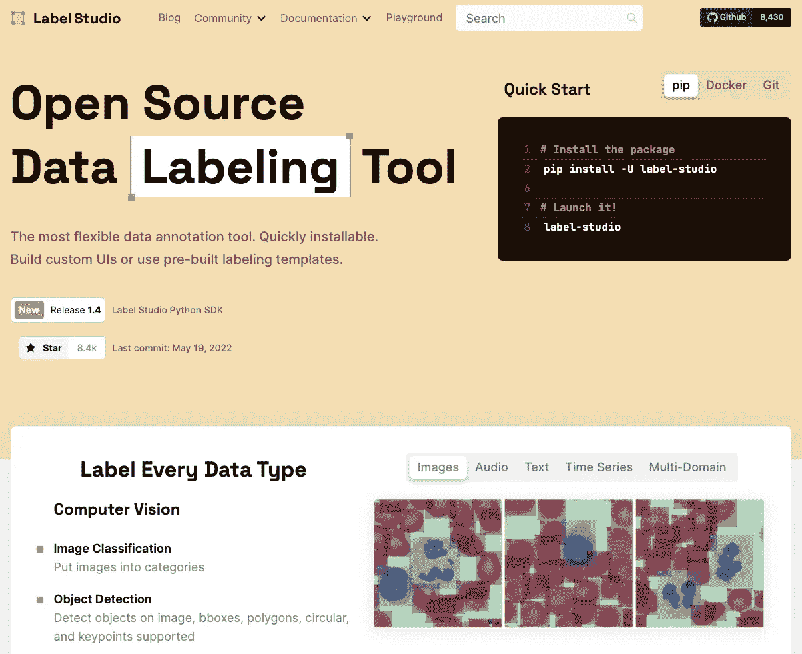

Screenshot from label studio [website](https://labelstud.io/)

我们将在笔记本实例上运行 Label Studio，在同一个 web 浏览器上访问它的界面，并标记来自[热狗而非热狗数据集](https://www.kaggle.com/datasets/dansbecker/hot-dog-not-hot-dog)的图像。

# 演练概述

我们将分三步解决这个问题:

*   我们将首先了解什么是 Label Studio，为什么在 SageMaker 上运行它是一个好主意，并介绍示例数据集。
*   然后，我们将在笔记本实例中设置 Label Studio。
*   最后，我们将标记来自[热狗-非热狗数据集](https://www.kaggle.com/datasets/dansbecker/hot-dog-not-hot-dog)的一些图像。

# 先决条件

要浏览此示例，请确保您具备以下条件:

1.  访问一个 [SageMaker 笔记本实例](https://www.youtube.com/watch?v=X5CLunIzj3U)。一个小的应该足够标注数据了。
2.  熟悉[标签工作室](https://labelstud.io/)。你可以访问[介绍标签工作室，这是一把数据标签的瑞士军刀](https://towardsdatascience.com/introducing-label-studio-a-swiss-army-knife-of-data-labeling-140c1be92881)，如果你觉得它很新的话。
3.  [热狗—非热狗数据集](https://www.kaggle.com/datasets/dansbecker/hot-dog-not-hot-dog)(或您的任何选择)。

# 步骤 1:当开源遇到托管云环境时

## Label Studio 是一个流行的开源数据标注工具

它让您可以用一个简单的 UI 来标记数据类型，如音频、文本、图像、视频和时间序列，并导出到各种模型格式。比如我遇到过用它标注大型医学图像的人。

你可以通过 pip 安装或在 [docker](https://hub.docker.com/r/heartexlabs/label-studio) 上运行，并通过网络浏览器访问。在我们的例子中，我们将使用 docker 选项。

以下介绍视频展示了如何使用该工具:

## 使用 SageMaker 作为 Label Studio 的托管主机

与 DYI 在 EC2 上的设置相比，在 [Sagemaker 笔记本实例](https://docs.aws.amazon.com/sagemaker/latest/dg/gs-console.html)上托管 Label Studio 是一个更好的选择。笔记本实例允许您访问基于 Jupyter 的托管 ML 环境。SageMaker 管理底层实例和授权代理的创建，因此您可以专注于标记数据。

我们将在笔记本实例上托管 Label Studio 容器，并将容器存储链接到实例 EBS 卷。笔记本实例带有一个代理，允许我们在浏览器上访问 Label Studio。

## “它只做热狗吗？不，不是热狗"

我是硅谷的粉丝，我们可以用热狗的图片作为例子。这是一个简单的影像分类数据集，可以随意使用您选择的任何数据集。

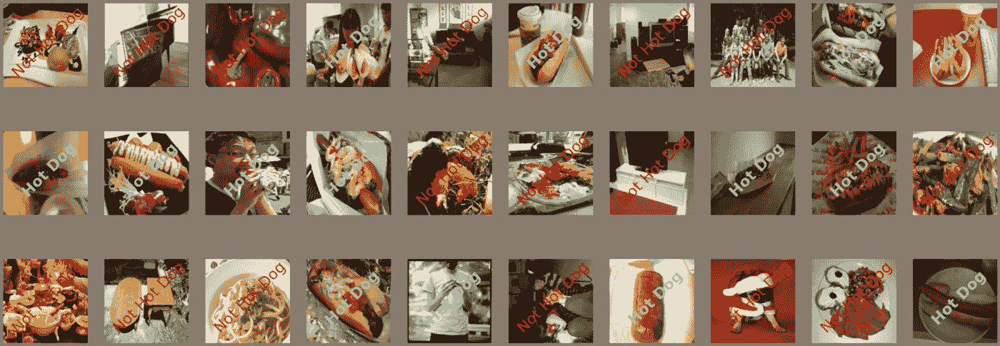

Image from [post](https://towardsdatascience.com/hot-dog-or-not-hot-dog-ab9d67f20674)

# 步骤 2:在笔记本实例上设置 Label Studio

我们将分 3 个部分设置 Label Studio:

## 访问实例并启动终端

您可以通过笔记本实例的 Jupyter/Jupyterlab 启动终端。如果您使用 Jupyter，按钮应该在右上角:

Image by author

## 在 Docker 中运行 Label Studio

在用 [docker](https://hub.docker.com/r/heartexlabs/label-studio) 启动 Label Studio 之前，我们需要复制实例 URL 的基底。

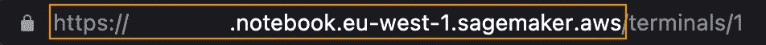

Image by author: copy the **base URL** of your Instance. It should look like **https://your-notebook-instance-name.notebook.your-region.sagemaker.aws**

我们在 Label Studio 命令的`--host`参数中使用这个基本 URL，因此代理知道如何正确地重定向网页。

然后，将基本 URL 粘贴到以下命令中，并在终端上运行它:

它将从 Dockerhub 中提取图像，运行 Label Studio 容器，并将`/home/ec2-user/SageMaker/mydata`实例 EBS 文件夹附加到容器存储中。这将允许您持久化标记的数据。

该命令应该需要几秒钟的时间来运行，这就是本部分的全部内容。

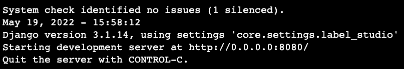

Image by author: You should see the following after running the docker command.

## 在网络浏览器上访问 Label Studio

现在复制您的工作室 URL，稍加更改，然后粘贴到一个新的浏览器选项卡中:

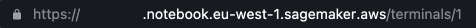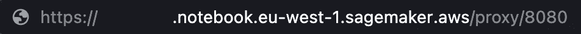

Images by author: On the left is my original terminal URL. I replaced **/terminal/1** with **/proxy/8080/** and pasted it in a new browser tab.

瞧啊。

Image by author: Label Studio will load and you can log in with account into it

# 步骤 3:使用 Label Studio 标注数据

现在是有趣的部分！

您可以将[数据集](https://www.kaggle.com/datasets/dansbecker/hot-dog-not-hot-dog)下载到您的笔记本电脑中，创建一个新的标记项目，并将一些图像上传到 Label Studio 中。

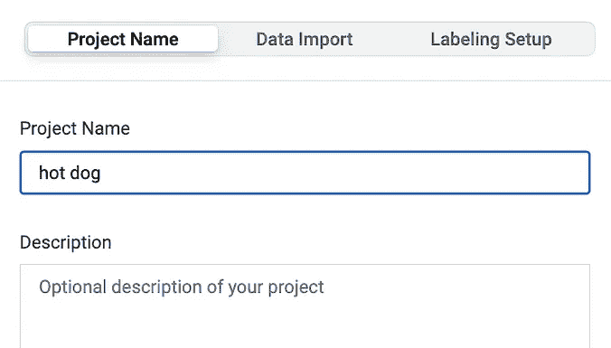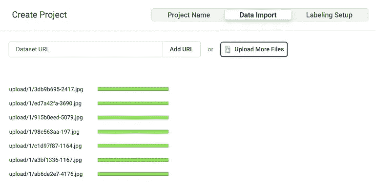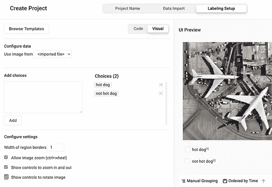

Images from author: I use the Image Classification template and create 2 classes for hot dog/not hot dog

**注意**您可能在 S3 有数据，您可以使用[AWS CLI](https://awscli.amazonaws.com/v2/documentation/api/latest/reference/s3/sync.html)或其他方式将它们复制到实例 EBS 卷上。

然后就可以开始贴标签，提交作品了。

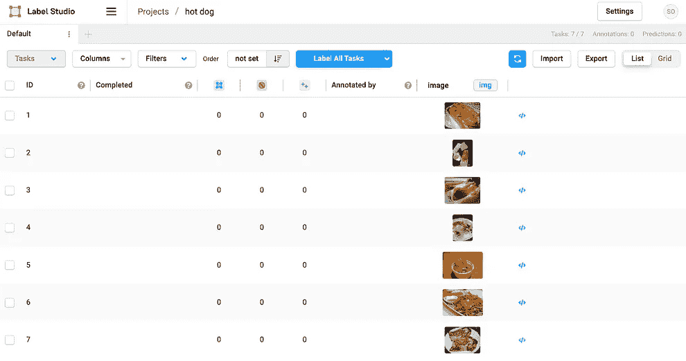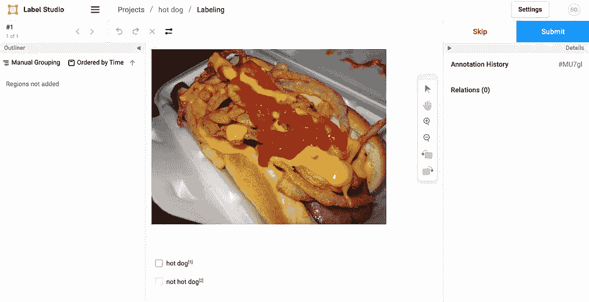

Images by author

带标签的结果将保存在笔记本实例的`/home/ec2-user/SageMaker/mydata`文件夹中。

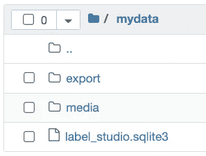

Image by author

# 结论

标记高质量数据在 ML 项目中至关重要。除了使用 Ground Truth，你还可以在 SageMaker 上托管开源标签工具。

在本文中，我展示了如何在 SageMaker 笔记本实例中设置和运行 Label Studio。

为了更进一步，你还可以阅读 SageMaker Studio 上的 [Hosting VS 代码，并了解如何在你的 cloud ML 环境中编写 host VS 代码。](https://towardsdatascience.com/hosting-vs-code-in-sagemaker-studio-f211385e25f7)