# 通往成功的阶梯！—玩家爬梯子动画

> 原文：<https://medium.com/geekculture/ladder-to-success-player-climb-ladder-animation-d0760089476c?source=collection_archive---------30----------------------->

这篇文章将展示如何给玩家爬梯子的能力。这种梯子系统可以用在任何长度的梯子上，并允许玩家上下梯子。

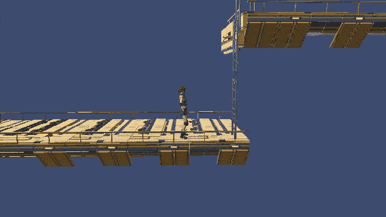

在播放器的 Animator 窗口中，我们有两个 bool 参数，它们将控制从任何状态到爬梯动画的转换，然后在 bool 为假时退出动画。向下攀爬动画是反向播放的向上攀爬动画。

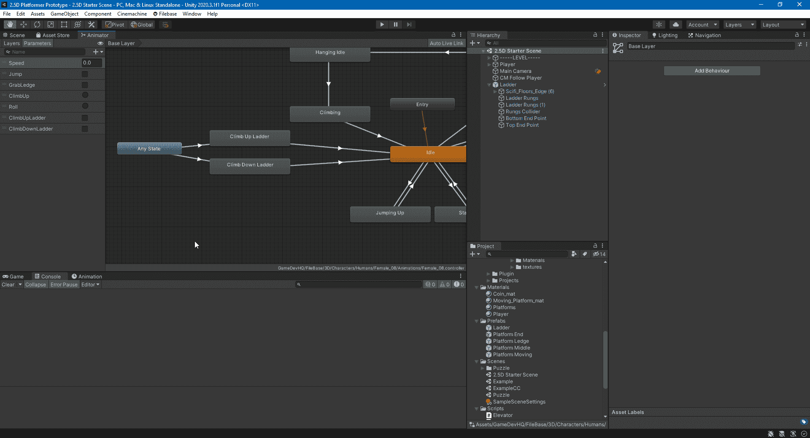

为了控制玩家爬梯子时的移动，我们需要添加一些变量。

1.  玩家爬梯子的速度。
2.  玩家所站的当前梯子的参考。
3.  这个 bool 将停止玩家输入，直到梯子被爬上。
4.  这个 bool 确保玩家在开始攀爬之前站在梯子旁边。
5.  这个 bool 是为了知道玩家是从梯子的顶端还是底端开始的。

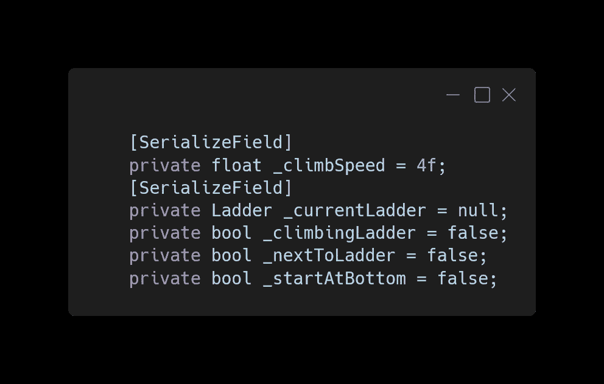

在更新中，我们增加了一个条件，爬梯子也必须为假，玩家的输入才能起作用。然后，如果玩家正在爬梯子，我们根据他们开始的地方沿着梯子移动控制器。如果玩家正在向下攀爬，我们检查他们何时到达底部并结束攀爬。

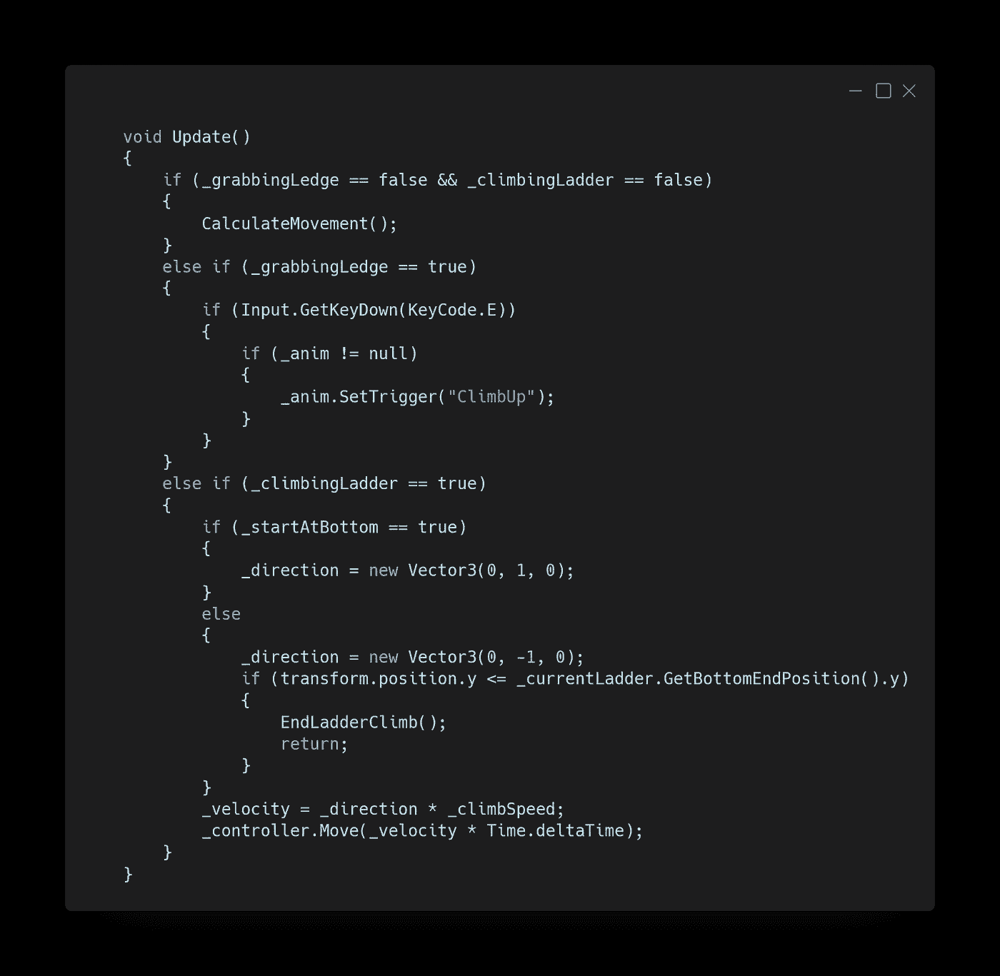

在 CalculateMovement 中，如果按下“E”键并且玩家在梯子附近，我们会添加爬梯的起点。在按键时，我们禁用控制器并将播放器移动到梯子的 z 轴位置加上播放器的偏移量。然后，我们将玩家设置为攀爬梯子，重新启用控制器，并根据玩家是在梯子的底部还是顶部来启动攀爬动画。最后，我们检查玩家是否需要翻转来面对梯子。

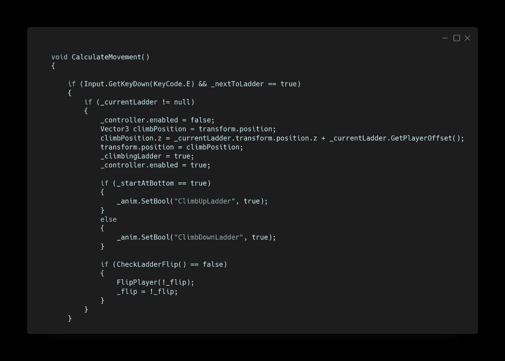

当玩家进入或退出触发器时，从梯子调用该方法。如果给定的 bool 为真，则玩家在梯子旁边，并且存储当前梯子的引用。然后，我们通过查看玩家是高于还是低于梯子来确定玩家是在梯子的顶部还是底部，并相应地设置 bool。如果 near Ladder bool 为 false，我们将玩家设置为不在梯子旁边，并清除梯子引用。

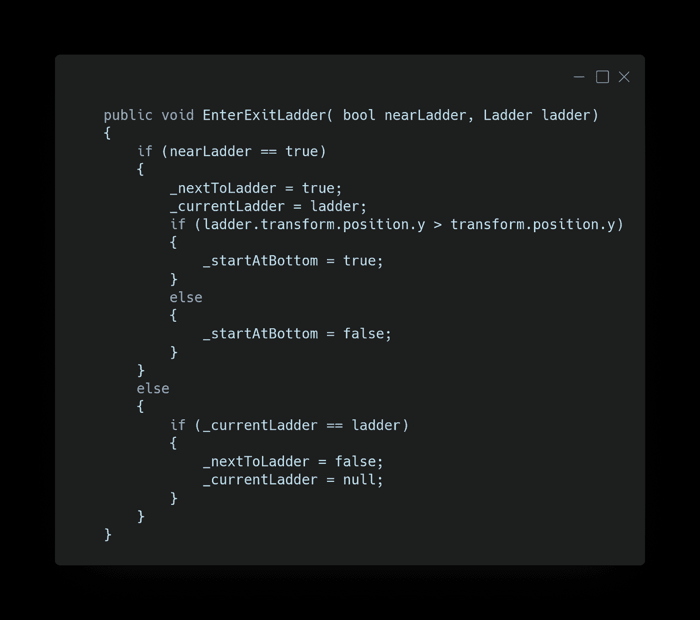

当玩家到达梯子的顶部或底部时，调用该方法。该方法将玩家设置为不再攀爬梯子，通过将 bool 设置为 false 来告诉动画制作人转换到 Idle，并启动协程以根据玩家开始的位置将玩家移动到正确的结束位置。

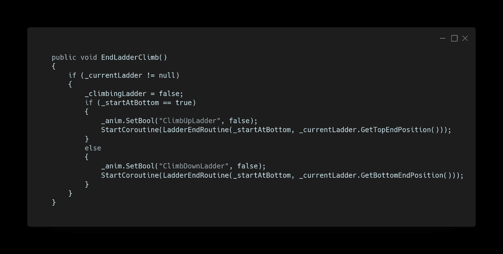

这些方法让其他脚本检查玩家是从梯子的顶部还是底部开始，以及玩家当前是否正在爬梯子。

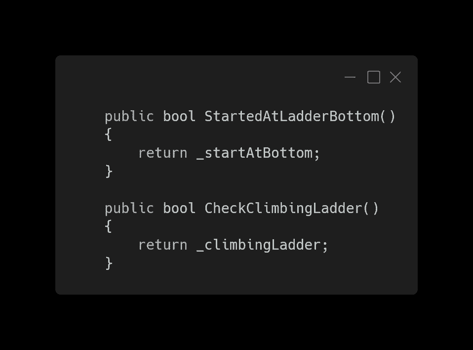

此方法用于检查梯子在播放器的哪一侧，检查播放器当前是否翻转到该方向，并返回 true 或 false。如果玩家的 z 轴位置大于梯子的位置，则梯子位于玩家屏幕的右侧。

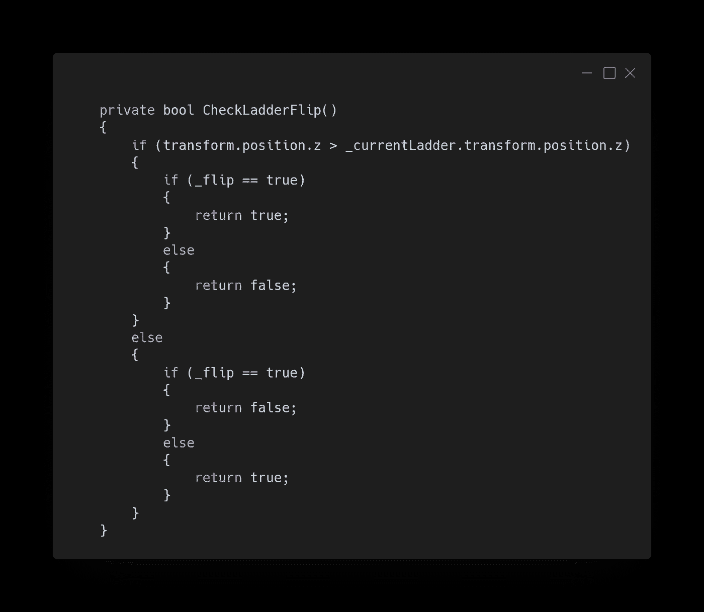

当玩家结束爬梯时，这个协程被调用。该方法首先检查玩家是否正在爬下梯子，并翻转玩家。然后，我们禁用控制器，将球员移向传入的结束位置，同时球员每一帧都远离该位置 0.1。一旦玩家足够接近终点位置，我们就将玩家在梯子上的起点改变到原来的相反位置，并重新启用控制器。

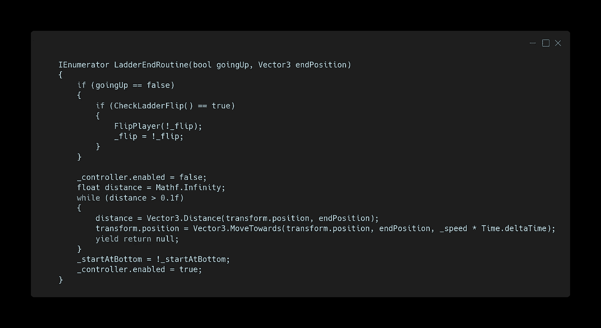

梯子有一个箱子碰撞器，被设置为一个触发器，用于检测玩家何时进入和退出，它也有一个用于梯子横档的箱子碰撞器，这样玩家就不能穿过梯子。梯子顶部和底部的端点是空的游戏对象，玩家在结束攀爬时向其移动。

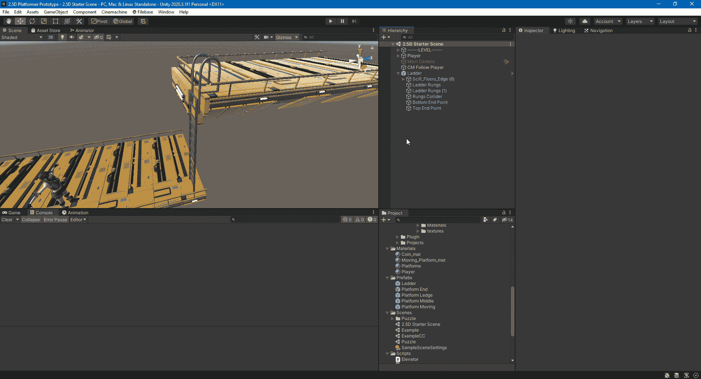

梯形脚本需要一些变量和方法，允许其他脚本检索这些变量的值。

1.  攀登时玩家将从梯子中心偏移的量。
2.  玩家在梯子顶端和底端的位置。

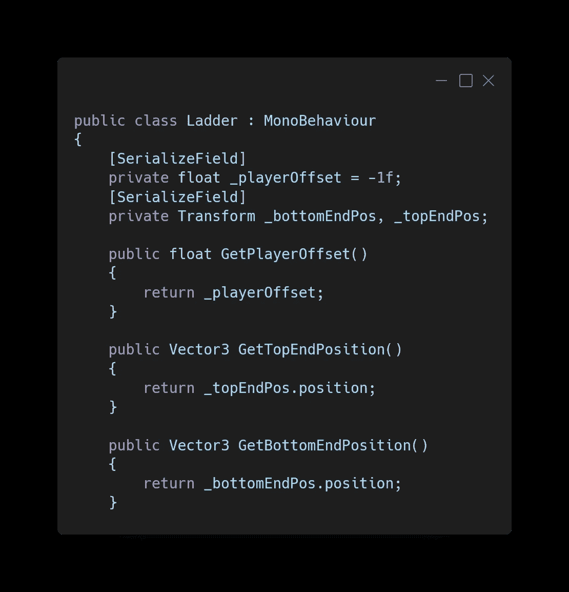

当玩家进入梯子的触发器时，我们在 PlayerController 上调用 EnterExitLadder 方法，并传入 true，这样方法就知道玩家进入的这个脚本，供玩家从中调用方法。

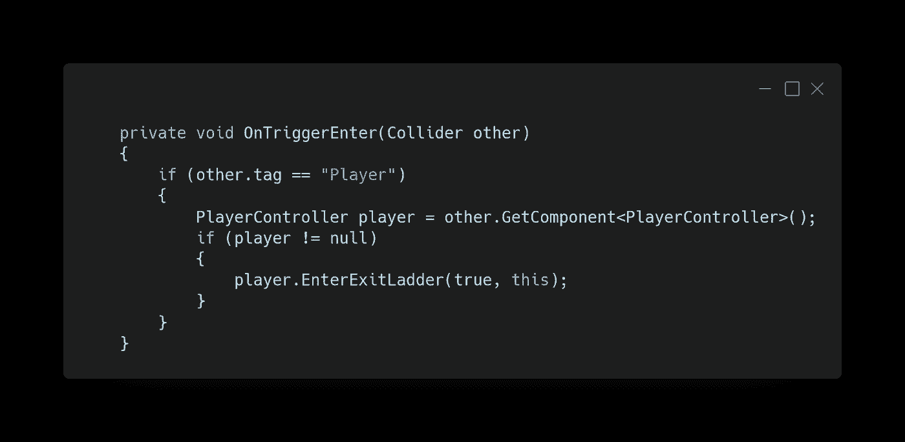

如果玩家退出触发器，我们调用 PlayerController 上的 EnterExitLadder 方法并传入 false，这样方法就知道玩家离开了，而这个脚本清除玩家的引用。如果玩家上的壁架抓取碰撞器离开了触发器，我们从父级抓取 PlayerController 脚本，并检查玩家当前是否正在爬梯子，以及玩家是否从梯子的底部开始。如果是的话，我们调用玩家的 EndLadderClimb 将他们移动到梯子的顶端并结束攀爬。

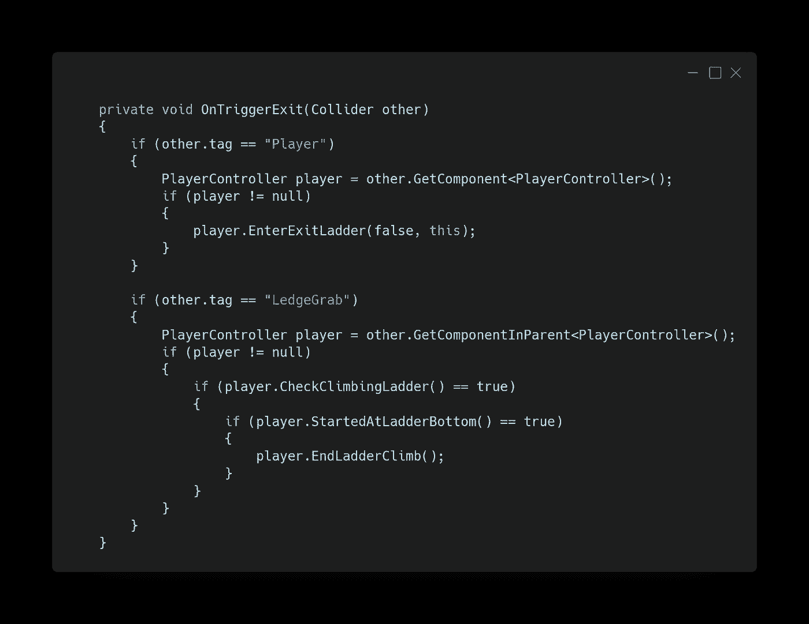

玩家现在可以通过按旁边的“E”键上下梯子。

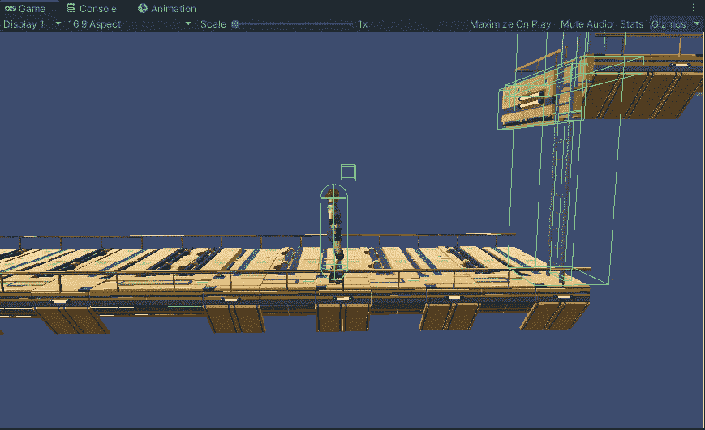