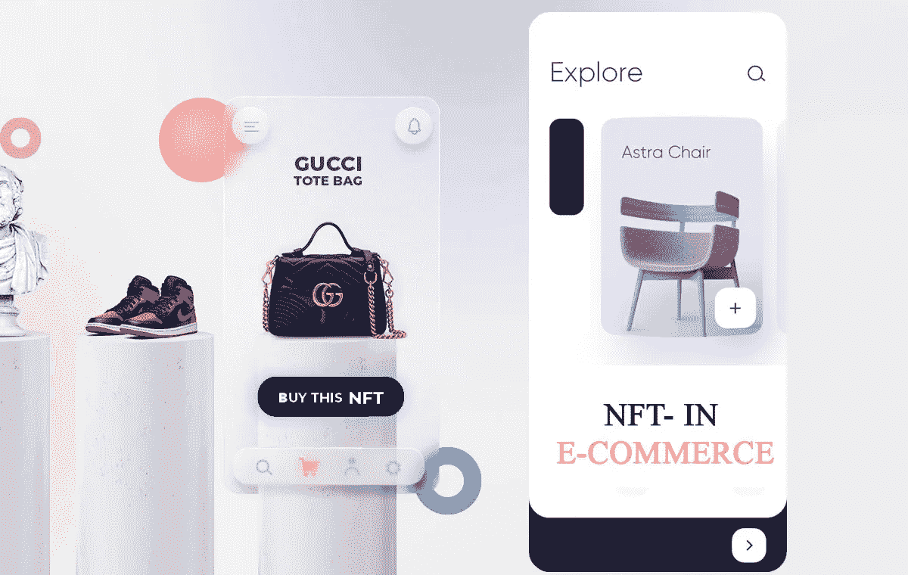
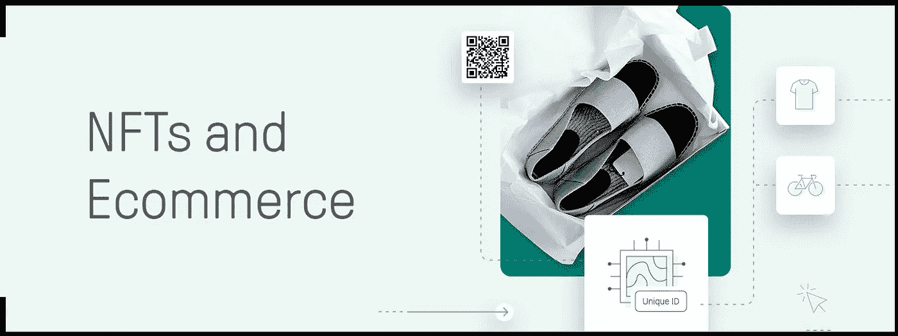

# 在 NFT 发展电子商务

> 原文：<https://medium.com/geekculture/laddering-the-ecommerce-through-nft-eaa033c20dde?source=collection_archive---------7----------------------->

数字世界正在发生一些令人兴奋的新事物。你可能听说过著名的模因年夜饭卖了近 6 万美元，或者杰克·多西的第一条推文卖了 200 多万美元。突然间，人们愿意为互联网上的内容支付高得离谱的价格。那么，到底发生了什么，这种席卷数字世界的突然趋势是什么？

NFT 和 NFT 的销售是密码世界的新趋势，看起来这种趋势将会持续下去。

NFTs 的概念最初很难理解，但是技术在当今世界有无限的潜力。

## 什么是 NFT？

NFT 代表[不可替代令牌](https://en.wikipedia.org/wiki/Non-fungible_token)。它是存在于数字分类账上的一段数据(称为区块链)。该数据表示可以包括任何有形或无形资产的数字文件。一个 ***视频文件、音频剪辑、图片、游戏皮肤、代码行、文章、博客、独家项目等*** *。*，可以成为 NFT。

我们中的许多人可能会将 NFT 视为一种新的、具有挑战性的技术。然而，NFT 技术不仅仅是数字化，它还是许多行业的有益资产。例如，一个著名的乐队以 NFT 的身份发行了他们的最新专辑；用户购买了罕见的人工智能完全设计的数字运动鞋。NFT 最重要的应用是在艺术领域。这一领域为艺术家创造数字内容、在线销售并为其作品创造稳定的收入流提供了无限的机会。甚至有人谈论将 NFT 整合到电子商务行业，因为这可能是一个有益的补充。

虽然您可以创建一个数字文件的多个副本，但从该文件生成的 NFT 是防复制的。NFT 作为购买它的用户的所有权证明。这项技术的运作方式不同于比特币或其他流通的加密货币。首先，NFT 可以交易，但是用户可以用其他货币买卖。

NFT 背后的总体想法是，他们将任何数字资产转化为用户可以跟踪和赚取收入的产品。

 [## 如何创建自己的 NFT 市场，在数字世界中保持竞争力

### 创建自己的 NFT 市场来吸引用户和 NFT 开发者。

medium.com](/security-token-offering/how-to-create-your-own-nft-marketplace-to-stay-competitive-in-digital-world-396da0847a3a) 

## **你在哪里买卖 NFT？**

随着 NFTs 的创建和广泛采用，需要创建一个可赎回的 NFT。数字内容创作者正在寻找一种将这些数字资产转化为金钱的方法。这种需求导致了 NFT 市场的兴起。网上有很多 NFT 市场，最著名的有 *OpenSea* 、 *Rarible* 和 *KnownOrigin* 。这些平台让任何人都有可能创造一个 NFT。在这里，用户上传一个文件，填写所需的细节，网站生成该文件的数字副本。这种数字拷贝是 NFT 用户想要的，他们可以在 NFT 市场上出售。

在 NFT 市场，买家寻找他们想要的 NFT。该网站为买家提供了购买资产或在网上拍卖行出价的选项。完成交易后，NFT 被添加到买家的钱包中，买家成为新的所有者。

虽然 NFT 是一项新技术，但它迅速成为主流主题，并在艺术行业得到采用。此外，电子商务也有可能在其流程中采用非功能性交易。

C **克里斯提的**——这家著名的艺术拍卖行在 NFT 世界声名鹊起，成为第一家出售数字化艺术品的著名艺术拍卖行。佳士得在出售了价格接近 7000 万美元的毕普的《日常生活:前 500 天》之后进入了主流市场。这件艺术品是历史上最有价值的秘密艺术品。

G**ucci**——这个品牌在区块链可能并不出名，但他们最近在其应用上发布了一套数字专用运动鞋。该品牌正在与交易平台合作，并使用户能够在这些经批准的平台上交易发布的产品。古驰已经尝试了数码试戴，并且可能正在筹备纯数码版本。该品牌还发布了一份声明，称他们正在探索 NFT 的景观，并对未来发布 NFT 有浓厚的兴趣。

N **巴绝杀** -熟悉 NBA 的球迷或体育爱好者可以在专门的在线平台上收集或交易绝杀瞬间。用户可以在线购买、出售和交易视频剪辑。该平台从交易卡中获得了重要的灵感，用户可以购买成包或限量发行的时刻。有限发布时刻有不同的稀有级别，用户可以在市场上与其他用户进行交易。该网站鼓励用户收集他们最喜欢的球员或球队的瞬间，并展示给其他用户观看。

## **电子商务和 NFTs**

NFT 在电子商务行业有几个潜在的使用案例。目前，该部门遭受退货欺诈，用户发现很难证明购买物品的所有权。如果用户用另一个用户的详细信息购买了产品，他们不能出示该商品的收据或证明他们购买了该商品。通常，所有权验证的过程是漫长而费力的。

采用 NFTs 的电子商务可以解决这些问题和其他问题。你可以用一件 NFT 来代表一件实物，合法的所有者可以证明这件物品属于他们。考虑到 NFT 是唯一的，并且存储在分散的分类账上。这种性质使得任何人都很容易核实 NFT 的主人。

 [## 政治的 NFT——重组社会的象征

### NFT 主张政治变革、民主事业和为社会做些好事，听起来很奇怪，对吧…

www.blockchainappfactory.com](https://www.blockchainappfactory.com/blog/nft-for-politics-token-that-restructures-the-society/?utm_source=Medium&utm_medium=Publication++geekculture+-+23%2F11%2F2021&utm_campaign=vignesh) 

## **NFTs 助力电子商务的未来**

电子商务平台在一个集中的生态系统上运行，需要第三方的参与。这些机构监督网站上发生的产品和服务的交易。因此，依赖这些中介，佣金分配可能会出现偏差。NFTs 可以消除平台上对这些第三方的需求。

一些店主可能会怀念去商店亲自购买打折商品的感觉。电子商务行业的 NFT 可以缓解这个问题。该平台可以提供用户购买的产品的数字表示。用户等待几天，然后收到实物。这种方式可以给客户带来满足感和乐趣，促使他们继续使用该平台。

## **结论**

每天，我们都在了解更多关于 NFT 的信息，以及它们能给各行各业带来的潜在好处。目前，它们在艺术界有多种用途，我们可以看到 [**电子商务在未来**](https://www.blockchainappfactory.com/nft-in-ecommerce?utm_source=Medium&utm_medium=Publication++geekculture+-+23%2F11%2F2021&utm_campaign=vignesh) 采用 NFTs。随着数字品牌 Shopify 为他们的在线商店增加了一个新功能，这个行业看起来确实在朝着这个方向发展。该网站现在允许用户在市场上销售 NFT。