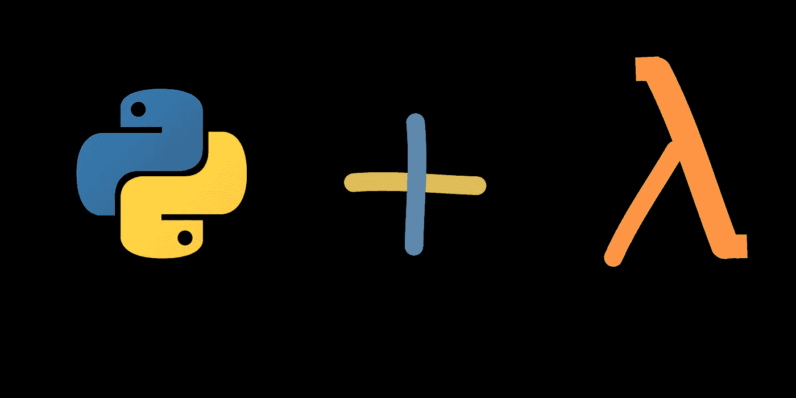
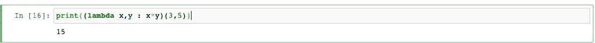
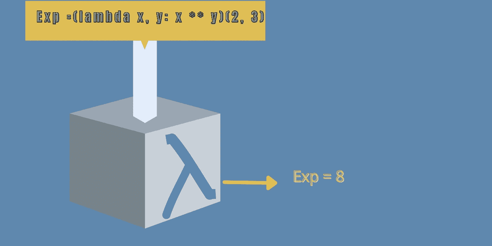
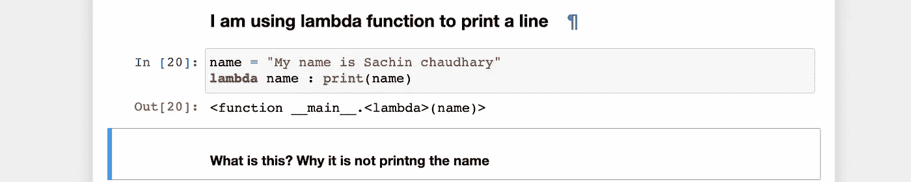
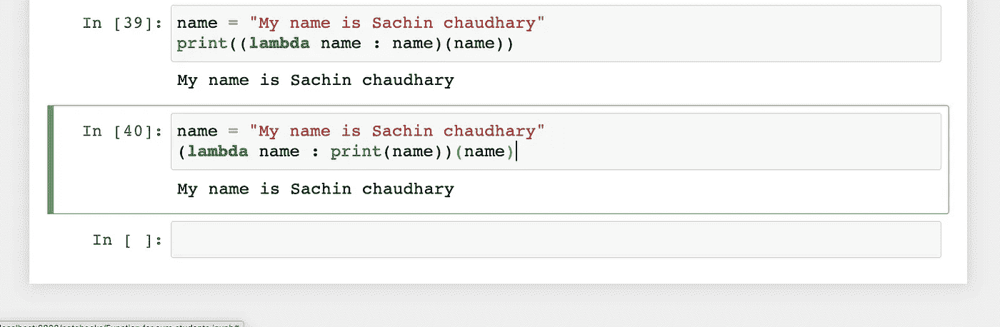

# Python 中的 Lambda 函数

> 原文：<https://medium.com/geekculture/lambda-function-in-python-b611fae231e0?source=collection_archive---------9----------------------->

ython lambdas 是小型的、匿名的子语法作品，比普通的 Python 函数更有限但更短。

在这篇文章中，我们将看到关于 lambda 的一切。我们将讨论并尝试回答以下关于 lambda 的问题:

*   拉姆达来的地方
*   什么是λ函数
*   如何使用 lambda 函数
*   何时避免 lambda 函数
*   λ替代品

Lambda 不仅仅是 python 中的一个概念，在其他编程语言如 Java、C#、C++等中都有使用。编程语言中 lambda 的概念来自微积分数学。

## 拉姆达来的地方

lambda 的历史可以追溯到 20 世纪 30 年代。以 [lambda 演算](https://en.wikipedia.org/wiki/Lambda_calculus)、[丘奇-图灵命题](https://en.wikipedia.org/wiki/Church%E2%80%93Turing_thesis)而闻名的阿隆佐·邱奇是一位美国数学家和逻辑学家，他将 lambda 演算形式化。函数式语言源于数理逻辑和 lambda 演算，而关键编程语言则采用艾伦·图灵开发的[基于状态的](https://www.sciencedirect.com/science/article/abs/pii/S0167739X16301066)计算模型。两个计算模型，lambda 演算和图灵机，可以翻译成一个。这种相似性被称为丘奇-图灵假说。

像 Haskell 和 Lisp 这样的函数式语言继承了 lambda 演算，但是像 Python 或 C 这样的语言继承了[命令式编程](https://en.wikipedia.org/wiki/Imperative_programming)。

最初，Python 不是一种函数式语言，但在后来的阶段，它采用了一些函数式概念。Lambda 函数是其中的一个，包括一些其他函数，如 reduce()、map()和 filter()。

我可以写更多关于 lambda 的历史，但这不是我们讨论的主要话题。所以继续下一个话题。

## 什么是λ函数

**Lambda 函数**是 Python 中的匿名函数。Lambda 函数类似于常规函数。常规函数和 lambda 函数的区别在于，它们可以不用名字定义，但是常规函数是用 ***def*** 关键字定义的。

> **lambda** 关键字用于定义匿名或 lambda 函数。

如果我们比较λ函数和正常函数，

1.  一个 **lambda 函数**可以接受任意数量的参数，但只能有一个表达式，而常规函数有确切数量的参数，我们在定义时就声明了。
2.  λ函数是单线函数。它的主体在定义它的同一行中包含表达式。在普通函数中，函数包含体块，其中定义了一些要执行的语句。
3.  因为 lambda 是一个单行函数，所以它可以被立即调用，但是普通函数需要调用它自己且需要时间来调用。

上面的代码显示了 lambda 函数，它给出了两个变量 x 和 y 的乘积。在上面的示例中，x 是存储 lambda 表达式返回值的变量。

Lambda 表达式的一部分。

> 关键词- lambda。
> 
> 参数 x 和 y。
> 
> 表达式- x*y

我们可以将参数传递给函数，方法是用括号将函数及其参数括起来:

下面是在同一行中传递参数的例子。

你也可以不用变量名写 lambda。这里我们知道 lambda 函数可以不用名字和变量来写。

**如何使用 lambda 函数**

到目前为止，我给出了 lambda 的所有理论，因此我们将借助例子来理解如何使用 lambda。

例 1 编写一个使用 lambda 函数计算指数的程序。

calculate exponent

为了解决上面的例子，我创造了一个非常漂亮的可视化来理解这个过程。你可以这样想..

*   首先，我定义了 lambda 表达式来计算指数。
*   将该表达式传递给由方框表示的 lambda 函数。
*   λ函数用方框表示。它会给你计算后的输出。
*   代码如下。

我取了不同的值，但这不是问题。

现在我想在这里讨论一件非常重要的事情。只有很少的编码员讨论这个东西。为此我举了另一个例子。

> 首先我们理解代码。

*   我只是定义了一个字符串，并存储在作为参数传递给 lambda 的变量' name '中。
*   之后声明一个 lambda 来打印结果。
*   但是我没有得到结果。

## ***这是因为 lambda 本身返回了一个函数对象。*** 在上面的例子中，lambda 仅仅是**返回**函数对象和它存储的内存位置。我们在控制台上得到的输出就是那个位置。

现在我将做一些改变来获得想要的输出。

代码解释:

现在我从 lambda 得到了我想要的东西，但是还有一个输出是**‘None’。**

***现在当我运行代码的时候，我的外部打印函数正在尝试调用 lambda 函数，内部打印函数正在调用 name 变量。所以内部打印给我字符串，外部打印从 lambda 函数返回对象。***

现在它给了我正确的输出，这是我两方面都想要的。

看看使用 lambda 打印一条语句是多么令人兴奋的任务。

这里你需要明白这个东西什么时候用 lambda，什么时候避免。

现在我将使用常规函数编写相同的代码。

有多简单？

## 何时避免 lambda 函数

所以问题是我们需要在简单的任务中避免使用 lambda，并理解 lambda 的用法。

如果我比较这里的差异。

我们在使用 lambda 函数时，没有使用任何函数名，也没有必要显式调用 lambda 函数，**这就是 lambda 被称为匿名函数的原因。**

对于常规函数，我们定义了一个名为 print_line 的函数，它也有主体，但是在 lambda 函数中没有主体。那是单行的。

以下是反对在 Python 中使用 lambda 函数的几点:

*   代码可读性
*   强迫以功能的方式思考
*   奇怪的语法
*   神秘风格

## λ替代品

*   列表理解。
*   发电机。

列表理解是 lambda 的最佳替代品。在某些情况下，当你将 lambda 与 map()、reduce()和 filter()函数一起使用时，同样的事情也可以通过 list comprehension 和 for 循环来完成。

现在你可以自己思考如何以及何时使用 lambda 函数。

我希望这篇文章能帮助初学者理解 lambda 简介。