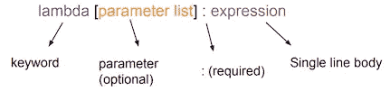
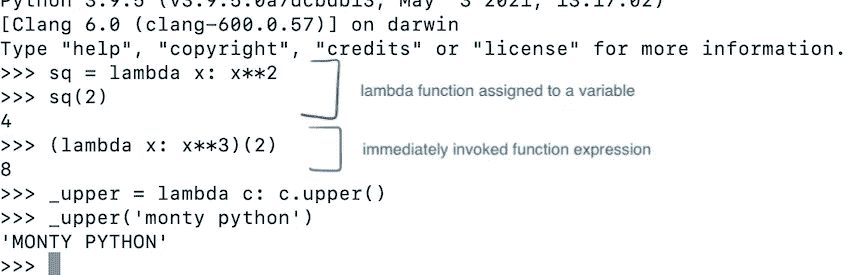
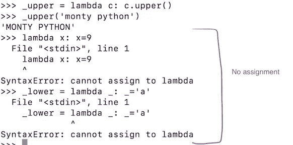
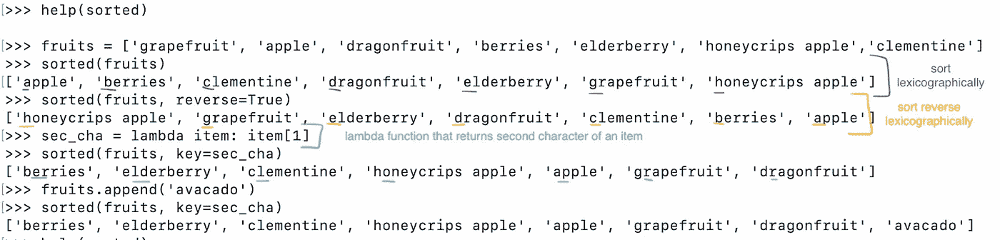
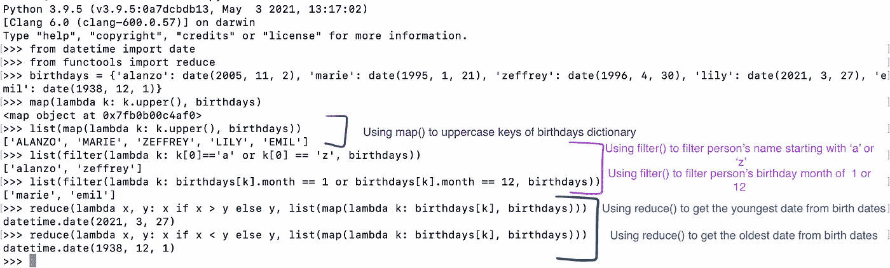
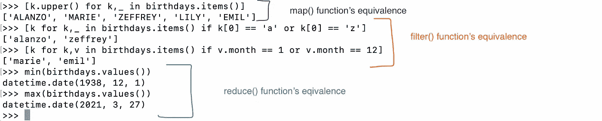

# Lambda 函数 Python

> 原文：<https://medium.com/geekculture/lambda-function-python-b8fa9167fd3b?source=collection_archive---------32----------------------->


Photo by [James Barker](https://unsplash.com/@barkernotbaker?utm_source=unsplash&utm_medium=referral&utm_content=creditCopyText) on [Unsplash](https://unsplash.com/s/photos/animals-unicellular?utm_source=unsplash&utm_medium=referral&utm_content=creditCopyText)

在 Python 中遇到‘lambda’之前，我在数学中遇到过，可能是在一些变量命名中；嗯..特征值λ。所以这个术语并不新鲜。然而，这个神秘的一号线已经飞离我的雷达，直到现在。

我们将学习 **lambda 函数**，它的**用法**，以及更多 pythonic 式的**替代**。

Lambda function 是创建一个没有名字的函数的另一种方式，也就是匿名函数。它的语法是



这个 lambda 语句返回一个函数对象，当**被调用**时**返回求值后的表达式**。我们可以通过立即给变量**或**赋值来调用 lambda 函数。



λ函数限制是:

*   它的主体仅限于一个表达式，没有赋值
*   它的主体只是一行逻辑代码



这是一个带有不同类型参数的 lambda 函数的例子。

运行该文件时，我们得到:

```
1+2 = 3
c*3 = ccc
x, *args, y, **kwargs = (1, (2, 'z'), 121, {'a': 97, 'b': 98})
```

现在让我们使用带有内置`sorted()`方法的 lambda 函数**。**

`sorted()`函数的函数签名是`sorted(iterable, /, *, key=None, reverse=False)`。*在 python 交互环境中，可以使用* `*help(sorted)*` *来了解函数签名及其文档*。

我们可以给我们定制的 lambda 函数作为**键**进行排序。让我们看一个例子。



这里我们使用了**内置的** **键**对列表进行字典序排序或者反向字典序排序。我们还将我们的**自定义** lambda 函数作为一个**键**，它根据列表中项目的第二个字符进行排序。

这是上面互动环节的`.py`形式:

让我们再分类一些:

运行该文件时，我们得到:

```
sort dates default way: [datetime.date(1938, 12, 1), datetime.date(1995, 1, 21), datetime.date(1996, 4, 30), datetime.date(2005, 11, 2), datetime.date(2021, 3, 27)]Birthday dictionary: {'alanzo': datetime.date(2005, 11, 2), 'marie': datetime.date(1995, 1, 21), 'zeffrey': datetime.date(1996, 4, 30), 'lily': datetime.date(2021, 3, 27), 'emil': datetime.date(1938, 12, 1)}sort name and birthday default (key) way: ['alanzo', 'emil', 'lily', 'marie', 'zeffrey']printing dictionary based on the default sort (key)
alanzo: 2005-11-02
emil: 1938-12-01
lily: 2021-03-27
marie: 1995-01-21
zeffrey: 1996-04-30sort name and birthday by birth date: ['emil', 'marie', 'zeffrey', 'alanzo', 'lily']
printing dictionary based on the sort birth date value
emil: 1938-12-01
marie: 1995-01-21
zeffrey: 1996-04-30
alanzo: 2005-11-02
lily: 2021-03-27sort name and birthday by birth date reverse way: ['lily', 'alanzo', 'zeffrey', 'marie', 'emil']
lily: 2021-03-27
alanzo: 2005-11-02
zeffrey: 1996-04-30
marie: 1995-01-21
emil: 1938-12-01
```

这里我们对生日字典**默认**方式(**键**)进行排序，并且还使用 lambda 函数根据**值**对字典进行排序。正如我们看到的代码相当冗长，所以 Python 内置了**高阶函数**来减少冗长。

概括一下，高阶函数**将** a **函数作为参数**和/或**返回** a **函数**作为其**返回值**。

让我们用函数`map`、`filter`、`reduce`来检验一下。

*边注*:如果你不熟悉这些函数，可以使用 python 交互环境中的`help(map)`来了解或者查阅；python 文档就是这样一种资源。



这里我们可以看到 lambda 函数如何传递给高阶函数，以执行映射、 g 中的**filter 和减少** iterables 的**操作。**

这里是 python 交互会话的一个`.py`格式。

运行该文件时，我们得到:

```
names in upper case: ['ALANZO', 'MARIE', 'ZEFFREY', 'LILY', 'EMIL']
names that starts with 'a' or 'z': ['alanzo', 'zeffrey']
names whose birthday falls in January or December: ['marie', 'emil']
youngest date from birthdays: 2021-03-27
eldest date from birthdays: 1938-12-01
```

看，我们可以在高阶函数中使用 lambda 函数来提取数据或对数据进行一些修改。

然而，这仍然很麻烦。Python 有**列表理解**来使这种数据分析和修改更容易被人理解。



下面是终端会话的`.py`格式:

很简单！？

希望对你理解 lambda 函数有所帮助。

概括地说，lambda 函数是一个线性逻辑代码，它接受参数(可选)并返回一个表达式。

感谢您的阅读，并祝贺完成！！🎈我会在我的下一篇文章——完结中看到你。

*忘了，还有 AWS 的 lambda 功能，在‘无服务器’架构下工作*。😛

灵感:

*   [蟒蛇深潜](https://www.udemy.com/course/python-3-deep-dive-part-1/)