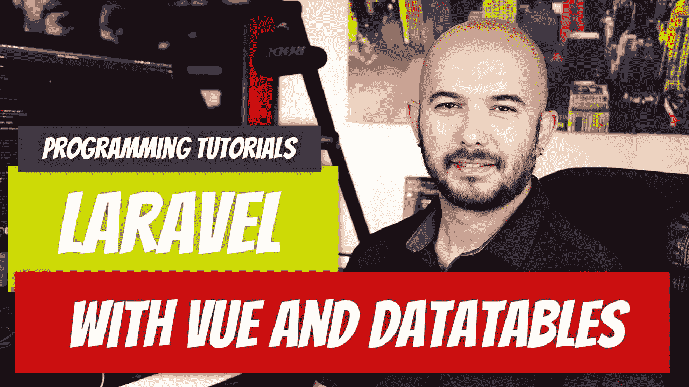

# 带有 Vue.js 和数据表的 Laravel 9.x

> 原文：<https://medium.com/geekculture/laravel-9-x-with-vue-js-and-datatables-b1299d0e6f09?source=collection_archive---------5----------------------->

到目前为止，我所看到的关于如何设置数据表的一切都没有产生我需要的那种结果。我想将数据表简单地集成到我的 Vue.js/Laravel 项目中，但事实证明这比没有更难找到。这不应该像想象的那么难。让我们用一个非常简单的方法来解决这个问题。