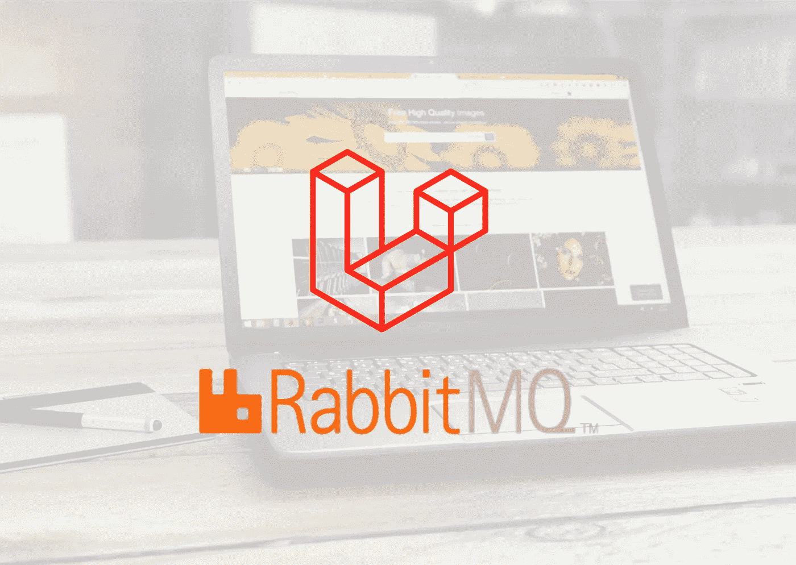

# 使用 RabbitMQ 消息代理的 Laravel 微服务通信

> 原文：<https://medium.com/geekculture/laravel-microservice-communication-using-rabbitmq-message-broker-9972927c6b3b?source=collection_archive---------0----------------------->

Laravel + Rabbit MQ

当我们使用整体架构时，处理大型网站项目是很麻烦的。作为一名 Laravel 开发人员，这非常具有挑战性，因为基本上，Laravel 为我们提供了一个全栈开发，您可以在同一个项目中同时使用前端和后端，换句话说，就是单片应用程序。问题是，我们能不能用 Laravel 开发微服务(或者也许…