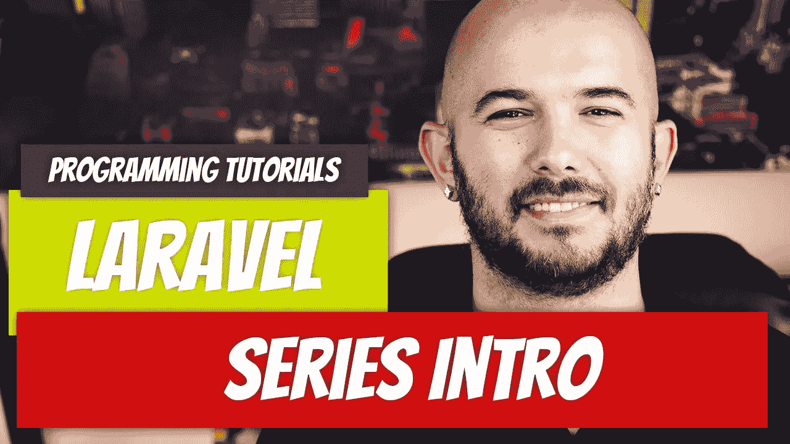

# 拉勒维尔— P1:系列介绍

> 原文：<https://medium.com/geekculture/laravel-p1-series-intro-61cfc5ef8133?source=collection_archive---------13----------------------->

Laravel 是一个 [PHP](https://www.php.net/) 框架，它为你提供了创建复杂 web 应用程序所需的工具，但它也允许你专注于应用程序逻辑。它是用现代语言特性构建的，支持开箱即用的多个数据库。

## 什么是 Laravel？

Laravel 是一个 PHP 框架，建立在约定优于配置的原则之上。这是一个完全开源的…