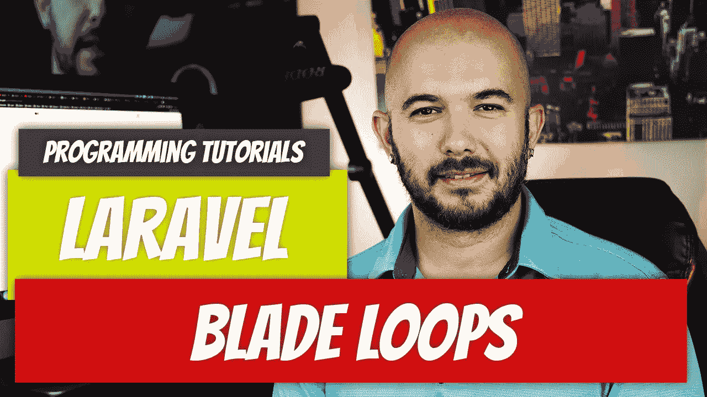

# Laravel — P11:刀片回路

> 原文：<https://medium.com/geekculture/laravel-p11-loops-fc8e11f61998?source=collection_archive---------10----------------------->

在前面的几篇文章中，刀片指令已经被证明是有用的，但是，直到现在它们才开始发光。当 PHP 中的循环嵌入到 HTML 中时，看起来会很混乱。刀锋让它们看起来很漂亮，就好像它们属于那里。