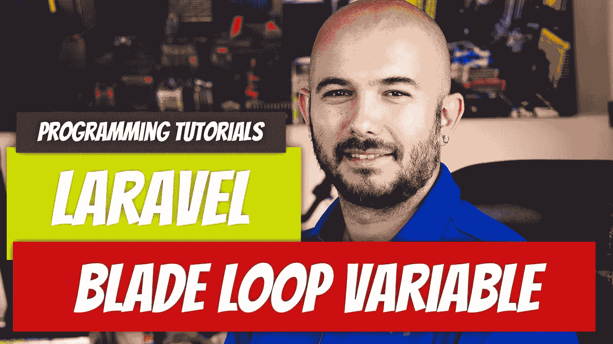

# Laravel — P12:叶片 Foreach 循环变量

> 原文：<https://medium.com/geekculture/laravel-p12-blade-foreach-loop-variable-366d045b5742?source=collection_archive---------9----------------------->

在`foreach`循环中使用 Blade 语法的另一个好处是可以访问循环变量。loop 变量让您可以访问各种信息，例如循环中还剩下多少次迭代。如果您没有阅读过刀片循环，请务必先阅读。