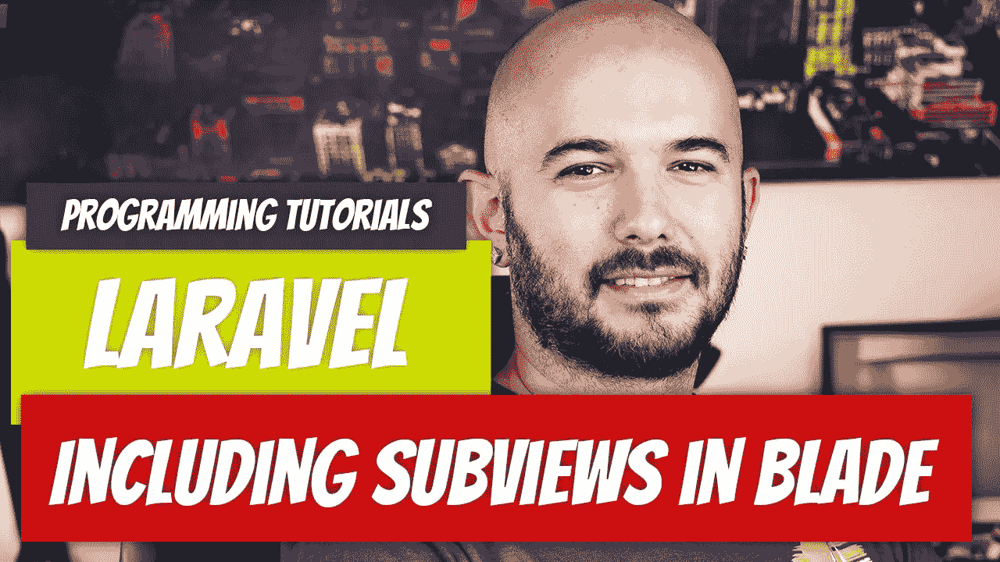

# Laravel — P13:在 Blade 中包含子视图

> 原文：<https://medium.com/geekculture/laravel-p13-including-subviews-in-blade-d767a17eb572?source=collection_archive---------11----------------------->

如果您已经下载了代码，并按照前面的文章进行了操作，您可能会注意到，除了更改正文内容之外，我们一直在创建几乎相同的视图。这意味着我们以相同的`html`标签开始，以它结束。

让我们看看我们之前创建的视图`loops/foreach-lop-variable-nested.blade.php`。