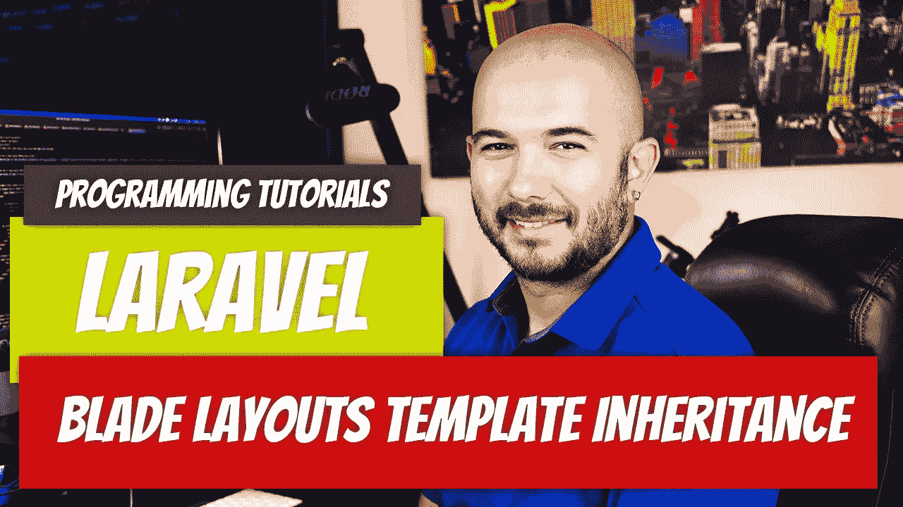

# Laravel — P15:使用模板继承的刀片布局

> 原文：<https://medium.com/geekculture/laravel-p15-blade-layouts-using-template-inheritance-5c2fa30a1e08?source=collection_archive---------1----------------------->

当您构建更大的应用程序时，创建布局是有意义的。在前几篇文章中，我们用`@include`指令做了一些，但是这次我们将真正创建一个布局。甚至当我们讨论`@include`指令时，我们使用它的原因是因为页面的布局没有改变。我们有相同的页眉和页脚。