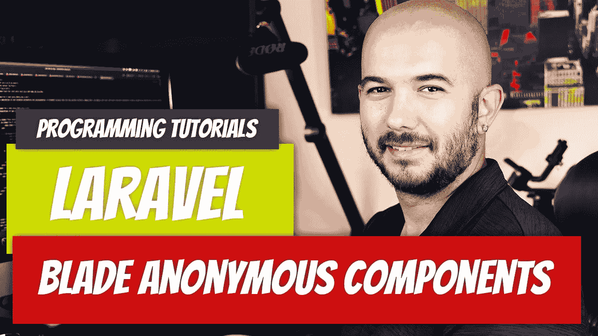

# Laravel — P16:刀片匿名组件介绍

> 原文：<https://medium.com/geekculture/laravel-p16-blade-anonymous-components-introduction-4117e1feb25e?source=collection_archive---------15----------------------->

在过去的几篇文章中，我们一直在讨论这个问题，现在我们终于来了，组件。有趣的是，虽然我更喜欢组件，但比起刀片组件，我更喜欢 Vue 组件。Vue 组件可能要晚得多，但是如果您有兴趣在我们真正到达那里之前阅读它，我已经写了一两篇关于它的文章。