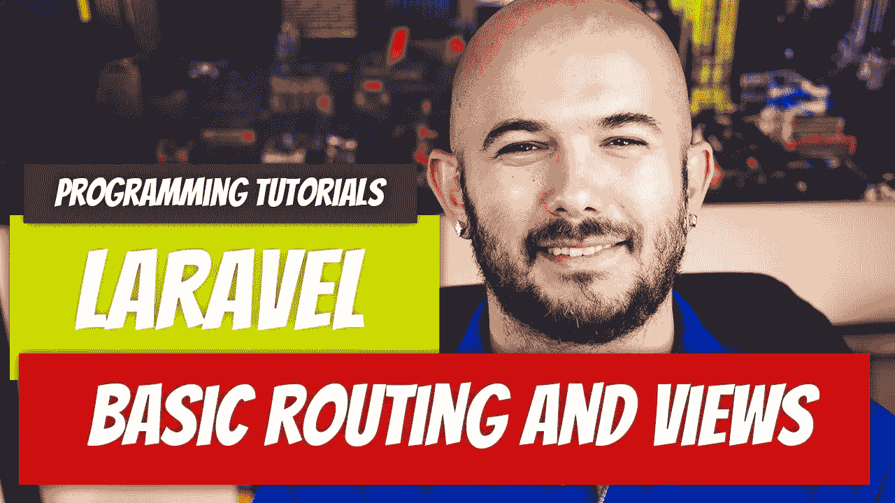

# 拉勒维尔— P4:基本路由和视图介绍

> 原文：<https://medium.com/geekculture/laravel-p4-basic-routing-and-view-introduction-4eab072da763?source=collection_archive---------20----------------------->

当谈到思考如何接近学习过程时，这是一件困难的事情。我不太喜欢马上学习一个特定的概念，比如控制器。我相信你通过慢慢理解这些概念可以学到最好的东西。我将试着按照战略顺序介绍这些概念。希望这对你有用。