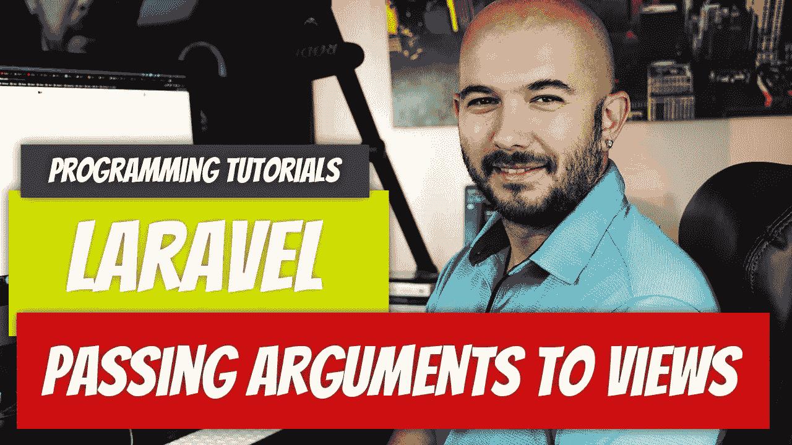

# 拉勒维尔— P6:将论证传递给观点

> 原文：<https://medium.com/geekculture/laravel-p6-passing-arguments-to-views-f465aaafe7a5?source=collection_archive---------14----------------------->

我们知道如何获取 URL 参数并从我们的路径返回它们，但是我们如何将参数传递给视图呢？

 [## Laravel — P5:路线参数

### 我们在上一篇文章中讨论了基本的路由和视图。我们经常需要向路由文件传递参数…

medium.com](/geekculture/laravel-p5-route-parameters-e7ddc6c9a3d2)