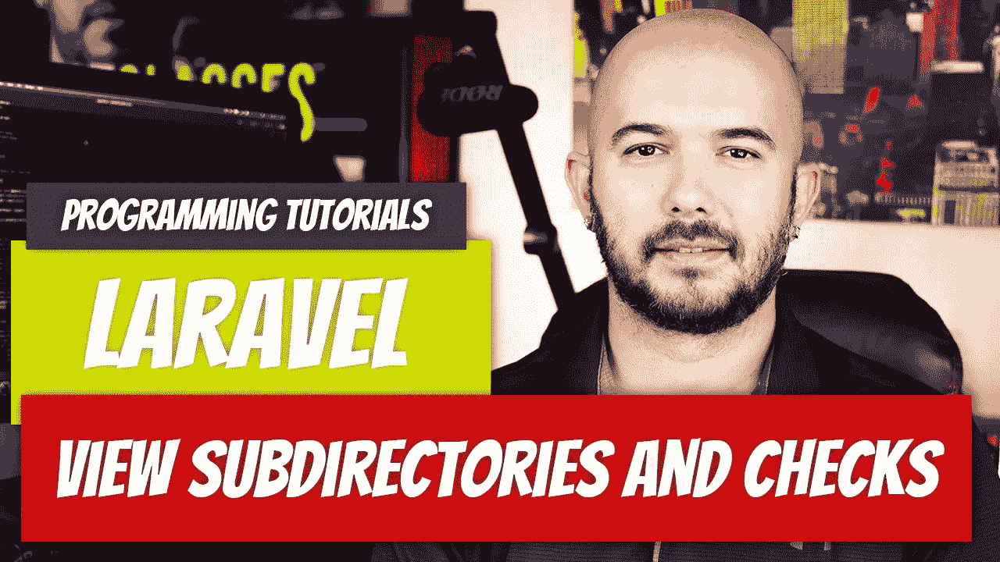

# Laravel — P7:查看子目录和检查

> 原文：<https://medium.com/geekculture/laravel-p7-view-subdirectories-and-checks-2f07f20a5315?source=collection_archive---------16----------------------->

在继续学习刀片模板引擎之前，我们还应该了解一些概念。这一次，我们将涉及子目录和一个简单的检查，看看我们调用的视图是否实际存在。