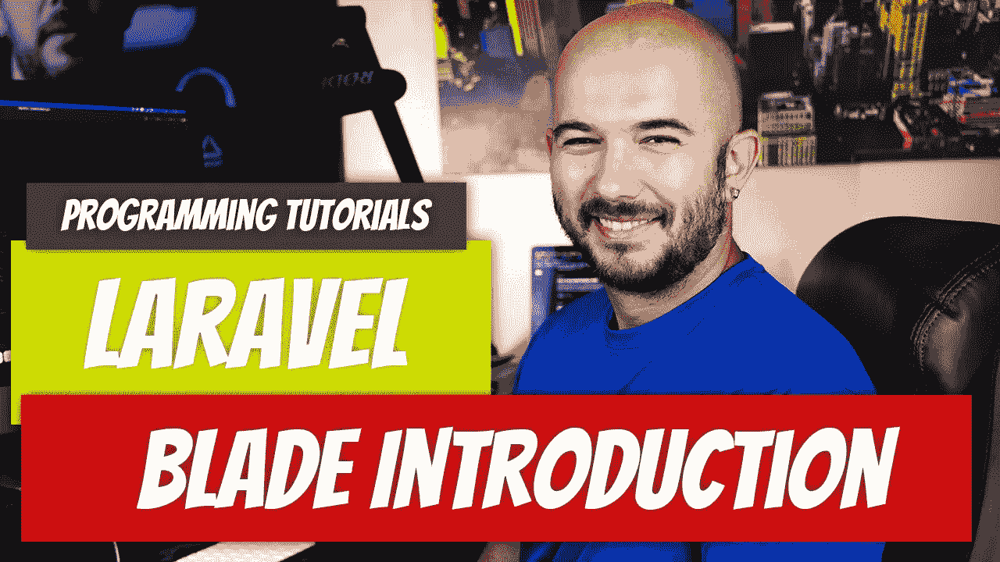

# Laravel — P8:刀片简介

> 原文：<https://medium.com/geekculture/laravel-p8-blade-introduction-94ac770dea2?source=collection_archive---------20----------------------->

Blade 是一个模板引擎，允许你写一些前端友好的代码。设计师最不希望看到的是视图中的 PHP。看看刀片组件，你会很快欣赏到外观的优雅，而不是 PHP 在后端之外使用时造成的混乱。刀片模板编译成 PHP 代码，但我们不需要担心。只要我们使用正确的…