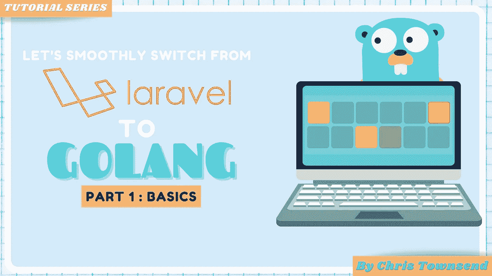

# Laravel to Go —第 1 部分—基础知识

> 原文：<https://medium.com/geekculture/laravel-to-go-part-1-basics-502fb236fdf0?source=collection_archive---------7----------------------->



Laravel to Go series

从 PHP 的主要背景转换到 Golang 是一个有洞察力的旅程，如果你像我一样不是来自严格类型化的语言背景，一开始可能会有点令人生畏。当然，一旦我们进入 PHP 7/8 领域，我们可以有严格的返回类型等，但这并不完全一样，但这是一个很好的转换准备。我问自己如何将 Laravel 应用程序转移到 Go 项目中？

我的 Laravel to Golang 系列将涵盖可以使用 Go 实现的 Laravel 概念和模式。请记住，Laravel 是一个框架，所以它不像你可以拿起 Go，然后像在 Laravel 中构建一样进行构建。您需要将构建模块放在一起，虽然我会介绍一些您可以使用的工具，但我不会在 go 中使用等效的框架。

首先，我们将启动并运行一个项目，并为之服务。就像你用 Laravel 在本地开发并使用`php artisan serve`

*TL；https://github.com/townsymush/laravel-to-go-series 博士:**链接到本练习的代码*

# 预读

在开始这个系列之前，我假设你已经以某种方式使用过围棋，即使它是`Hello World`的领域。在进一步阅读之前，请阅读以下资源

*   [安装 Go](https://golang.org/doc/install)——Go 的安装指南，不过如果可以的话，我建议使用类似 [Brew](https://brew.sh/) 的东西
*   [围棋之旅](https://tour.golang.org/welcome/1) —围棋之旅将带你了解各种基础知识，是一门互动课程。
*   [有效 Go](https://golang.org/doc/effective_go) —让你对如何使用 Go 有一个基本的了解。它涵盖了最佳实践、格式和理论，比如 Go 中的接口。

# 包管理器

在 Laravel 中，默认的包管理器是 Composer。它管理项目的依赖项、框架以及项目所需的任何其他依赖项。Go 有一个内置的依赖管理器，叫做 Go 模块。它从`1.11`开始就可用了，如果你在这个版本之前使用 Go，我不得不说管理你的依赖关系是一个很大的痛苦。Go 模块使设置您的环境变得更加容易。它基本上是面向 Go 的 composer，但速度更快、更简单。我们也不必担心像 PSR 命名空间这样的事情。

# Go 模块

我建议总是在项目开始时初始化 Go 模块。为项目的根目录创建一个文件夹。

一旦在文件夹中运行`go mod init {project-name}`，这将创建一个空的`go.mod`文件，准备好填充你的奇怪和美妙的依赖...希望不会太奇怪。

如果您想在 Go 项目中添加一个依赖项，只需运行带有包名的 go get 即可

例:`go get github.com/go-chi/chi`。这将把这个包添加到你的 go mod 文件中。

如果你想更新软件包，就像你运行`composer update`一样，你可以使用`-u`标志。

示例:运行`go get -u github.com/go-chi/chi`

你可以用围棋模块做更多的事情，所以你可以在这里自由地做更多的阅读。现在让我们继续前进。

# Main.go

所有 Go 应用程序都需要一个`main.go`文件。这是您服务于您的应用程序的地方。你可以在一个很长的 main 函数中做任何事情，但是抽象在这里很重要。就像你不会在一个`index.php`中完成所有的代码一样。

Laravel 从`index.php`开始提供服务，所以让我们在 Go 中进行等效操作。我们可以从在你的项目文件夹路径下制作一个`main.go`文件开始

```
package mainimport (
	"fmt"
)func main() {
	fmt.Println("Hello World")  
}
```

注意事项

*   import 就像 PHP 中的`use`语句。我们将命名我们在这个文件中使用的依赖项
*   `fmt`是一个内部内置包。因此，为什么你看不到类似`github.com/user/fmt`的东西

主文件是我们引导应用程序的地方。从这里，我们将进入服务应用程序和创建一个结构。Laravel 遵循模型视图控制器(MVC)模式。我通常不会以这种方式构建一个 Go 项目，但是为了有助于保持熟悉，我们将在本系列的后面部分遵循这种模式。

# 服务 HTTP 服务器

要有一个工作的应用程序，我们需要通过 HTTP 提供我们的应用程序，就像你按照步骤安装 Laravel，然后调用`php artisan serve`。在围棋中，我们需要调用 [net/http 包](https://golang.org/pkg/net/http/)

*   我们在 main.go 文件中包含了 3 个依赖项
*   net/http——这是 http 相关的所有东西，是 Go 内部的一部分
*   日志——这是用来记录日志的，我们在这里使用它来终止应用程序，并在服务器死亡时记录日志
*   io —用于输入和输出任务。我们只是在这里使用它在我们的浏览器中输出一些测试

让我们为我们的应用服务，看看我们有什么！在项目根目录下的命令行中键入`go run main.go`。现在访问`http://localhost:7777/`，看看你的创作。

*我很清楚这第一部分非常基础，但我只是想放些东西让你开始，这样你就可以继续这个系列。*

现在我们已经有了一个正在运行的应用程序，在第 2 部分中，我将指导您拆分您的应用程序，使它代表一个更熟悉的模式(MVC)。我们将讨论路由和拆分应用程序的方法。我通常不会以这种方式构建我的 Go 应用程序，但我认为在这种情况下，可以帮助您了解来自 Laravel 的背景。

如果你喜欢这个，请给我一个掌声，甚至厚颜无耻地跟随。

通话完毕

克莉丝

2022 年 4 月 30 日更新—第 2 部分已经发布，请去看看

[](https://townsyio.medium.com/laravel-to-go-part-2-routing-and-handlers-1303d8f529a5) [## Laravel to Go —第 2 部分—路由和处理程序

### 从 Laravel 的角度来看，是时候解决 Golang 中的路由和处理程序问题了。

townsyio.medium.com](https://townsyio.medium.com/laravel-to-go-part-2-routing-and-handlers-1303d8f529a5)